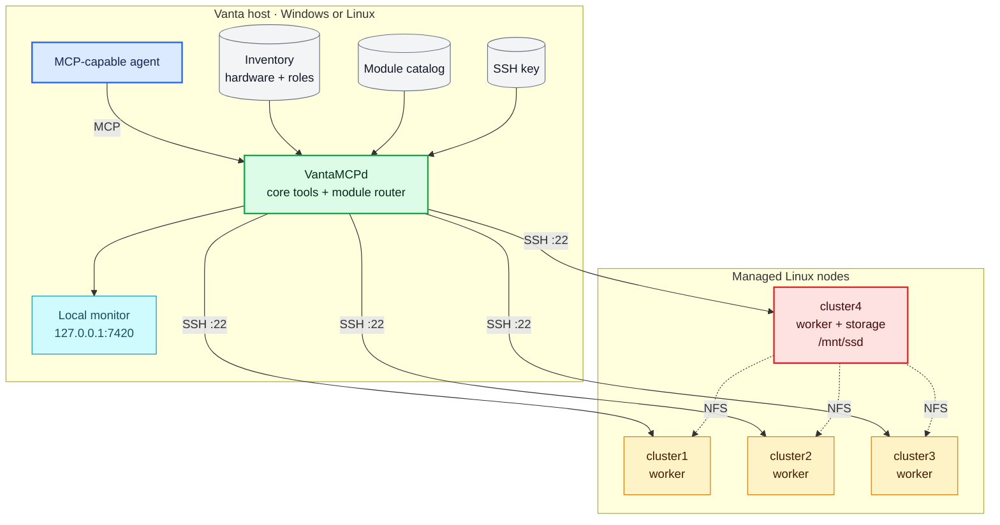
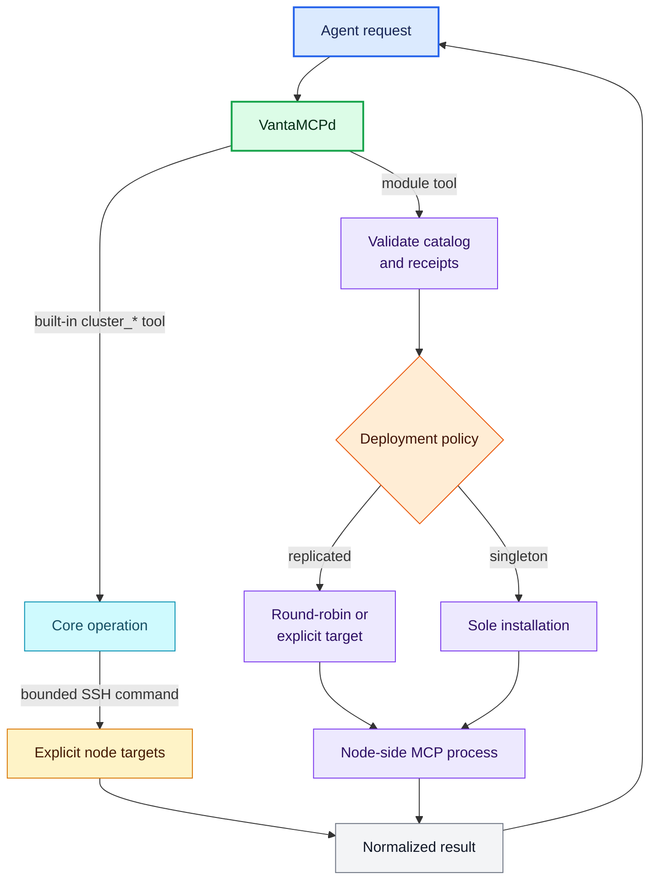

# VantaMCPd

> **Put old hardware back to work. Give your agent a cluster.**

<p align="center">
  
</p>

**Vanta** is the quiet layer beneath the work: it absorbs the awkward differences between machines,
operating systems, remote access, and runtimes, then presents the useful signal as one MCP interface.
Complexity is not something to hide from; it is raw material to turn into capability.

VantaMCPd lets agents operate a heterogeneous cluster of Linux
nodes over SSH. Bootstrap secure access once, then inspect status and logs, manage packages, services,
files, storage, and NFS, or install node-side MCP modules that add new capabilities quickly. Small ARM
boards can do useful work today, while x86 and accelerator-equipped nodes fit the same model with more 
advanced capabilities.

The project ships **no real hosts**. The cluster is described by a local inventory file you create from
a template; everything else, including tools, scripts, and docs, is written against roles, not specific
machines.

Three parts are deliberately independent:

| Part | Meaning |
| --- | --- |
| **Agent** | Any MCP-capable client, such as VS Code with Copilot, Claude Code, Hermes Agent, or OpenClaw |
| **Vanta host** | The Windows or Linux machine that runs the local VantaMCPd Node.js process and monitoring dashboard |
| **Managed nodes** | The Debian/Armbian machines VantaMCPd reaches over SSH; ARM, x86, and accelerators use the same inventory model |

With stdio MCP, the agent launches VantaMCPd on its own host. The agent and Vanta host are therefore
usually the same machine, but they are different roles in the architecture. See
[Host setup](docs/HostSetup.md), [Node setup](docs/NodeSetup.md), and
[MCP client integration](docs/Clients.md) for the currently supported combinations.

## Modules

Modules extend managed nodes with MCP tools for useful workloads. VantaMCPd checks each module's
declared hardware and software requirements, installs it only on compatible nodes after approval, and
routes its tools according to the module's deployment policy.

| Module | Purpose | Deployment | Requirements | Guide |
| --- | --- | --- | --- | --- |
| **Core** (`core`, built in) | Cluster inventory, health, packages, services, files, storage, jobs, and module lifecycle | Runs on the Vanta host; fans out over SSH | Node.js 20.11+, OpenSSH client, and configured Debian/Armbian nodes | [Built-in tools](#tools) |
| **Text Tools** (`text-tools`, v0.4.0) | 111 bounded text, data, date/time, document, security, and developer operations across twelve category tools | Replicated; on demand; round-robin routing | Debian/Ubuntu; `armhf`, `arm64`, or `amd64`; 256 MB RAM; 40 MB disk | [Text Tools](modules/text-tools/TextTools.md) |
| **Scientific Corpus Search** (`corpus-search`, v0.4.1) | Provenance-aware arXiv metadata search using SQLite FTS5/BM25, with phrase, exclusion, and field query syntax | Singleton; on demand; durable installation job | Debian/Ubuntu; `armhf`, `arm64`, or `amd64`; 256 MB RAM; 10 GiB free node storage | [Scientific Corpus Search](modules/corpus-search/CorpusSearch.md) |

Use `cluster_list_modules` to see install options, compatibility, deployment policies, and live
installation state. See [Node modules](docs/Modules.md) for architecture and lifecycle details.

## Quickstart

From a clean checkout to a working agent-driven cluster. Run steps 1-5 on the **Vanta host**, then
complete step 6 in any MCP-capable agent. Node.js 20.11 or newer, npm, and an OpenSSH client are required.
Choose either host path below: Linux uses standard Node.js and SSH tools, while Windows provides
PowerShell helpers for the same setup. Git is needed only to clone or update the checkout.

**1. Install host prerequisites and build.**

Windows:

```powershell
powershell -ExecutionPolicy Bypass -File .\scripts\install-prereqs.ps1
```

Linux, after installing Node.js 20.11+, npm, and `openssh-client` with your distribution's package
manager or the [Node.js downloads](https://nodejs.org/en/download):

```bash
node --version
ssh -V
npm install
npm run build
```

**2. Create and edit the inventory.**

```powershell
# PowerShell
if (-not (Test-Path .\cluster.config.local.json)) {
  Copy-Item .\cluster.config.example.json .\cluster.config.local.json
}
```

```bash
# Bash
test -e cluster.config.local.json || cp cluster.config.example.json cluster.config.local.json
```

Set the real node names, addresses, user, roles, and storage in `cluster.config.local.json`. The managed
nodes must already run Debian/Armbian with SSH and a sudo-capable account; see
[Node setup](docs/NodeSetup.md) for the short first-boot checklist.

**3. Bootstrap key authentication and passwordless sudo on each node.**

```powershell
# Windows helper: prompts for each node's login and sudo password once
powershell -ExecutionPolicy Bypass -File .\scripts\bootstrap.ps1
```

On Linux, use `ssh-keygen`, `ssh-copy-id`, and `visudo` as shown in
[Linux node enrollment](docs/HostSetup.md#linux-node-enrollment). This is a one-time operation; passwords
go directly to SSH and sudo, never through VantaMCPd or the agent.

**4. Install the baseline packages on the managed nodes.**

```powershell
# Windows helper
powershell -ExecutionPolicy Bypass -File .\scripts\prepare-nodes.ps1
```

Linux hosts can use the equivalent SSH command in [Host setup](docs/HostSetup.md#prepare-managed-nodes).

**5. Register VantaMCPd with the agent.**

Every client launches the same local stdio process:

```text
command: node
args:    ["<absolute-repo-path>/dist/index.js"]
env:     { "VANTA_CONFIG": "<absolute-repo-path>/cluster.config.local.json" }
```

The repository already includes [.vscode/mcp.json](.vscode/mcp.json) for VS Code. Exact configurations
for Claude Code, Hermes Agent, OpenClaw, and generic MCP clients are in [MCP clients](docs/Clients.md).

**6. Discover and install node modules from your agent:**

> List the available node modules and their deployment policies.
>
> Check whether text-tools is compatible with cluster1 and cluster2, then install it there.
>
> Check whether corpus-search is compatible with the storage node, install it using the Medium profile,
> then show its job progress.

Module installation requires approval and explicit target nodes or tags. See [Node modules](docs/Modules.md)
for deployment, routing, durable jobs, and update behavior, the
[Text Tools quickstart](modules/text-tools/TextTools.md#quickstart) for replicas and routing, and the
[Corpus Search quickstart](modules/corpus-search/CorpusSearch.md#quickstart) for profiles, storage,
installation, and recovery.

**Re-running the whole block on a working cluster is safe.** Every step is idempotent: an existing SSH
key is reused, `authorized_keys` and `/etc/sudoers.d/99-vanta` are left alone once correct (so you are
not even prompted for a password), and already-present packages are not upgraded. Module activation may
install apt packages declared by that module after confirmation. On Windows, step 3 also re-probes the
nodes and refreshes the `hardware` blocks. Step 2 guards the private inventory with `Test-Path` or
`test -e`, so an existing cluster configuration is not overwritten; `bootstrap.ps1` applies the same
guard itself if you skip step 2 entirely.

Windows helper checks — these change nothing on the Vanta host or managed nodes:

```powershell
.\scripts\install-prereqs.ps1 -Check     # Windows Vanta host
.\scripts\bootstrap.ps1      -Verify     # key + sudo state per node
.\scripts\prepare-nodes.ps1  -Check      # packages per node
```

Keeping the inventory current as the cluster changes:

| Change | What to run |
| --- | --- |
| New node | Add it to the inventory, then enroll and prepare it using the matching [host setup](docs/HostSetup.md) path |
| Disk added / swapped / repartitioned | `npm run discover` (add `-- --assign` if its purpose is ambiguous) |
| OS or kernel upgraded | `npm run discover` |
| Node reimaged | Remove its entry from `~/.vanta/known_hosts.json`, then repeat node enrollment |
| Inventory edited by hand | Restart the MCP server — it reads the file once at start-up |

`npm run discover` re-probes the nodes and **writes** the refreshed `hardware` blocks back to the
inventory; your `diskRoles` overrides are preserved. Since the inventory is gitignored and holds the only
record of your cluster, back it up before large changes:

```bash
cp cluster.config.local.json "cluster.config.local.json.bak-$(date +%Y%m%d%H%M%S)"
```

PowerShell users can use `Copy-Item` instead.

Then ask your agent: *"Check the status of all cluster nodes"*.

---

## Cluster model

| Concept | Meaning |
| --- | --- |
| node `name` | `clusterN` by convention — the handle you use as a `targets` entry |
| `role` | `worker`, `worker+storage`, `control`, `control+worker`, `control+storage`, `storage` |
| tags | free-form labels (`armv7`, `armbian`, …). Every `+`-separated role token is also a tag |
| `storage` block | required when the role includes `storage`: device, mountpoint, fs type, label, NFS export |

So `targets: ["storage"]` hits every storage node and `targets: ["worker"]` every worker, on any cluster,
without hard-coding names.

### Physical topology



### Request and module flow



Core tools fan out over SSH with bounded concurrency and drive stock utilities such as `apt`,
`systemctl`, `journalctl`, and `lsblk`. Module calls validate live installation receipts, apply the
manifest's deployment policy, and launch the selected node-side MCP process over SSH stdio.

Inventory files:

| File | What it is | Used by VantaMCPd? |
| --- | --- | --- |
| [cluster.config.example.json](cluster.config.example.json) | Committed two-node template with one `worker` and one `worker+storage` | No; copy it to create your inventory |
| `cluster.config.local.json` | Your private inventory containing the real nodes; ignored by Git | Yes, by default |

Set `VANTA_CONFIG` when the daemon should load an inventory from a different path.

---

## Installation

The Quickstart above covers the shortest path to a working cluster. For the complete six-step Windows
and Linux walkthrough, including managed-node preparation, enrollment checks, and command variants, see
**[Installation](docs/Installation.md)**. Prepare each managed machine with **[Node setup](docs/NodeSetup.md)**;
platform support details and standalone SSH procedures remain in **[Host setup](docs/HostSetup.md)**.

## Operate the cluster

The built-in **Core** module provides the cluster management capabilities below. Once connected, ask
the agent:

**Health and triage**

> Check the status of all cluster nodes
>
> Which node has the least free disk space, and what is using it?
>
> Are any systemd units failed anywhere in the cluster?
>
> Show me the CPU temperature and load of every node - is anything throttling?
>
> Has any node rebooted recently, or is a reboot pending?
>
> Show the last 50 ssh journal errors on cluster2
>
> Check dmesg on all nodes for USB or SD-card I/O errors

**Inventory and hardware**

> List the cluster nodes with their roles and recorded hardware
>
> Where can I watch what you are doing on the cluster?
>
> Re-probe the hardware on cluster4, I swapped a disk
>
> Which disks are unassigned, and what do you think they are for?
>
> How much swap does each node have, and is it persistent across reboots?

**Packages and services**

> Which nodes have pending apt upgrades?
>
> Do a dry run of upgrading all nodes, then tell me what would change
>
> Install htop and tmux on the workers only
>
> Is nfs-kernel-server running on the storage node? Restart it if not
>
> Disable the unattended-upgrades timer on all nodes and explain the trade-off

**Storage and swap**

> Mount the SSD on the storage node and share it to the rest of the cluster over NFS
>
> Is the NFS share mounted and writable on every worker?
>
> Point apt's cache at the shared SSD so the nodes stop re-downloading the same packages
>
> cluster4 lost its swap after a reboot - find out why and fix it

**Files and config**

> Show me /etc/fstab on every node side by side
>
> Back up /etc/exports from the storage node to my machine
>
> Add a 2GB swap file on the shared SSD for cluster1

Destructive work (formatting, partitioning, reboots, `rm -rf`) is refused until you approve it
explicitly, so it is safe to ask for it and then read back what the agent proposes.

Installed modules add workload-specific tools beyond these Core operations. See the [module catalog](#modules)
for the available modules and [Node modules](docs/Modules.md) for installation, routing, lifecycle, and
usage details.

## Monitoring

The daemon records every SSH interaction and serves a live dashboard at **<http://127.0.0.1:7420>**.

> **Multiple launches:** Each stdio client starts its own VantaMCPd process, and only one process can
> bind the default dashboard port `7420`. Use a different `monitoring.port` in each client's inventory,
> or disable web monitoring for all but one process. See [Multiple clients](docs/Clients.md#multiple-clients).


- **Nodes** — every configured node, installed-module count, calls, failures, timing, bytes moved,
  last tool and last activity. Click a row for configuration, module IDs and recorded hardware.
- **Modules** — active module versions, node coverage, deployment, runtime and package size. Click a row
  for manifest details and the live MCP tool API.
- **Jobs** — active and recent durable operations with target, status, phase, progress, duration, and
  heartbeat freshness. The dashboard is read-only; cancellation remains a confirmed MCP operation.
- **Interactions** — a tail-following list of every command, attributed to its module and the MCP tool
  that issued it, with redacted input parameters, exit status and duration. New rows appear live over SSE;
  `following` pauses it, and `copy log path` copies today's persisted JSONL `file://` URL.
- **Filters** — by node, module, status (`ok`, `exit 1`, `exit 4`, `error` … built from what actually
  happened), and a free-text search across command, module, tool, parameters and error. They combine.

It binds to **loopback only** and there is deliberately no setting to change that: the log contains your
hostnames, usernames and full command lines. Events are also appended to `~/.vanta/logs/vanta-<date>.jsonl`
for grepping after the fact. The daemon tells the agent the URL, so you can just ask *"where can I watch
this?"*. See [Monitoring](docs/Reference.md#monitoring) for the fields, retention and redaction behaviour.

---

## Tools

The table below lists the built-in VantaMCPd tools. Each installed node module can add its own tools;
discover them with `cluster_list_module_tools` and invoke them through `cluster_call_module_tool`. See
[Node modules](docs/Modules.md#implemented-modules) for the current module catalog and tool guides.

| Tool | Purpose |
| --- | --- |
| `cluster_list_nodes` | Inventory: names, hosts, roles, tags, sudo mode, storage config, recorded hardware |
| `cluster_hardware` | CPU (model/SoC/arch/cores/MHz), memory, block devices, filesystems, OS/kernel/board — `refresh: true` re-probes and saves |
| `cluster_ping` | Connectivity, effective user, groups, passwordless-sudo check |
| `cluster_status` | OS, kernel, uptime, load, CPU temp/governor, memory, swap, disks, failed units, pending upgrades, reboot-required |
| `cluster_run` | Arbitrary bash (base64-transported), optional sudo/cwd/env, destructive-command guard |
| `cluster_check_command` | Policy dry-run: is this command considered destructive? |
| `cluster_logs` | journalctl (unit / priority / since / boot / regex), dmesg, or `tail` of a file |
| `cluster_packages` | apt update/upgrade/full-upgrade/install/remove/purge/autoremove/clean/search/show/policy/list |
| `cluster_services` | systemctl status/start/stop/restart/reload/enable/disable/mask/daemon-reload/failed |
| `cluster_list_dir` | Remote directory listing (`ls -lAh` or depth-limited `find`) |
| `cluster_read_file` | Read a remote text file (1MB cap, binary-safe transport) |
| `cluster_write_file` | Write a file with optional sudo, mode, owner and timestamped backup |
| `cluster_upload` / `cluster_download` | SFTP transfer to/from the Vanta host |
| `cluster_storage` | SSD inspect/format/mount/unmount + NFS export and client mounts |
| `cluster_swap` | Swap status, persist active swap in fstab, mkswap an existing partition, or repartition a whole disk as maximum-size swap |
| `cluster_power` | Reboot or poweroff (always requires `confirm: true`) |
| `cluster_list_modules` | List modules, deployment policy, compatibility, and live installed-node receipt versions |
| `cluster_check_module` | Run recorded and live compatibility checks for a module |
| `cluster_install_module` | Install a compatible module on explicit targets (always requires `confirm: true`) |
| `cluster_uninstall_module` | Remove an installed module and receipt from explicit targets (always requires `confirm: true`) |
| `cluster_purge_module_data` | Permanently remove marked retained module data after uninstall (always requires `confirm: true`) |
| `cluster_list_module_tools` | List tools from an explicit node or an automatically selected installation |
| `cluster_call_module_tool` | Call a module tool with normalized output and explicit routing metadata |
| `cluster_list_jobs` | List durable background jobs, phases, progress, and terminal results |
| `cluster_get_job` | Refresh one durable job by ID |
| `cluster_get_job_log` | Read the bounded tail of a durable job log |
| `cluster_cancel_job` | Cancel a running durable job (always requires `confirm: true`) |

`targets` accepts node names (`["cluster1","cluster4"]`), roles/tags (`["storage"]`, `["worker"]`), or is
omitted / `["all"]` to hit every node. Commands fan out with bounded concurrency (default 4).

---

## Documentation

Operational details beyond getting started live in **[docs/Reference.md](docs/Reference.md)**. Node-side
module usage, architecture, implemented packages, and the roadmap are documented in
**[docs/Modules.md](docs/Modules.md)**.

| Section | What it covers |
| --- | --- |
| [Installation](docs/Installation.md) | Complete Windows/Linux setup from host prerequisites through module installation |
| [Host setup](docs/HostSetup.md) | Windows/Linux host support, node enrollment, and baseline preparation |
| [Node setup](docs/NodeSetup.md) | Managed-node OS, network, account, SSH, sudo, and first-boot prerequisites |
| [MCP clients](docs/Clients.md) | VS Code/Copilot, Claude Code, Hermes Agent, OpenClaw, and generic stdio configuration |
| [Node modules](docs/Modules.md) | Available modules, activation, package lifecycle, architecture, and future module catalog |
| [Hardware inventory](docs/Reference.md#hardware-inventory) | What the daemon records per node, and how disk roles (`system`/`swap`/`storage`) are decided |
| [Swap](docs/Reference.md#swap) | `cluster_swap` actions and their guard rails |
| [Attached storage](docs/Reference.md#attached-storage) | Formatting the external disk and sharing it over NFS |
| [Operational tools](docs/Reference.md#operational-tools) | Parameters and examples for packages, services, logs, files, commands and power |
| [Monitoring](docs/Reference.md#monitoring) | The audit log, the dashboard and its HTTP API |
| [Security model](docs/Reference.md#security-model) | Auth, injection defences, the destructive-command guard |
| [Configuration reference](docs/Reference.md#configuration-reference) | Every key in `cluster.config.local.json` |
| [Troubleshooting](docs/Reference.md#troubleshooting) | Symptom → fix |
