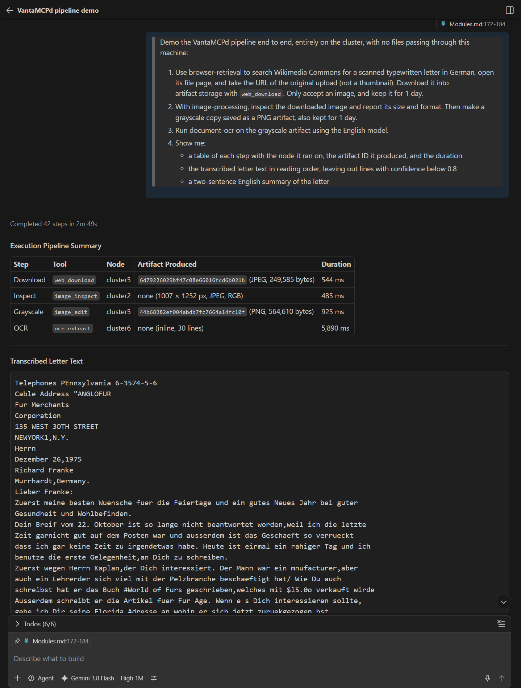

# Node Modules

## Purpose

Node modules extend VantaMCPd with workload-specific MCP tools that run on managed Debian or Armbian
nodes. VantaMCPd validates each local package, checks it against recorded hardware and a live preflight,
installs it after approval, and routes calls according to its deployment policy.

Module packages are trusted code shipped in this repository. They may target ARM, x86, GPU-equipped,
or other supported nodes; eligibility comes from declared capabilities rather than node names or roles.

## Using Modules

After pulling module changes, run `npm run build` and restart the `vanta` MCP server in the client so it
reloads the local catalog.

### Implemented Modules

Each module guide owns its requirements, installation options, tools, examples, limits, security model,
data lifecycle, and troubleshooting instructions.

| Module | Purpose | Deployment | Guide |
| --- | --- | --- | --- |
| `artifact-storage` | Immutable shared artifacts with quotas and expiration | Singleton service | [Artifact Storage](../modules/artifact-storage/ArtifactStorage.md) |
| `text-tools` | Bounded text, data, document, security, and developer operations | Replicated, on demand | [Text Tools](../modules/text-tools/TextTools.md) |
| `corpus-search` | Provenance-aware multi-source metadata search with SQLite FTS5/BM25 | Singleton, on demand | [Corpus Search](../modules/corpus-search/CorpusSearch.md) |
| `document-ocr` | CUDA-assisted OCR for bounded image and scanned-PDF artifacts | Replicated, on demand | [Document OCR](../modules/document-ocr/DocumentOCR.md) |
| `browser-retrieval` | JavaScript-rendered page retrieval, structured extraction, and file downloads into artifact storage | Replicated service | [Browser Retrieval](../modules/browser-retrieval/BrowserRetrieval.md) |
| `python-compute` | Sandboxed Python calculation, analysis, and rendered artifacts | Replicated service | [Python Compute](../modules/python-compute/PythonCompute.md) |
| `image-processing` | Isolated raster inspection, editing, composition, conversion, and comparison | Replicated service | [Image Processing](../modules/image-processing/ImageProcessing.md) |

### Management Tools

| Tool | Use |
| --- | --- |
| `cluster_list_modules` | List packages, install options, deployment policies, compatibility, and installation state |
| `cluster_check_module` | Check recorded capabilities, required commands, free disk, reachability, and health |
| `cluster_install_module` | Install a compatible package on explicit targets after confirmation |
| `cluster_uninstall_module` | Remove a package and receipt from explicit targets after confirmation |
| `cluster_purge_module_data` | Permanently remove declared retained data after uninstall and confirmation |
| `cluster_list_module_tools` | Discover compact tool summaries, one named tool's schema, or all schemas on an explicit or automatically selected installation |
| `cluster_call_module_tool` | Call a tool on an explicit installation or use manifest-defined routing |
| `cluster_list_jobs` | List durable jobs and their progress |
| `cluster_get_job` | Refresh one durable job by ID; `includeResult` returns a background call's output |
| `cluster_get_job_log` | Read a bounded remote job-log tail |
| `cluster_cancel_job` | Cancel a running job after confirmation |

### Install and Update

Start by listing the catalog and checking the intended target:

> List the available node modules for worker-a.

> Check whether text-tools is compatible with worker-a.

> Install text-tools on worker-a.

Installation never defaults to the entire cluster. The request must identify node names or tags and
must be approved before `cluster_install_module` is called with `confirm: true`.

When artifact storage is enabled and the manifest declares `artifactAccess`, installation also ensures the configured artifact
storage node's NFS share is mounted on each client target before staging the module. Missing clients
receive `nfs-common` and a persistent systemd automount entry; an existing mount is reused, while a
different mount or fstab source fails the install. This does not mount node-local `persistentData`
devices or initialize the artifact storage service itself.

VantaMCPd stages the package over SFTP, verifies its SHA-256 manifest, runs the trusted installer,
checks the installed entrypoint, switches the active version, and writes a root-owned receipt. Missing
commands may be installed only when their apt packages are declared by the manifest. A failed install
leaves the previous active version intact.

Typed `installOptions` expose their descriptions, defaults, and bounds through `cluster_list_modules`.
Explicit options are validated before remote work begins. The resolved values are recorded in the
installation receipt, so `cluster_list_modules` and the dashboard report what each node was actually
installed with rather than what the configuration currently says. A node installed before this was
recorded reports no options until its next install. Persistent defaults can be set globally and
per node in `cluster.config.local.json`:

```json
{
  "modules": {
    "python-compute": {
      "installOptions": { "bundle": "full" },
      "nodes": {
        "worker-b": {
          "installOptions": { "maxMemoryMb": 2048, "concurrentCalls": 3 }
        }
      }
    }
  }
}
```

Precedence is explicit tool arguments, per-node configuration, module-wide configuration, then manifest
defaults. Configuration is loaded at startup. Changed options apply on the next install; uninstall and
reinstall a current version to apply them immediately.

A job-backed install returns `state: "provisioning"` and a `jobId` after verified staging. The remote
systemd oneshot then owns the operation, so it survives an SSH disconnect or local daemon restart. Use
the job tools to follow phases, logs, completion, or cancellation.

At startup, `defaults.autoUpdateModules` defaults to `true`. VantaMCPd updates older validated receipts
to the local catalog version after hardware discovery. It does not create installations, reinstall an
equal version, or downgrade a newer remote version. Modules are updated one at a time: when an update
runs as a durable job, VantaMCPd waits for the job to finish before updating the next module, so two
installers never compete for apt on the same node. Set the option to `false` to disable reconciliation.

### Discover and Call Tools

Module tools remain behind the two proxy tools rather than appearing in the core daemon tool list:

> List the tools provided by text-tools.

> Use text-tools to extract the numeric IDs from `item=12 item=37` with the pattern `item=(\d+)`.

> Use image-processing to inspect an image artifact, strip its metadata, and store an 800-pixel WebP rendition.

Before every call, VantaMCPd verifies the receipt, active version, entrypoint, and advertised tool name.
Inputs are MCP data, not shell interpolation. Startup time, call time, stderr, input, and output are
bounded by the manifest. The response identifies the selected node, module version, tool, deployment,
selection method, and normalized output.

### Background Calls

A tool call normally runs over one SSH session and returns its result, bounded by the manifest's
`limits.callMs`. Work that takes longer can run as a durable background job instead:

> Use python-compute to run this simulation in the background, then show me the result when it is done.

The choice is made in two places:

| Where | How |
| --- | --- |
| Manifest | `background.tools` marks each tool `optional` or `required`; unlisted tools are immediate-only |
| Call | `cluster_call_module_tool` takes `execution: "immediate"` (default) or `"background"` |

A background request for an immediate-only tool, and an immediate request for a `required` tool, are
rejected with the allowed alternative. `cluster_list_module_tools` reports each tool's `execution`
policy.

A background call returns a `jobId` at once. The job runs the module entrypoint on the node as the SSH
user, sends the tool call with `_meta: {"vantamcpd/execution": "background"}` so the module can apply
its longer background limits, and stores the MCP result (bounded by `limits.maxOutputBytes`) with the
job. Poll `cluster_get_job`, then call it with `includeResult: true` to receive the normalized output.
The job survives SSH drops and daemon restarts. If its runner is interrupted midway, the job fails
instead of running the call a second time.

One durable job runs per module per node: a background call and an install of the same module exclude
each other. Automatic routing sends a background call to a replica without such a job. Install,
uninstall, and startup auto-update skip a node while a background call for that module runs there.
Submissions also respect the per-node job limit and the manifest's `background.minFreeMemoryMb`; a
node that cannot accept the job rejects it rather than queueing it.

```json
{
  "background": {
    "tools": { "python_run": "optional" },
    "maxTimeoutMs": 22500000,
    "minFreeMemoryMb": 256
  }
}
```

`maxTimeoutMs` bounds the job and should exceed the module's own longest background run.

### Example: Download, Clean Up, and Read a Scanned Letter



Artifact-aware modules can be chained so that a file moves from the web to OCR entirely inside the
cluster. Each step passes an artifact ID to the next; the bytes never reach the agent's machine. This
request uses browser-retrieval, image-processing, and document-ocr together with artifact storage:

> Demo the VantaMCPd pipeline end to end, entirely on the cluster, with no files passing through this
> machine:
>
> 1. Use browser-retrieval to search Wikimedia Commons for a scanned typewritten letter in German, open
>    its file page, and take the URL of the original upload (not a thumbnail). Download it into
>    artifact storage with `web_download`. Only accept an image, and keep it for 1 day.
> 2. With image-processing, inspect the downloaded image and report its size and format. Then make a
>    grayscale copy saved as a PNG artifact, also kept for 1 day.
> 3. Run document-ocr on the grayscale artifact using the English model.
> 4. Show me:
>    - a table of each step with the node it ran on, the artifact ID it produced, and the duration
>    - the transcribed letter text in reading order, leaving out lines with confidence below 0.8
>    - a two-sentence English summary of the letter

Before you run it, set the browser-retrieval `downloadContact` install option (see
[BrowserRetrieval.md](../modules/browser-retrieval/BrowserRetrieval.md)). Without a contact in the
User-Agent, `upload.wikimedia.org` can refuse original files with `429 Too Many Requests`.

The agent calls `web_retrieve` or `web_query` to find the file page and its original image link, then
`web_download` with `expectedTypes` limited to image formats and `retentionDays: 1`, `image_inspect`
and `image_edit` (`grayscale`, artifact output as PNG), and `ocr_extract` with `language: "en"`. OCR
can also run as a background job; the agent then polls it and reads the result. For a 1975 letter from
the Anglo-American Fur Merchants Corporation in New York, one run produced:

| Step | Tool | Node | Artifact produced | Duration |
| --- | --- | --- | --- | --- |
| Download | `web_download` | cluster5 | `ad7d9468…` (JPEG, 249,585 bytes) | 477 ms |
| Inspect | `image_inspect` | cluster2 | none (1007 × 1252 px, JPEG, RGB) | 494 ms |
| Grayscale | `image_edit` | cluster5 | `86b7b51c…` (PNG, 564,610 bytes) | 980 ms |
| OCR | `ocr_extract` | cluster6 | none (inline, 30 lines) | 6,346 ms |

Round-robin routing sent the two image-processing calls to different replicas. Both read the same
artifact from shared storage. All 30 OCR lines scored above 0.8, so none were dropped. The text
keeps the letter's own transliterations (`Wuensche`, `Geschaeft`) and some misreadings such as
`Breif` and `rahiger`:

```text
Dezember 26,1975
Richard Franke
Murrhardt,Germany.
Lieber Franke:
Zuerst meine besten Wuensche fuer die Feiertage und ein gutes Neues Jahr bei guter
Gesundheit und Wohlbefinden.
Dein Breif vom 22. Oktober ist so lange nicht beantwortet worden,weil ich die letzte
Zeit garnicht gut auf dem Posten war und ausserdem ist das Geschaeft so verrueckt ...
```

The English model worked here because the letter spells out its umlauts (`ue`, `ae`). For
documents with `ä`, `ö`, `ü`, or `ß`, prefer `language: "auto"`. Artifacts expire after their retention
period, so a one-day demo leaves nothing behind.

### Deactivate a Module

> Uninstall text-tools from worker-a.

Uninstall requires explicit targets and confirmation. VantaMCPd validates the receipt, runs the trusted
uninstaller, and removes the active payload and receipt. Repeating the operation when the module is
absent succeeds without changing the node.

Data declared with `retainOnUninstall: true` remains in place. Purging it is a separate destructive
operation allowed only after uninstall; it requires confirmation and removes only the marked module
directory under the configured storage mount.

## Compatibility

Compatibility combines stable inventory facts with a live preflight:

| Source | Examples |
| --- | --- |
| Recorded hardware | OS, package architecture, CPU cores and features, RAM, storage configuration, GPUs, accelerators, and runtime capabilities |
| Live preflight | Reachability, free root and data-volume space, required commands, devices, drivers, and runtime versions |

Missing or stale required facts produce `unknown`, not `compatible`; refresh hardware and check again.
`minDiskMb` refers to free space on the root filesystem. Modules with persistent data declare its
separate storage requirement through `persistentData.minFreeMb`.

`cluster_list_modules` performs a live receipt scan. `inventoryComplete: false` means unreachable nodes
may still contain installations, so absence from `installedNodes` is not proof that a module is absent
there. Invalid receipts are reported separately and never count as installations.

## Deployment and Routing

Every manifest chooses one deployment policy.

### Replicated

```json
{ "deployment": { "mode": "replicated", "routing": "round-robin" } }
```

A replicated module may be installed on any number of compatible nodes. With no `target`, tool calls
are assigned to reachable installations by a process-local round-robin cursor. An explicit target
bypasses routing. Discovery without a target uses the first reachable installation without advancing
the call cursor.

Routing happens per MCP call: calls are not split, retried midway, or aggregated. Submit independent
calls concurrently to use replicas in parallel. The cursor resets after daemon restart or a successful
lifecycle operation, and candidates are rediscovered from remote receipts.

### Singleton

```json
{ "deployment": { "mode": "singleton" } }
```

A singleton module may have one installation in the configured cluster. Installation fails when
another receipt exists, multiple targets are supplied, or any node is unreachable and uniqueness
cannot be proved. Lifecycle operations for the same module are serialized within one daemon. Run one
VantaMCPd manager per cluster when singleton placement is required.

## Runtime and Recovery

| Runtime | Behavior |
| --- | --- |
| `on-demand` | Starts a fresh process over SSH stdio for discovery or a call, then closes it |
| `service` | Installs and enables `vantamcpd-<module-id>.service`; a short-lived SSH stdio adapter communicates with the service |

On-demand modules have no process state to recover after a disconnect or reboot. Service modules rely
on systemd for restart and are disabled and stopped during uninstall. Service units reference the
stable `/opt/vantamcpd/modules/<module-id>/current/` path and define their own users, writable paths,
restart policies, and resource limits.

## Package Contract

Each repository-owned package lives under `modules/<module-id>/` and contains at least:

```text
modules/<module-id>/
  module.json
  install.sh
  uninstall.sh
  <entrypoint files>
  <ModuleGuide>.md
```

The manifest declares identity and version, short capability phrases, entrypoint, compatibility, apt
dependencies, lifecycle scripts, deployment, runtime, resource limits, and optional shared-artifact
access. A manifest may list repository-level files in `sharedFiles`; the catalog hashes and stages each
one beside the module's own files so independently deployed packages can share canonical source code.
Schema v2 adds typed install options, job-backed installation, persistent data, and background calls.

Packages are rejected for unsupported schemas, duplicate IDs, unknown properties, missing files,
symbolic links, path traversal, malformed semantic versions, or size-limit violations. IDs, paths,
commands, apt package names, and option names use constrained character sets.

### Capability Discovery

Each manifest may provide up to twelve short `capabilities` phrases describing work a user would ask
for. VantaMCPd places them in server instructions and the module proxy tool descriptions, allowing an
agent to route a request without being told the module name. Capability text affects discovery only;
it does not change compatibility, installation, or routing.

### Installation Layout

Installed payloads and receipts use root-owned paths:

```text
/opt/vantamcpd/modules/<module-id>/<version>/
/opt/vantamcpd/modules/<module-id>/current -> <version>/
/var/lib/vantamcpd/modules/<module-id>.json
```

Installation and uninstallation are idempotent. Activation occurs only after package validation,
compatibility checks, verified staging, dependency preflight, installer completion, and an entrypoint
smoke test. Uninstall removes the executable payload and receipt while preserving explicitly declared
persistent data.

The remote receipt is the source of truth for installation state. Hardware inventory is the source of
truth for stable capability, live preflight for current capacity, the installed entrypoint for module
health and tools, and `/var/lib/vantamcpd/jobs/<job-id>/` for durable job state.

## Security and Observability

- Only trusted packages from the local repository catalog can be installed; URLs and uploaded archives
  are not accepted.
- Manual lifecycle operations require explicit targets and confirmation. There is no compatibility
  bypass.
- Singleton placement fails closed unless uniqueness can be verified across the cluster.
- Lifecycle scripts use the audited sudo path; runtime processes receive no VantaMCPd credentials or
  SSH keys.
- Package size, process startup, call duration, input, output, and stderr are bounded. Each module adds
  domain-specific limits for the data it processes.
- Module checks, lifecycle operations, routing decisions, and calls appear in the audit stream and the
  read-only monitoring dashboard.
- Durable jobs use allowlisted operations, systemd units, resource locks, bounded logs, heartbeat and
  timeout enforcement, cancellation, expiration cleanup, a per-node concurrency limit, and a free-memory
  check at submission. Background module calls run as the SSH user, never as root.

## Future Work

Platform work under consideration:

1. Add artifact ACLs, backup, replication, deduplication, and optional alternate storage backends.
2. Extend `corpus-search` with further source adapters behind its existing adapter boundary, each
   selectable as its own profile alongside the installed arXiv, PubChemLite, and Wikipedia sources and
   recording its own provenance and licensing, as those three already do. A candidate fits when its
   records are titled, individually identified, externally linkable, openly licensed, and small enough
   for a sampled corpus to stay within a node's storage budget. The datasets under consideration, and
   those rejected on licensing, are listed under Future Expansion in the
   [module guide](../modules/corpus-search/CorpusSearch.md).
3. Add precomputed embeddings and vector or hybrid retrieval only on compatible node profiles.
4. Evaluate separate modules for browser screenshots, advanced PDF layout and table extraction, and
  geospatial operations. Curated
   Wikipedia content beyond the ingested title index belongs with them rather than in `corpus-search`.
5. Support heavier ML and vision workloads as suitable arm64, x86-64, GPU, or accelerator-equipped
   nodes join the same inventory and compatibility model.
6. Declare background calls for `image-processing` batch work, using the same background-call mechanism
   that `corpus-search` now uses for `corpus_refresh`.

Persistent Python sessions, caller-installed dependencies, network access from submitted code,
authenticated browser sessions, scripted browser interaction, and browser-generated binary outputs
also remain deferred until their state, authorization, isolation, and artifact requirements are defined.