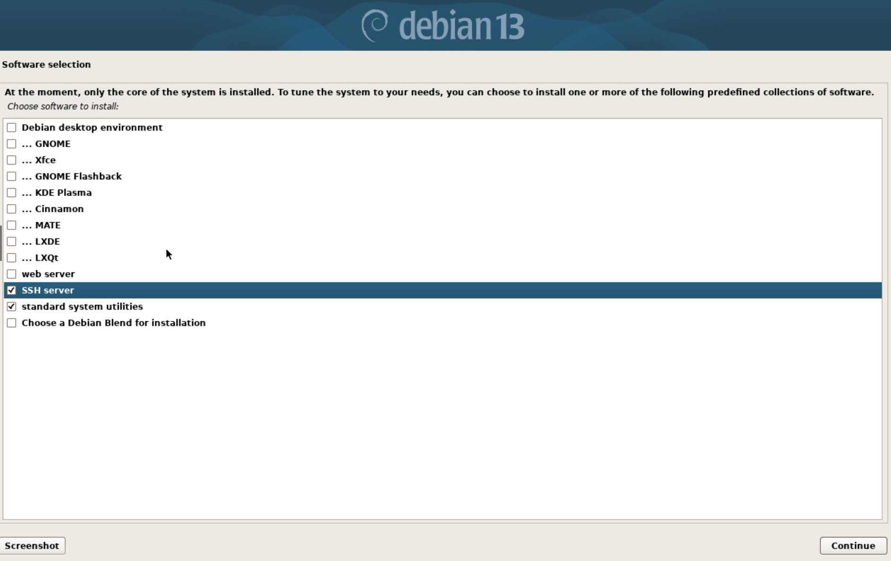

# Node Setup

A managed node is a Linux machine that VantaMCPd reaches over SSH. It does not need Node.js, npm, the
VantaMCPd repository, or an MCP client. Prepare the operating system, network, and login account once;
the Vanta host handles enrollment and installs the remaining baseline packages remotely.

## Recommended Platform

| Item | Recommendation |
| --- | --- |
| Operating system | Debian 12 (bookworm) or 13 (trixie), installed without a desktop, or a current Debian-based Armbian CLI image |
| Service and package tools | `systemd`, `apt`, and `dpkg` |
| Architecture | `amd64`, `arm64`, or `armhf`; individual modules declare which they support |
| Machine | Physical hardware or a virtual machine; both are enrolled identically |
| Network | Wired Ethernet or bridged virtual networking, TCP port 22 reachable from the Vanta host, and a stable address |
| Account | A normal login user that can run `sudo` |
| Time | NTP synchronization enabled for reliable apt and TLS operations |

Ubuntu may work when it provides the same administration tools, but Debian and Debian-based Armbian are
the validated node platforms. Module-specific CPU, memory, disk, command, and accelerator requirements
are checked before installation.

## Install the Operating System

Use the path that matches the machine. Both end at the same place: a headless Debian system with SSH
running and a sudo-capable login account.

### Debian ISO (x86-64 or arm64 machines and virtual machines)

Download the **netinst** image for the machine's architecture from
[debian.org](https://www.debian.org/distrib/). For a virtual machine, give it at least 2 cores, 2 GB of
RAM, and a 20 GB disk, and attach the network adapter in **bridged** mode so the Vanta host can reach
port 22 directly and the address stays stable.

The installer defaults are fine except for three screens:

1. **Hostname** — set it to the inventory node name, for example `cluster5`. The domain may be left
   blank. Setting it here means you do not need `hostnamectl` afterwards.

2. **Root password** — **leave it empty**. Debian then disables the root account, installs `sudo`, and
   adds the first user you create to the `sudo` group, which is exactly what enrollment expects. If you
   set a root password instead, that user is *not* given sudo and you must fix it after first boot:

   ```bash
   su -
   apt-get update && apt-get install -y sudo
   /usr/sbin/usermod -aG sudo <user>
   exit
   ```

   Log out and back in for the new group to apply.

3. **Software selection** — clear every desktop environment and keep only **SSH server** and
   **standard system utilities**. A managed node needs no graphical environment, and leaving one out
   keeps the disk and memory footprint small.

   

When the installer finishes, detach the ISO so the machine boots from its disk.

### Armbian image (single-board computers)

Flash a current Debian-based CLI image for the exact board, complete its first-boot account setup, and
apply normal OS updates. Set a recognizable hostname, matching the inventory node name:

```bash
sudo hostnamectl set-hostname cluster1
```

## Verify Before Enrolling

1. Give the node a stable address, preferably with a DHCP reservation on the router.
2. Confirm SSH, sudo, and time synchronization on the node itself:

   ```bash
   sudo apt-get update
   sudo apt-get install -y openssh-server sudo
   sudo systemctl enable --now ssh
   sudo timedatectl set-ntp true
   id -nG
   hostname -I
   ```

   The `id -nG` output must list `sudo` for the login account; log out and back in after any group
   change. `hostname -I` prints the address to record in the inventory. On a Debian ISO install that
   selected the SSH server task, the first two commands simply report that nothing is missing.
3. From the Vanta host, confirm that the account is reachable:

   ```bash
   ssh <user>@<node-address>
   ```

Extra disks for swap or shared storage may be attached before discovery, but do not need to be
partitioned or formatted manually. VantaMCPd can classify and prepare them after enrollment.

> **Virtual machines:** attach extra disks as SATA or NVMe rather than virtio if the node will take a
> `storage` role or host swap. The destructive-device guard accepts `/dev/sd*` and `/dev/nvme*` only, so
> it refuses virtio disks that appear as `/dev/vda`.

## Inventory Values

Record these values before editing `cluster.config.local.json`:

| Value | Example | Inventory field |
| --- | --- | --- |
| Node name | `cluster5` | `nodes[].name` |
| Stable IP address or hostname | `192.168.1.105` | `nodes[].host` |
| Login user | `configure` | `defaults.user` or `nodes[].user` |
| Role | `worker` or `worker+storage` | `nodes[].role` |
| Tags, for targeting a subset | `["amd64", "vm"]` | `nodes[].tags` |
| Storage device, when applicable | `/dev/sda1` | `nodes[].storage.device` |

Hardware facts such as CPU model, core count, memory, and disks are discovered automatically on first
connection, so they are not recorded by hand.

## Next Steps

Add the node to the [inventory](Installation.md#2-create-and-edit-the-inventory), then enroll and
prepare it. When joining a node to a cluster that is already running, the single-node flags keep the
existing nodes untouched:

```powershell
# Windows Vanta host
.\scripts\bootstrap.ps1     -Nodes cluster5     # SSH key + passwordless sudo, prompts for passwords once
.\scripts\prepare-nodes.ps1 -Nodes cluster5     # baseline packages
```

On Linux, follow [Linux node enrollment](HostSetup.md#linux-node-enrollment) and
[prepare managed nodes](HostSetup.md#prepare-managed-nodes) for the same two steps.

Then:

1. Run `npm run discover` to record the node's hardware in the inventory. The Windows `bootstrap.ps1`
   does this automatically; add `-- --assign` if a disk's purpose is ambiguous.
2. **Restart the VantaMCPd MCP server.** It reads the inventory once at start-up, so a node added while
   it is running stays invisible until then.
3. Confirm the node from the agent:

   > Ping the cluster nodes and show the status of cluster5.

4. Install any modules it should run. Compatibility is evaluated per node, so a node of a different
   architecture is checked against each module's declared support before anything is installed:

   > Check whether text-tools is compatible with cluster5, then install it there.

The Vanta host stores the dedicated SSH key and inventory. Passwords are used only during enrollment and
are entered directly into SSH and sudo prompts; VantaMCPd and the agent do not receive them.
