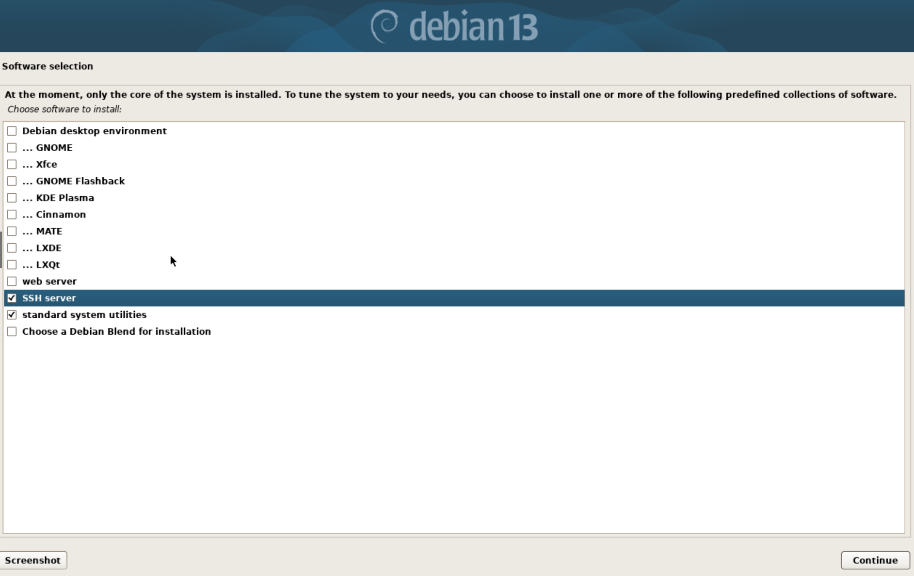

# Node Setup

A managed node is a Linux machine that VantaMCPd reaches over SSH. It does not need Node.js, npm, the
VantaMCPd repository, or an MCP client. Prepare the operating system, network, and login account once;
the Vanta host handles enrollment and installs the remaining baseline packages remotely.

## Recommended Platform

| Item | Recommendation |
| --- | --- |
| Operating system | Debian 12 (bookworm) or 13 (trixie), installed without a desktop, or a current Debian-based Armbian CLI image |
| Service and package tools | `systemd`, `apt`, and `dpkg` |
| Architecture | `amd64`, `arm64`, or `armhf`; individual modules declare which they support |
| Machine | Physical hardware or a virtual machine; both are enrolled identically |
| Network | Wired Ethernet or bridged virtual networking, TCP port 22 reachable from the Vanta host, and a stable address |
| Account | A normal login user that can run `sudo` |
| Time | NTP synchronization enabled for reliable apt and TLS operations |

Ubuntu may work when it provides the same administration tools, but Debian and Debian-based Armbian are
the validated node platforms. Module-specific CPU, memory, disk, command, and accelerator requirements
are checked before installation.

## Install the Operating System

Use the path that matches the machine. Both end at the same place: a headless Debian system with SSH
running and a sudo-capable login account.

### Debian ISO (x86-64 or arm64 machines and virtual machines)

Download the **netinst** image for the machine's architecture from
[debian.org](https://www.debian.org/distrib/). For a virtual machine, give it at least 2 cores, 2 GB of
RAM, and a 20 GB disk, and attach the network adapter in **bridged** mode so the Vanta host can reach
port 22 directly and the address stays stable.

The installer defaults are fine except for three screens:

1. **Hostname** — set it to the inventory node name, for example `worker-a`. The domain may be left
   blank. Setting it here means you do not need `hostnamectl` afterwards.

2. **Root password** — **leave it empty**. Debian then disables the root account, installs `sudo`, and
   adds the first user you create to the `sudo` group, which is exactly what enrollment expects. If you
   set a root password instead, that user is *not* given sudo and you must fix it after first boot:

   ```bash
   su -
   apt-get update && apt-get install -y sudo
   /usr/sbin/usermod -aG sudo <user>
   exit
   ```

   Log out and back in for the new group to apply.

3. **Software selection** — clear every desktop environment and keep only **SSH server** and
   **standard system utilities**. A managed node needs no graphical environment, and leaving one out
   keeps the disk and memory footprint small.

   

When the installer finishes, detach the ISO so the machine boots from its disk.

### Armbian image (single-board computers)

Flash a current Debian-based CLI image for the exact board, complete its first-boot account setup, and
apply normal OS updates. Set a recognizable hostname, matching the inventory node name:

```bash
sudo hostnamectl set-hostname worker-a
```

## Verify Before Enrolling

1. Give the node a stable address, preferably with a DHCP reservation on the router.
2. Confirm SSH, sudo, and time synchronization on the node itself:

   ```bash
   sudo apt-get update
   sudo apt-get install -y openssh-server sudo
   sudo systemctl enable --now ssh
   sudo timedatectl set-ntp true
   id -nG
   hostname -I
   ```

   The `id -nG` output must list `sudo` for the login account; log out and back in after any group
   change. `hostname -I` prints the address to record in the inventory. On a Debian ISO install that
   selected the SSH server task, the first two commands simply report that nothing is missing.
3. From the Vanta host, confirm that the account is reachable:

   ```bash
   ssh <user>@<node-address>
   ```

Extra disks for swap or shared storage may be attached before discovery, but do not need to be
partitioned or formatted manually. VantaMCPd can classify and prepare them after enrollment.

> **Virtual machines:** attach extra disks as SATA or NVMe rather than virtio if the node will take a
> `storage` role or host swap. The destructive-device guard accepts `/dev/sd*` and `/dev/nvme*` only, so
> it refuses virtio disks that appear as `/dev/vda`.

## GPU Nodes (NVIDIA CUDA)

A GPU node is enrolled exactly like every other node. Once it is in the inventory, one tool call
**promotes** it: VantaMCPd installs the NVIDIA driver, a container runtime, and the NVIDIA Container
Toolkit, then exposes the card to containers as a CDI device.

### How It Works

| Aspect | Design |
| --- | --- |
| Host footprint | Driver and container toolkit only. The CUDA toolkit, Python, and model weights live in each module's container image, so the host stays a plain managed node |
| Driver | `nvidia-open` — the open kernel modules, which cover Turing and newer — from NVIDIA's CUDA repository for Debian 12 or 13 on `amd64` or `arm64`. Older cards need the `proprietary` option (`cuda-drivers`) |
| Kernel module | Built locally by DKMS against the running kernel. The headers meta-package is installed, so a kernel upgrade rebuilds it |
| Container access | The toolkit generates a CDI spec and containers request `nvidia.com/gpu=all`, so two modules can carry different CUDA, PyTorch, and Python versions without colliding on the host |
| Driver and toolkit | Versioned independently. A node needs only the driver; an image's CUDA runtime must not exceed what `nvidia-smi` reports |
| Repository scope | NVIDIA's repository also ships packages Debian maintains, `dkms` among them. An apt pin keeps it to the driver stack, so a later `apt upgrade` cannot quietly move system packages onto vendor builds |
| Promotion | A durable job runs a staged root-owned script (`/var/lib/vantamcpd/gpu-setup.sh`) and records a receipt (`/var/lib/vantamcpd/gpu.json`). Every step is idempotent, so re-running is also how to regenerate the CDI spec after a driver upgrade |
| Safeguards | An explicit single target and `confirm: true`; readiness is re-checked on the node before anything is installed; the apt sources file is backed up before `contrib` is enabled; the driver is marked manually installed so `apt autoremove` cannot remove it |

### Before You Start

| Item | Requirement |
| --- | --- |
| Node | Debian 12 or 13 on `amd64` or `arm64`, enrolled and reachable |
| Disk | Roughly 8 GB free on `/` for the driver and DKMS build, plus room for container images |
| Secure Boot | Off, unless a MOK is enrolled: DKMS-built modules are unsigned and otherwise compile but never load |
| Passthrough (VMs) | Pass **both** functions of the card, VGA and audio, through `vfio-pci` with IOMMU enabled, and leave the VM console on the emulated display so the guest never drives the card |

### 1. Enroll It Like Any Other Node

Follow [Install the Operating System](#install-the-operating-system), [Verify Before
Enrolling](#verify-before-enrolling), [Inventory Values](#inventory-values), and [Next
Steps](#next-steps) unchanged, giving the node the `gpu` role modifier the way a storage node takes
`+storage`:

```json
{ "name": "cluster-gpu", "host": "10.0.0.16", "role": "worker+gpu", "tags": ["amd64", "vm"] }
```

```powershell
.\scripts\bootstrap.ps1     -Nodes cluster-gpu
.\scripts\prepare-nodes.ps1 -Nodes cluster-gpu
```

Every role token becomes a tag, so GPU work can then be targeted with `["gpu"]` rather than by node
name. Restart the MCP server, then confirm the node from the agent:

> Ping cluster-gpu and show its status.

It is a normal worker at this point, with no accelerator recorded: discovery finds GPUs through
`nvidia-smi`, which promotion installs.

### 2. Check GPU Readiness

> Check whether cluster-gpu is ready for CUDA workloads.

```text
cluster_gpu { action: "check", targets: ["cluster-gpu"] }
```

The probe is read-only and reads the PCI bus directly rather than asking the driver, so it works before
anything is installed — and it is how you confirm that passthrough reached the guest:

```jsonc
{
  "state": "ready-to-promote",
  "blockers": [],
  "warnings": ["kernel headers are missing; promotion installs them"],
  "system": {
    "os": "Debian GNU/Linux 13 (trixie)", "arch": "amd64", "virtualization": "kvm",
    "secureBoot": "disabled", "freeRootMb": 472148, "cudaRepo": "debian13"
  },
  "gpus": [{ "pci": "0000:00:10.0 0x24b0", "name": "... NVIDIA Corporation GA104GL [RTX A4000] ..." }]
}
```

An empty `gpus` list means the card never reached the guest — fix passthrough first; nothing else here
will work. Warnings never block: they describe something the promotion fixes itself, or a condition to
know about, such as Secure Boot being enabled.

| Reported `state` | What to do |
| --- | --- |
| `ready-to-promote` | Promote (step 3) |
| `not-eligible` | Fix what `blockers` lists, then check again |
| `reboot-required` | Reboot, then promote again |
| `enabled` | Prove it (step 4) |

Run this action again at any time — it doubles as the status view after promotion.

### 3. Promote the Node

> Promote cluster-gpu for GPU workloads.

```text
cluster_gpu { action: "enable", targets: ["cluster-gpu"], confirm: true }
```

| Option | Default | Effect |
| --- | --- | --- |
| `driver` | `open` | `nvidia-open`, the open kernel modules. `proprietary` installs `cuda-drivers` instead |
| `containerRuntime` | `podman` | Installs Podman and wires up CDI. `docker` configures an existing Docker install; `none` installs the driver only |

The call returns a `jobId` at once and the work continues on the node. Follow it with
`cluster_get_job` and `cluster_get_job_log`. The log is divided into phases, each reporting progress, so
the dashboard shows which step a long promotion is on:

```text
== preflight ==          GPU, architecture and release accepted; repository chosen
== apt components ==     contrib enabled (sources file backed up first)
== apt pinning ==        the CUDA repository is limited to the driver stack
== prerequisites ==      kernel headers, dkms, curl, ca-certificates, gnupg
== cuda repository ==    cuda-keyring installed, NVIDIA repository fetched
== driver ==             driver package installed and marked manual
== driver load ==        nouveau removed, nvidia loaded, persistence enabled
== container runtime ==  the container runtime and the NVIDIA Container Toolkit
== device injection ==   /etc/cdi/nvidia.yaml generated
== receipt ==            /var/lib/vantamcpd/gpu.json written
== summary ==            COMPLETE or INCOMPLETE
```

The driver phase is the long one: it downloads the driver and builds the kernel module with DKMS, which
takes a few minutes on a small node and prints nothing of its own while it compiles.

**How to tell it worked**, in order of authority:

1. The job reaches `status: "succeeded"` and its log ends with `COMPLETE: driver <version> is loaded and
   the node can run CUDA containers.`
2. `cluster_gpu { action: "check" }` reports `state: "enabled"`, with a `driver.version` and
   `container.cdiDevices` listing `nvidia.com/gpu=all`.
3. The hardware inventory lists the card as an accelerator — refreshed automatically when the job
   succeeds, which is what makes GPU modules evaluate as `compatible` rather than `unknown`.

**If the log ends with INCOMPLETE**, the driver installed but its kernel module could not be loaded in
place, usually because `nouveau` was still bound to the card. Reboot and promote again; the second run
skips everything already done and finishes the device injection:

```text
cluster_power { action: "reboot", targets: ["cluster-gpu"], confirm: true }
cluster_gpu   { action: "enable", targets: ["cluster-gpu"], confirm: true }
```

### 4. Prove It End to End

> Run the GPU smoke test on cluster-gpu.

```text
cluster_gpu { action: "test", targets: ["cluster-gpu"] }
```

This is the check that matters: a container, not the host, has to reach the card. The toolkit injects
the host driver libraries and the `nvidia-smi` binary itself, so a plain `debian:13` image proves the
whole path — passthrough, driver, CDI, runtime — without pulling a multi-gigabyte CUDA image.

```text
== host ==
GPU 0: NVIDIA RTX A4000 (UUID: GPU-eba9e040-...)

== podman container ==
+-----------------------------------------------------------------------------------------+
| NVIDIA-SMI 615.71.09              KMD Version: 615.71.09     CUDA UMD Version: 13.4      |
|   0  NVIDIA RTX A4000               On  |   00000000:00:10.0 Off |                  Off |
| 41%   37C    P8              7W /  140W |       1MiB /  16376MiB |      0%      Default |
+-----------------------------------------------------------------------------------------+
|  No running processes found                                                               |
+-----------------------------------------------------------------------------------------+

== resident compute processes ==
pid, process_name, used_gpu_memory [MiB]
```

**How to tell it worked:** the same card appears in *both* blocks. The host block alone only proves the
driver loaded; the container block proves a module will be able to use it. An empty process list is
expected on an idle node.

Pass `image` to repeat the test against a real module image — a CUDA or PyTorch image also proves its
own runtime works against this driver, which the base image deliberately does not cover.

### Running Several Models at Once

| Concern | Practice |
| --- | --- |
| VRAM | The card's memory is the real limit and cannot be oversubscribed. Size each model's resident footprint, cap it per container, and leave headroom for activations and fragmentation |
| Scheduling | Contexts from separate containers coexist and time-slice. MIG exists only on datacenter cards; elsewhere there is no hardware partitioning, so latency under contention rises |
| Concurrent kernels | MPS (`nvidia-cuda-mps-control -d`) lets kernels from different processes overlap and caps threads and memory per client, but needs a shared daemon and IPC directory across containers. Start without it |
| Observation | `cluster_gpu { action: "test" }` lists the resident compute processes; `nvidia-smi dmon` shows utilization over time |

### Pitfalls

| Symptom | Cause and check |
| --- | --- |
| Promotion log ends with INCOMPLETE | The module could not load in place. Reboot, then run `enable` again |
| `nvidia-smi` reports no devices after a kernel upgrade | DKMS did not rebuild. The readiness check reports the headers and DKMS state |
| Driver builds but never loads | Secure Boot rejecting an unsigned module; the readiness check warns about this before promotion |
| A container stops seeing the GPU after a driver upgrade | The CDI spec pins driver library paths. Re-run `enable` to regenerate it |
| A container loses the GPU after `systemctl daemon-reload` | Known interaction between systemd cgroup drivers and the container toolkit; restart the container |
| A container image fails with a CUDA version error | Its CUDA runtime is newer than the host driver supports. Compare it against the version in the readiness check |

## Inventory Values

Record these values before editing `cluster.config.local.json`:

| Value | Example | Inventory field |
| --- | --- | --- |
| Node name | `worker-a` | `nodes[].name` |
| Stable IP address or hostname | `192.0.2.11` | `nodes[].host` |
| Login user | `configure` | `defaults.user` or `nodes[].user` |
| Role | `worker`, `worker+storage`, or `worker+gpu` | `nodes[].role` |
| Tags, for targeting a subset | `["amd64", "vm"]` | `nodes[].tags` |
| Storage device, when applicable | `/dev/sda1` | `nodes[].storage.device` |

Hardware facts such as CPU model, core count, memory, and disks are discovered automatically on first
connection, so they are not recorded by hand.

## Next Steps

Add the node to the [inventory](Installation.md#2-create-and-edit-the-inventory), then enroll and
prepare it. When joining a node to a cluster that is already running, the single-node flags keep the
existing nodes untouched:

```powershell
# Windows Vanta host
.\scripts\bootstrap.ps1     -Nodes worker-a     # SSH key + passwordless sudo, prompts for passwords once
.\scripts\prepare-nodes.ps1 -Nodes worker-a     # baseline packages
```

On Linux, follow [Linux node enrollment](HostSetup.md#linux-node-enrollment) and
[prepare managed nodes](HostSetup.md#prepare-managed-nodes) for the same two steps.

Then:

1. Run `npm run discover` to record the node's hardware in the inventory. The Windows `bootstrap.ps1`
   does this automatically; add `-- --assign` if a disk's purpose is ambiguous.
2. **Restart the VantaMCPd MCP server.** It reads the inventory once at start-up, so a node added while
   it is running stays invisible until then.
3. Confirm the node from the agent:

   > Ping the cluster nodes and show the status of worker-a.

4. Install any modules it should run. Compatibility is evaluated per node, so a node of a different
   architecture is checked against each module's declared support before anything is installed:

   > Check whether text-tools is compatible with worker-a, then install it there.

The Vanta host stores the dedicated SSH key and inventory. Passwords are used only during enrollment and
are entered directly into SSH and sudo prompts; VantaMCPd and the agent do not receive them.
