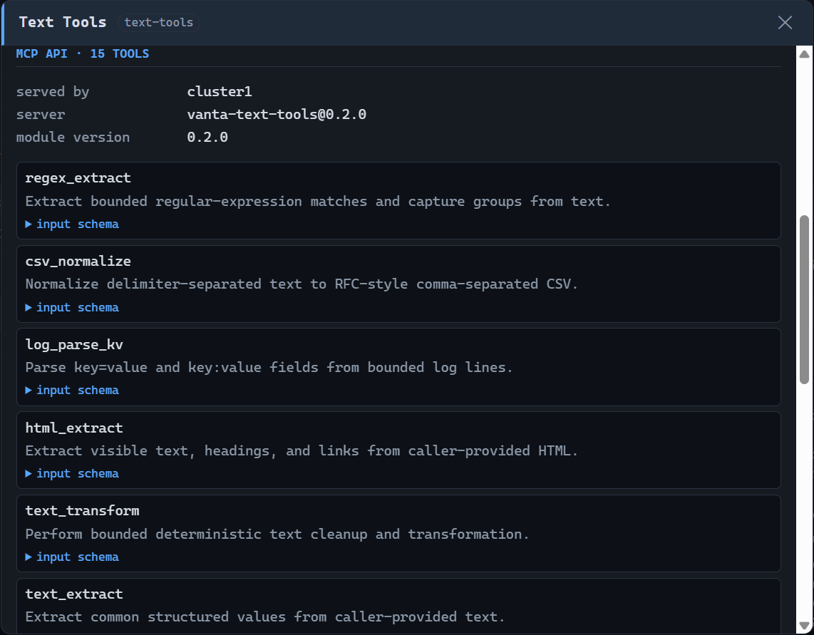
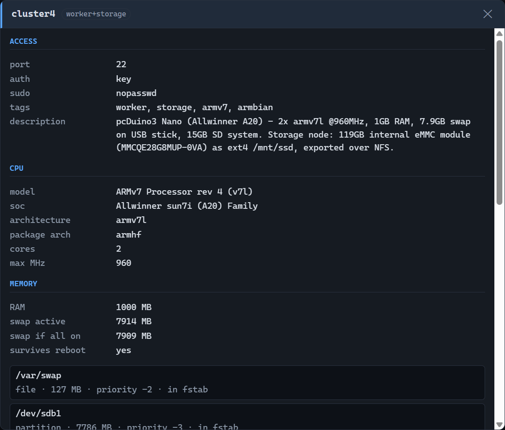

# VantaMCPd reference

Detailed reference for the data model, storage and swap workflows, the security model and the
configuration file. For installation and day-to-day use, start at [README.md](../README.md).

| Section | What it covers |
| --- | --- |
| [Hardware inventory](#hardware-inventory) | What the daemon records about each node, and how disk roles are decided |
| [Swap](#swap) | `cluster_swap` actions and their guard rails |
| [Attached storage](#attached-storage) | Formatting the external disk and sharing it over NFS |
| [Operational tools](#operational-tools) | Parameters and examples for packages, services, logs, files, commands and power |
| [Monitoring](#monitoring) | The audit log, the dashboard and its HTTP API |
| [Security model](#security-model) | Auth, injection defences, the destructive-command guard |
| [Configuration reference](#configuration-reference) | Every key in the inventory file |
| [Troubleshooting](#troubleshooting) | Symptom → fix |
| [MCP clients](Clients.md) | Host/client model and setup for VS Code, Claude Code, Hermes, OpenClaw, and generic clients |

---

## Hardware inventory

Each node carries a `hardware` block that the daemon fills in itself — you never write it by hand:

| Group | Fields |
| --- | --- |
| `cpu` | `model`, `soc`, `arch` (`uname -m`), `packageArch` (`dpkg --print-architecture`), `cores`, `maxMhz` |
| `memory` | `totalMb`, `swapTotalMb`, `swapDevices[]`, `swapPotentialMb`, `swapPersistent` |
| `disks[]` | `name`, `sizeGb`, `model`, `rotational`, `removable`, `role`, `roleSource`, `partitions[]` |
| `filesystems[]` | `mountpoint`, `device`, `fsType`, `sizeGb` |
| `os` | `name`, `id`, `version`, `kernel`, `armbian`, `board`, `boardModel` |
| — | `machineId`, `discoveredAt` |

Only stable facts live here. Anything volatile — free memory, disk usage, temperature, load — stays in
`cluster_status`.

### Disk roles

Every whole disk is classified so later work knows what it may touch:

| Role | How it is detected |
| --- | --- |
| `system` | Hosts `/` (or is the parent of the root device) |
| `swap` | Has a partition with a `swap` filesystem |
| `storage` | Matches the node's `storage.device`, or has a partition mounted at `storage.mountpoint` |
| `data` | Has filesystems but matches none of the above — needs a human decision |
| `unassigned` | No filesystems at all |

Detection is authoritative for `system` and `swap`. For anything that lands on `data` or `unassigned`,
`npm run discover -- --assign` prompts per disk and stores your answer in a node-level `diskRoles` map.
The Windows bootstrap helper runs this path automatically:

```jsonc
{ "name": "cluster4", "diskRoles": { "sdc": "storage" } }
```

`diskRoles` is yours, not the daemon's: it overrides detection and is never overwritten by a refresh.
Disks resolved that way are reported with `"roleSource": "configured"`.

### Swap facts

`memory.swapDevices[]` lists every entry in `/proc/swaps` with its size, priority and — importantly —
whether an `/etc/fstab` entry exists for it. `swapPersistent: false` means some active swap is a one-off
`swapon` that disappears on the next reboot; fix it with `cluster_swap { action: "persist" }`.
`swapPotentialMb` is what the node would have if every swap-formatted partition were enabled.

### When it is populated

1. During Windows helper enrollment, right after key-based login works for a node (skipped with `-Verify`).
  Linux hosts can run `npm run discover -- --assign` after enrollment.
2. The daemon on startup, for any node that has no `hardware` block yet — in the background, so start-up
   is not delayed. Disable with `"autoDiscoverHardware": false` in `defaults`.
3. On demand: `cluster_hardware { refresh: true }`, or `npm run discover` (optionally
   `npm run discover -- --assign cluster4`).

Refreshing rewrites the block in the inventory file, preserving every other key. Re-run it after adding
a disk, resizing the SD card or upgrading the OS.

---

## Swap

These boards have 1GB of RAM, so swap on an external USB stick is worth having — and SD-card swap is
slow and wears the card, so a dedicated stick is the right place for it.

```text
cluster_swap { action: "status" }                                         # safe, read-only
cluster_swap { action: "persist" }                                        # fstab entries for active swap
cluster_swap { action: "create", targets: ["cluster4"], device: "/dev/sdb",
               confirmDevice: "/dev/sdb" }                                # WIPES THE WHOLE DISK
cluster_swap { action: "enable", targets: ["cluster4"], device: "/dev/sdb1",
               confirmDevice: "/dev/sdb1" }                               # wipes that partition only
cluster_swap { action: "disable", device: "/dev/sdb1", removeFstab: true }
```

Guard rails:

- `create` and `enable` refuse unless `confirmDevice` exactly equals `device`, and only ever act on one
  node per call.
- The disk carrying `/` is resolved on the node and rejected, as is anything under `/dev/mmcblk*`.
- A disk that is (part of) the node's configured `storage.device` is rejected.
- Disks with a mounted partition are rejected.
- fstab entries use `sw,nofail`, so a missing USB stick can never block boot. `/etc/fstab` is backed up
  before every modification.
- `create` uses `sfdisk` when present and falls back to `parted` — Debian 12 ships `sfdisk`/`fdisk` in a
  separate `fdisk` package, so `parted` is the one that is actually installed by `prepare-nodes.ps1`.

---

## Attached storage

A node whose role includes `storage` carries a `storage` block describing an external disk. Recommended
sequence for a fresh disk (run each step, read the output before the next):

```text
cluster_storage { action: "inspect" }                              # confirm the device path
cluster_storage { action: "format", confirmDevice: "/dev/sda1" }   # DESTROYS DATA - only if empty
cluster_storage { action: "mount" }                                # UUID fstab entry, noatime,nofail
cluster_storage { action: "export_nfs" }                           # nfs-kernel-server + /etc/exports
cluster_storage { action: "mount_clients" }                        # other nodes mount the export
cluster_storage { action: "status" }
```

Guard rails:

- `format` refuses unless `confirmDevice` exactly equals the device path.
- Any `/dev/mmcblk*`, `/dev/ram*` or `/dev/loop*` target is rejected outright (that is the boot SD card).
- fstab uses `nofail` + `x-systemd.device-timeout=30`, so a missing SSD can never block boot.
- `/etc/fstab` and `/etc/exports` are backed up before every modification.
- NFS exports use `rw,sync,no_subtree_check` — **not** `no_root_squash`.

Once mounted, good uses for external storage on 1GB nodes: a shared `apt` cache, container/image
storage, build artefacts, logs, and a swap file (SD-card swap is slow and wears the card).

---

## Operational tools

Every tool below accepts `targets` (node names, tags, omitted or `["all"]` for the whole cluster) and
`timeoutMs` (per node, milliseconds). Results are rendered per node with its host, exit status and
duration, so a partial failure is visible rather than hidden behind an aggregate.

### Packages — `cluster_packages`

| Parameter | Applies to | Meaning |
| --- | --- | --- |
| `action` | all | `update`, `upgrade`, `full_upgrade`, `install`, `reinstall`, `remove`, `purge`, `autoremove`, `clean`, `search`, `show`, `policy`, `list_installed`, `list_upgradable` |
| `packages` | `install`, `reinstall`, `remove`, `purge`, `show`, `policy` | Package names; each is validated and shell-quoted |
| `query` | `search`, `list_installed`, `list_upgradable` | Search term, or a case-insensitive filter over the listing |
| `dryRun` | install/remove/upgrade actions | Simulate with `apt-get -s` and change nothing |
| `updateFirst` | `install`, `reinstall`, `upgrade`, `full_upgrade` | Refresh the indexes first. Default true |

```text
cluster_packages { action: "list_upgradable" }                                   # read-only, no sudo
cluster_packages { action: "upgrade", dryRun: true }                             # preview first
cluster_packages { action: "install", targets: ["worker"], packages: ["htop","tmux"] }
cluster_packages { action: "clean" }                                             # frees SD-card space
```

The read-only actions (`search`, `show`, `policy`, `list_installed`, `list_upgradable`) run without
sudo. Every writing action goes through one canonical non-interactive invocation
([src/apt.ts](../src/apt.ts)): `DEBIAN_FRONTEND=noninteractive`, `NEEDRESTART_MODE=a`,
`-o Dpkg::Use-Pty=0`, `-o DPkg::Lock::Timeout=300`, `--force-confdef`/`--force-confold`, and stdin from
`/dev/null` so a child cannot consume the transported script. Defaults are generous because these nodes
are slow: 30 minutes for an upgrade, 15 for an install.

### Services — `cluster_services`

| Parameter | Meaning |
| --- | --- |
| `action` | `status`, `is_active`, `is_enabled`, `list`, `list_failed`, `show`, `start`, `stop`, `restart`, `reload`, `enable`, `disable`, `mask`, `unmask`, `daemon_reload`, `reset_failed` |
| `unit` | Unit name, e.g. `ssh`, `nfs-server`, `docker.service`. Required except for `list`, `list_failed`, `daemon_reload` and `reset_failed` |
| `pattern` | Glob filter for `action="list"`, e.g. `nfs*` |
| `now` | For `enable`/`disable`: also start/stop the unit immediately (`--now`) |
| `lines` | Journal lines appended to `status`. Default 20, max 200 |

```text
cluster_services { action: "list_failed" }
cluster_services { action: "status", targets: ["storage"], unit: "nfs-kernel-server" }
cluster_services { action: "disable", unit: "unattended-upgrades.timer", now: true }
```

Unit names are validated against a strict character set. The read-only actions (`status`, `is_active`,
`is_enabled`, `list`, `list_failed`, `show`) run without sudo; the rest use it.

### Logs — `cluster_logs`

| Parameter | Meaning |
| --- | --- |
| `source` | `journal` (default), `dmesg`, or `file` |
| `unit` | Restrict the journal to one unit |
| `path` | Absolute log file path; required when `source="file"` |
| `lines` | Trailing lines to return. Default 100, max 2000 |
| `since` | `journalctl --since` value, e.g. `1 hour ago`, `today`, `2026-09-12 08:00` |
| `priority` | Minimum journal priority: `emerg` … `debug` |
| `grep` | Case-insensitive regular expression filter |
| `boot` | `current` (default), `previous`, or `all` |
| `sudo` | Read as root. Default true, which is what full system logs need |

```text
cluster_logs { targets: ["cluster2"], unit: "ssh", priority: "err", lines: 50 }
cluster_logs { source: "dmesg", grep: "usb|mmc|I/O error" }
cluster_logs { source: "file", path: "/var/log/syslog", lines: 200 }
```

`since` is restricted to a safe character set and `grep` may not contain newlines, so neither can escape
into the command line.

### Files — `cluster_list_dir`, `cluster_read_file`, `cluster_write_file`, `cluster_upload`, `cluster_download`

| Tool | Key parameters | Notes |
| --- | --- | --- |
| `cluster_list_dir` | `path`, `all`, `sudo`, `recursiveDepth` | `ls -lAh` by default; `recursiveDepth` (0-4) switches to a capped `find` |
| `cluster_read_file` | `node`, `path`, `sudo`, `maxBytes` | Single node, 1 MB cap, transported base64 so binary content is safe |
| `cluster_write_file` | `path`, `content`, `sudo`, `mode`, `owner`, `backup`, `createDirs` | Writes via a temporary file, reports the resulting sha256 alongside the expected one |
| `cluster_upload` | `localPath`, `remotePath`, `mode`, `timeoutMs` | SFTP to every target; the remote path must be writable by the SSH user |
| `cluster_download` | `node`, `remotePath`, `localPath`, `timeoutMs` | SFTP from one node to the Vanta host |

```text
cluster_list_dir { path: "/etc/systemd/system", recursiveDepth: 2 }
cluster_read_file { node: "cluster4", path: "/etc/exports" }
cluster_write_file { path: "/etc/sysctl.d/60-vanta.conf", content: "vm.swappiness=10\n", sudo: true, mode: "644" }
cluster_download { node: "cluster4", remotePath: "/etc/exports", localPath: "~/backup/exports" }
```

Remote paths must be absolute and free of newlines. Local paths expand `~`. `cluster_write_file` keeps a
timestamped `.bak-<timestamp>` copy unless `backup: false`, and `mode`/`owner` are pattern-checked before
they reach `chmod`/`chown`. SFTP transfers are bounded by `timeoutMs` (default 10 minutes), so a stalled
network cannot hang the call. To land a file in a root-owned location, upload to `/tmp` and move it with
`cluster_run { sudo: true }`.

### Commands — `cluster_run`, `cluster_check_command`

| Parameter | Meaning |
| --- | --- |
| `command` | Bash command or multi-line script; transported base64, so quoting and pipes are safe |
| `sudo`, `cwd`, `env` | Run as root, set the working directory, add environment variables |
| `confirm` | Acknowledge a command the destructive-command guard flagged |

```text
cluster_check_command { command: "rm -rf /var/cache/foo" }   # policy dry run, touches nothing
cluster_run { command: "df -hPT", targets: ["worker"] }
cluster_run { command: "rm -rf /var/cache/foo", confirm: true }
```

`cluster_check_command` answers whether the guard considers a command destructive without running it.
See [Security model](#security-model) for the rule set.

### Power — `cluster_power`

| Parameter | Meaning |
| --- | --- |
| `action` | `reboot` or `poweroff` |
| `confirm` | Must be `true`; the schema rejects anything else |
| `delayMinutes` | 0-60. Default 0, meaning now |

```text
cluster_power { action: "reboot", targets: ["cluster2"], confirm: true }
```

`poweroff` on a headless SBC needs physical access to undo, so confirmation is part of the schema rather
than a runtime check: a call without it never reaches a node.

---

## Monitoring

Every SSH interaction is recorded at the one place they all funnel through (`SshPool.exec`), so nothing
a tool does can bypass it.


The module filter is populated from observed interactions. Module-specific operations use their module
ID, while built-in and generic operations use `core`. The **copy log path** button at the right of the
**Interactions** heading copies the current day's persisted JSONL `file://` URL without asking the
browser to navigate to a local resource.

### Module detail

The **Modules** table summarizes active installations using the dashboard's cached inventory. Clicking
a row connects to one reachable installation and shows the module's live MCP server identity, advertised
tools, descriptions, and input schemas.



### Durable jobs

The **Jobs** table reads the job manager's refreshed cache and shows active and recent trusted
background work: operation/module, target, status, phase, bounded progress, duration, and heartbeat
freshness. It does not run an SSH scan per browser request and deliberately has no mutation controls.
Use `cluster_cancel_job` with `confirm: true` to stop a running job.

### Node detail

Clicking a row in **Nodes** opens that node's configuration and recorded hardware — access settings,
CPU, detected GPUs with VRAM and CUDA/ROCm capability, memory and swap devices, the configured storage block, disks with their roles and partitions,
mounted filesystems and OS.



The payload behind it is built as an **allow-list**, so a field added to the inventory later cannot leak
by accident. Deliberately excluded: the node's address, `privateKeyPath` (it can contain the local host
username) and the SSH user. Every remaining value is then passed through an IPv4 scrub, because
addresses arrive from places an allow-list cannot anticipate — NFS mount sources in `filesystems`,
export CIDRs, and hand-written `description` text. They render as `x.x.x.x`. Dotted groups whose parts
are not valid octets, such as a quad-dotted kernel or package version, are left alone.

This makes the node-detail view safe to screenshot. The **Interactions** list retains operational detail:
commands and MCP input parameters are stored after redaction and clipping, but can still contain
non-secret data that is private to the cluster.

### What a record contains

| Field | Meaning |
| --- | --- |
| `seq`, `ts` | Monotonic id and ISO timestamp |
| `node`, `host` | Which node it went to |
| `module` | Installed module responsible for the interaction, or `core` for built-in operations |
| `tool` | The MCP tool that caused it, tracked through an `AsyncLocalStorage` context |
| `parameters` | Validated MCP input as compact JSON, redacted and clipped to 1000 chars |
| `kind` | `exec` or `sftp` |
| `command` | The command as issued, redacted and clipped to 2000 chars |
| `sudo` | Whether it ran through `sudo` |
| `ok`, `code`, `durationMs` | Outcome |
| `bytesOut`, `bytesErr` | Response sizes |
| `truncated`, `timedOut`, `error` | Failure detail |
| `preview` | Short stdout/stderr excerpt — only when `logOutput` is on |

### Redaction

Secrets normally travel on stdin rather than the command line, but a caller can still paste one into a
heredoc or an env assignment, so command text is scrubbed before it is stored or served:
`--password X`, `password:`/`secret:`/`token:`/`api_key:` assignments, `Authorization: Bearer|Basic`
headers, and inline `PRIVATE KEY` blocks. Structured MCP parameters also replace values whose key looks
like a password, secret, token, API key, authorization value or private key with `***`. This is a safety net, not a guarantee — keep
`logOutput: false` (the default) unless you need the output previews.

### Log format

One JSON object per line (JSONL), appended as each interaction completes, in
`~/.vanta/logs/vanta-<YYYY-MM-DD>.jsonl`. Lines are self-contained, so `tail -f`, `grep` and
`ConvertFrom-Json` all work without a parser.

```json
{"node":"cluster1","host":"10.0.0.11","kind":"exec","command":"install text-tools","sudo":true,"ok":true,"code":0,"durationMs":36,"bytesOut":0,"bytesErr":0,"module":"text-tools","tool":"cluster_install_module","parameters":"{\"moduleId\":\"text-tools\",\"targets\":[\"cluster1\"],\"confirm\":true}","seq":1,"ts":"2026-09-13T00:10:55.609Z"}
```

| Field | Type | Meaning |
| --- | --- | --- |
| `seq` | number | Monotonic counter, restarts at 1 with the daemon |
| `ts` | string | ISO-8601 UTC completion time |
| `node` | string | Node name from the inventory |
| `host` | string | Node address — present in the file, never sent to the dashboard |
| `kind` | string | `exec` or `sftp` |
| `module` | string | Module ID, or `core` for built-in and generic operations |
| `tool` | string? | MCP tool that caused it, via an `AsyncLocalStorage` context |
| `parameters` | string? | Validated MCP input as redacted compact JSON, clipped to 1000 chars |
| `command` | string? | The command as issued, redacted and clipped to 2000 chars |
| `sudo` | boolean | Whether it ran through `sudo` |
| `ok` | boolean | Exit code 0, not timed out, connection succeeded |
| `code` | number\|null | Exit code; `null` when the connection itself failed |
| `durationMs` | number | Round-trip time |
| `bytesOut` / `bytesErr` | number | stdout / stderr sizes |
| `truncated` | boolean? | Output hit `security.maxOutputBytes` |
| `timedOut` | boolean? | Command exceeded its timeout |
| `error` | string? | Connection or transport failure |
| `preview` | string? | Short output excerpt — only when `logOutput` is on |

Optional fields are omitted entirely rather than written as `null`, so a reader must treat absence as
"did not apply".

### Retention

The last `maxEvents` (default 5000) are held in memory for the dashboard. On disk, the directory is kept
under `maxLogMb` (default 64 MB) by deleting whole days, oldest first, at start-up and at each date
rollover. At roughly 250 bytes per event that is on the order of a quarter of a million interactions.

The file being written is never deleted, so a single extraordinarily busy day can still exceed the
budget; the daemon reports that on stderr instead of truncating your newest data.

Because it is JSONL, after-the-fact analysis needs no tooling:

```powershell
Get-Content ~\.vanta\logs\vanta-2026-09-13.jsonl | ConvertFrom-Json |
  Where-Object { -not $_.ok } | Select-Object ts, node, tool, code, command
```

### Telling the agent about it

The daemon advertises the dashboard in two places, so an MCP-capable agent can point you at it unprompted:

- The MCP server **instructions** carry the URL, so the agent knows about it from the first message.
- `cluster_list_nodes` returns a `monitoring` block reporting the **live** state, not just the intent:

```jsonc
"monitoring": {
  "logging": true,
  "dashboard": "http://127.0.0.1:7420",   // absent when it is not serving
  "running": true,
  "logDir": "~/.vanta/logs",
  "detail": "Live view of every SSH interaction: ..."
}
```

`running` is set from the socket's `listening` event rather than from configuration, so a dashboard that
lost a port race reports `running: false` with a `detail` explaining where to look — the agent will not
send you to a URL that is not answering.

### Dashboard assets

The page is four ordinary files under `src/web/`, not strings embedded in TypeScript:

| File | Serves as |
| --- | --- |
| `index.html` | `/` |
| `style.css` | `/style.css` |
| `app.js` | `/app.js` |
| `icon.svg` | `/icon.svg` and the favicon |

They are read once at start-up from `dist/web/`, so requests do no file I/O. `npm run build` runs
`tsc` **and** `scripts/copy-assets.mjs`, which copies `src/web/` into `dist/web/` — `tsc` alone only emits
`.js`, so a bare `tsc` leaves the dashboard without its assets. It fails loudly in that case, telling you
to run the build.

Serving the script and stylesheet as separate resources is what allows the Content-Security-Policy to be
`script-src 'self'; style-src 'self'` with **no `unsafe-inline`** — inline code is refused outright.

### HTTP API

Bound to `127.0.0.1` only, with no authentication — loopback *is* the boundary. Requests carrying a
non-localhost `Origin` are rejected with 403 so a page on another site cannot read the log through your
browser, and only `GET` is accepted.

| Endpoint | Purpose |
| --- | --- |
| `GET /` | The dashboard (single self-contained page, no external fetches) |
| `GET /api/events` | `?node=` `?status=` `?q=` `?since=` `?limit=` (default 200, max 2000) |
| `GET /api/summary` | Every configured node with activity and cached installed-module counts; addresses omitted |
| `GET /api/jobs` | Cached active and recent durable jobs; read-only and no remote scan per request |
| `GET /api/node` | `?name=` — configuration, module inventory and hardware, address-scrubbed |
| `GET /api/stream` | Server-sent events, one JSON event per frame — what drives tail-following |

### Configuration

```jsonc
"monitoring": {
  "enabled": true,      // record interactions at all
  "web": true,          // serve the dashboard
  "port": 7420,
  "logDir": "~/.vanta/logs",
  "maxEvents": 5000,    // in-memory window the dashboard reads
  "maxLogMb": 64,       // size budget for logDir; oldest days pruned first
  "logOutput": false    // include stdout/stderr previews - off by default
}
```

Set `"enabled": false` to turn the whole thing off, or `"web": false` to keep the file log without the
HTTP server.

Durable jobs have a separate top-level configuration block:

```jsonc
"jobs": {
  "retentionDays": 7,       // retain terminal state/logs before cleanup
  "pollIntervalMs": 10000,  // refresh remote state for MCP and dashboard views
  "cancelGraceMs": 5000,    // graceful stop window before process-group termination
  "maxLogBytes": 1000000    // upper bound accepted by job-log reads
}
```

---

## Security model

- **Key-only SSH auth.** An ed25519 key dedicated to this cluster; password auth is only a fallback via
  `VANTA_SSH_PASSWORD`.
- **Host-key TOFU.** Fingerprints are pinned in `~/.vanta/known_hosts.json` on first connect; a later
  mismatch aborts the connection instead of silently trusting it.
- **No shell injection.** Every command is base64-encoded and piped into `bash -s`, so user/agent input
  never lands unquoted in a shell string. Package names, unit names, paths, devices, CIDRs and mount
  options are additionally validated against strict allow-list regexes.
- **Destructive-command guard.** `mkfs`, `wipefs`, partitioning, `rm -rf`, `dd of=/dev/*`, `shutdown`,
  `reboot`, firewall flushes, `curl … | sh`, removal of `systemd`/`openssh-server`, fork bombs and edits
  to `/etc/sudoers`, `/etc/shadow`, `/etc/fstab` all require `confirm: true`. Extend the list with
  `security.extraDenyPatterns` in your inventory.
- **Bounded output.** Responses are capped (`security.maxOutputBytes`, default 200KB) and per-node
  commands time out (default 120s).
- **No real hosts in the repo.** `cluster.config.local.json` and `cluster.config.json` are gitignored;
  only the template is committed.
- **NOPASSWD sudo trade-off.** Anyone who obtains the private key gets root on every node. Keep the key
  on an encrypted disk, never commit it, and treat this cluster as a lab environment. To tighten this,
  replace `/etc/sudoers.d/99-vanta` with a command allow-list and set `"sudo": "password"` plus
  `VANTA_SUDO_PASSWORD` in `.env`.
- **Dependency install scripts.** npm 11 records reviewed install scripts in `allowScripts`. Two entries
  are approved, pinned to the exact reviewed version:

  | Entry | Script | Why |
  | --- | --- | --- |
  | `ssh2@1.17.0` | `node install.js` | Builds `sshcrypto.node`, the native AES-GCM / ChaCha-Poly ciphers |
  | `cpu-features@0.0.10` | `node-gyp rebuild` | Detects AES-NI so ssh2 can order ciphers by what the CPU accelerates |

  Both are already trusted at runtime — `ssh2` is what holds the root SSH sessions — and both are loaded
  inside `try {} catch {}`, so a failed build degrades to pure-JS crypto rather than breaking. Because the
  entries are pinned, bumping either package makes it pending again and forces a fresh review. To refuse
  them instead (pure-JS ciphers, no build toolchain needed):

  ```powershell
  npm deny-scripts ssh2 cpu-features
  ```

Nothing secret belongs in the inventory either — it only holds hosts, users and paths.

---

## Configuration reference

`cluster.config.local.json`, modelled on [cluster.config.example.json](../cluster.config.example.json):

```jsonc
{
  "defaults": {
    "user": "configure",
    "port": 22,
    "auth": "key",                  // or "password" (+ VANTA_SSH_PASSWORD)
    "privateKeyPath": "~/.ssh/vanta_cluster_ed25519",
    "sudo": "nopasswd",             // "password" (+ VANTA_SUDO_PASSWORD) | "none"
    "connectTimeoutMs": 15000,
    "commandTimeoutMs": 120000,
    "maxConcurrency": 4,
    "strictHostKeyChecking": true,
    "autoDiscoverHardware": true, // probe + record CPU/memory/disk/OS for unknown nodes on startup
    "nfsNetwork": "10.0.0.0/24"   // default CIDR for NFS exports when not set per-node
  },
  "security": {
    "allowArbitraryCommands": true,
    "requireConfirmForDangerous": true,
    "maxOutputBytes": 200000,
    "extraDenyPatterns": []
  },
  "monitoring": {
    "enabled": true,            // record every SSH interaction
    "web": true,                // serve the dashboard on 127.0.0.1 (loopback only, always)
    "port": 7420,
    "logDir": "~/.vanta/logs",
    "maxEvents": 5000,
    "maxLogMb": 64,
    "logOutput": false          // stdout/stderr previews - off by default
  },
  "modules": {
    "corpus-search": {
      "installOptions": {
        "profileId": "medium-arxiv-cs",
        "categories": ["cs.AI", "cs.LG", "cs.CL"]
      }
    }
  },
  "nodes": [
    { "name": "cluster1", "host": "10.0.0.11", "role": "worker", "tags": [] },
    { "name": "cluster2", "host": "10.0.0.12", "role": "worker+storage", "storage": { },
      "diskRoles": { "sdc": "storage" } }   // optional, overrides disk-role detection
    // a "hardware" block is added to each node automatically - see "Hardware inventory" above
  ]
}
```

Per-node keys override the defaults. `role` defaults to `worker`. The role and the `storage` block must
agree: a role containing `storage` without a block, and a block on a node whose role does not include
`storage`, are both rejected at load time — the storage tools select their node by that block, so a
mismatch would silently target the wrong machine.

`modules.<module-id>.installOptions` supplies persistent defaults for that module's manual and automatic
installs. Values are validated against the module manifest before SSH work, and options passed directly
to `cluster_install_module` take precedence. Editing them does not reconfigure an installed node; they
apply to the next install that runs. Corpus Search accepts `small-arxiv-cs`, `medium-arxiv-cs`,
or `large-arxiv-cs`; its optional `categories` list replaces the packaged topic list. See the
[Corpus Search quickstart](../modules/corpus-search/CorpusSearch.md#quickstart) for profile behavior and
installation verification.

Lookup order for the inventory: `VANTA_CONFIG` → `cluster.config.local.json` → `cluster.config.json`,
searched in the working directory and then next to the installed package. The shipped
`cluster.config.example.json` is never picked up implicitly.

The daemon reads configuration and the local module catalog once at startup. After editing module
defaults or updating module packages, run `npm run build` when source changed and restart the MCP server.

Environment variables (see [.env.example](../.env.example)): `VANTA_CONFIG`, `VANTA_ENV_FILE`,
`VANTA_KNOWN_HOSTS`, `VANTA_KEY_PASSPHRASE`, `VANTA_SSH_PASSWORD`, `VANTA_SUDO_PASSWORD`.

---

## Troubleshooting

| Symptom | Fix |
| --- | --- |
| `node`/`npm` not recognized | Install Node.js 20.11+; on Windows, `scripts/install-prereqs.ps1` can do this |
| `ssh not found` | Install an OpenSSH client; on Windows use Optional Features, on Debian/Ubuntu install `openssh-client` |
| `No cluster inventory found` | Create `cluster.config.local.json` from `cluster.config.example.json` and edit it |
| `Private key not found` | Complete the matching [host enrollment](HostSetup.md) path |
| Node reimaged / new node added | Update the inventory, then repeat enrollment and node preparation |
| `sudo: a password is required` | Repeat node enrollment, or set `"sudo": "password"` and provide `VANTA_SUDO_PASSWORD` securely |
| `Host key mismatch` | Node was reimaged? Remove its entry from `~/.vanta/known_hosts.json` |
| `Could not get lock /var/lib/dpkg/lock` | Unattended-upgrades is running; retry — apt calls already use `DPkg::Lock::Timeout=300` |
| `npm warn allow-scripts … not yet covered by allowScripts` | A dependency's install script needs review: `npm approve-scripts <pkg>` or `npm deny-scripts <pkg>` |
| `sfdisk: command not found` | Debian 12 ships it in the separate `fdisk` package; `cluster_swap` falls back to `parted` |
| Swap gone after a reboot | `cluster_swap { action: "persist" }` — the entry was never in `/etc/fstab` |
| Daemon not listed by the agent | Run `npm run build`, verify the absolute stdio paths, then restart/reprobe it in the client |
| Daemon says authentication failed after bootstrap | The daemon loaded the inventory at start-up; restart it |
| Dashboard not reachable | Check the daemon's stderr for `monitor dashboard: http://127.0.0.1:7420`; port in use → change `monitoring.port` |
| `~/.vanta/logs` growing | Capped by `monitoring.maxLogMb` (default 64MB); oldest days are pruned automatically |
| Dashboard loads but is unstyled / empty | Assets missing from `dist/web`; run `npm run build`, not bare `tsc` |
| `monitor web server error: ... EADDRINUSE` | Another instance already holds the port; stop it or change `monitoring.port` |
| apt upgrade times out | Pass a larger `timeoutMs`; these boards are slow |

---

## MCP Client Integration

VantaMCPd is a local stdio server. Any compatible client launches the same built entry point:

```
command: node
args:    ["<repo>/dist/index.js"]
env:     { "VANTA_CONFIG": "<repo>/cluster.config.local.json" }
```

Exact current setup for VS Code/Copilot, Claude Code, Hermes Agent, OpenClaw, and generic clients is in
[MCP client integration](Clients.md). Each stdio client launches its own process; use different
`monitoring.port` values if more than one process must run concurrently.
