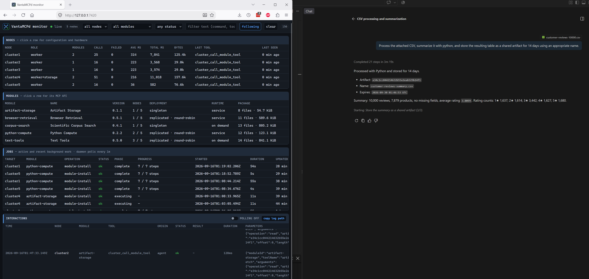

# Artifact Storage

`artifact-storage` is the cluster's shared, bounded file exchange. It stores immutable files on one
configured storage node and makes that directory available to opted-in compute modules through the
existing NFS mount. Agents transfer data through MCP using opaque IDs and bounded chunks; no tool
accepts a node filesystem path.



*A CSV summarized with `python-compute` and stored for 14 days as a shared artifact.*

The module is a singleton because one filesystem owns quota accounting, metadata, expiration, and
garbage collection. Its broker is a persistent systemd service with no TCP listener.

## Quickstart

1. Configure and mount storage before enabling artifacts. The selected node needs a `storage` block
	 with NFS enabled, and every consumer node must mount that export at the same mountpoint. Verify the
	 storage workflow first:

	 > Inspect the configured cluster storage, export it over NFS, mount it on clients, and show status.

2. Enable the store in `cluster.config.local.json`:

	 ```json
	 {
		 "artifacts": {
			 "enabled": true,
			 "storageNode": "storage-a"
		 }
	 }
	 ```

	 `storageNode` may be omitted only when exactly one configured node has a `storage` block. Restart
	 VantaMCPd after editing the inventory because configuration and the module catalog are loaded once
	 at startup.

3. Check placement and install on that exact storage node:

	 > Check whether artifact-storage is compatible with storage-a.

	 > Install artifact-storage on storage-a.

	 Installation requires confirmation and runs as a durable job. It creates the store at
	 `<storage.mountpoint>/vantamcpd/artifacts`, installs a locked service account, initializes the
	 protocol marker, starts the broker, and retains the store across module upgrades.

4. Follow the returned job ID until installation finishes, then verify the service and MCP surface:

	 > Show the artifact-storage installation job and service status on storage-a.

	 > List the tools provided by artifact-storage.

5. Exercise the complete path:

	 > Upload `hello artifact` as `hello.txt`, inspect it, download it, and verify its SHA-256.

## Configuration

The default policy is suitable for a small shared disk. Override values under
`modules.artifact-storage.installOptions`; changes apply on the next installation or update, not to an
already running broker.

```json
{
	"artifacts": {
		"enabled": true,
		"storageNode": "storage-a"
	},
	"modules": {
		"artifact-storage": {
			"installOptions": {
				"totalQuotaMb": 10240,
				"producerQuotaMb": 2048,
				"maxArtifactMb": 512,
				"retentionDays": 7,
				"maxRetentionDays": 90,
				"gcIntervalMinutes": 15,
				"freeReserveMb": 512
			}
		}
	}
}
```

| Option | Default | Meaning |
| --- | ---: | --- |
| `totalQuotaMb` | 10240 | Maximum bytes reserved by committed artifacts, active uploads, and compute reservations |
| `producerQuotaMb` | 2048 | Maximum reserved bytes attributed to one producer |
| `maxArtifactMb` | 512 | Maximum size declared by one agent upload |
| `retentionDays` | 7 | Default lifetime assigned at upload creation |
| `maxRetentionDays` | 90 | Maximum lifetime measured from initial artifact creation |
| `gcIntervalMinutes` | 15 | Interval between cleanup passes |
| `freeReserveMb` | 512 | Filesystem free space that reservations may not consume |

The storage node must have at least 1 GiB free in its configured storage filesystem. NFS clients and
the storage node must use consistent numeric UID and primary GID values for the configured SSH user;
the shared directory is group-writable and setgid.

## Tools

For an existing file on the VantaMCPd host, prefer the built-in `cluster_upload_artifact` tool. It
performs the complete protocol below with bounded reads, whole-file and chunk SHA-256 checks, and abort
cleanup, then returns the committed artifact metadata:

```text
cluster_upload_artifact { localPath: "./report.csv", mimeType: "text/csv", retentionDays: 14 }
```

Use the lower-level operations directly when a client already supplies raw base64 bytes. Chat-only
pasted images and documents are not automatically visible to MCP servers: when the client exposes no
bytes or local path, save the content as a file before importing it.

### `artifact_upload`

Uploads are sequential transactions with four operations:

| Operation | Required fields | Optional fields | Result |
| --- | --- | --- | --- |
| `begin` | `name`, `bytes` | `mimeType`, `producer`, `retentionDays`, whole-file `sha256` | `uploadId`, `nextOffset`, declared size, and chunk limit |
| `append` | `uploadId`, `offset`, base64 `data` | chunk `sha256` | Confirmed byte count and next offset |
| `commit` | `uploadId` | None | Immutable artifact metadata |
| `abort` | `uploadId` | None | Whether the unfinished upload was removed |

Names are 1-128 characters and cannot contain slashes, backslashes, control characters, or NUL.
`producer` defaults to `agent` and accepts up to 64 letters, digits, dots, underscores, or hyphens.
MIME type is inferred from the name when omitted.

Each decoded chunk is at most 524,288 bytes. Send the exact `nextOffset` returned by the preceding
operation; chunks cannot overlap or arrive out of order. `commit` succeeds only when the received size
equals the declared size and, when supplied, the whole-file SHA-256 matches. A zero-byte artifact can
be committed immediately after `begin`.

Example protocol sequence:

```json
{ "operation": "begin", "name": "report.csv", "bytes": 7340032, "mimeType": "text/csv", "producer": "agent", "retentionDays": 14 }
```

```json
{ "operation": "append", "uploadId": "<upload-id>", "offset": 0, "data": "<base64 chunk>", "sha256": "<chunk sha256>" }
```

```json
{ "operation": "commit", "uploadId": "<upload-id>" }
```

If a transfer cannot continue, call `abort`. Otherwise, unfinished uploads stop counting against quota
and are removed after one hour without activity.

### `artifact_fetch`

`info` returns metadata without content:

```json
{ "operation": "info", "artifactId": "<artifact-id>" }
```

`read` returns up to 524,288 bytes as base64, plus a SHA-256 for that chunk. Continue from
`nextOffset` until `eof` is true:

```json
{ "operation": "read", "artifactId": "<artifact-id>", "offset": 0, "length": 524288 }
```

Callers should verify each chunk hash and the complete artifact hash from `info`. An expired artifact
cannot be inspected or read, even if its cleanup pass has not run yet.

### `artifact_list`

Lists unexpired artifacts in opaque-ID order and reports total and per-producer reserved bytes.
`limit` defaults to 50 and is capped at 200. Pass `nextCursor` from one response as `cursor` for the
next page, and optionally filter by exact `producer`:

```json
{ "limit": 50, "producer": "python-compute" }
```

### `artifact_update`

Sets the remaining retention period. The resulting expiry can never exceed
`createdAt + maxRetentionDays`, so repeated updates cannot preserve an artifact indefinitely:

```json
{ "artifactId": "<artifact-id>", "retentionDays": 30 }
```

The operation may also shorten retention. It returns the updated metadata.

### `artifact_delete`

Permanently removes one committed artifact. Explicit confirmation is mandatory:

```json
{ "artifactId": "<artifact-id>", "confirm": true }
```

Deleting an already absent artifact returns `removed: false`.

## Compute Integration

Artifact-aware manifests opt into read, write, or both. When artifacts are disabled, their existing
inline operations continue to work and only artifact-specific requests fail.

**Python Compute** accepts up to eight `artifactInputs`. Each item names an artifact ID and may choose
a safe filename. The broker verifies the source metadata, size, and SHA-256, copies it into per-call
state, and mounts only that directory read-only at `/inputs`; submitted Python never sees the NFS root.
Set `artifactMode` to `store` to reserve space before execution and publish emitted files after a
successful run. Stored output references contain IDs and hashes instead of base64 content.

> Use the shared CSV artifact, summarize it with python-compute, and store the
> resulting table as a shared artifact for 14 days.

**Text Tools** provides `csv_normalize_artifact` and `csv_to_json_artifact` through `data_convert`.
They verify and stream the source, enforce row and output-byte limits, and publish a new immutable
artifact rather than returning a large MCP payload.

> Normalize the shared CSV artifact, allowing up to 200,000 rows, and retain the result for 14 days.

Text Tools `0.5.0` and Python Compute `0.2.0` are the first artifact-aware releases. Python Compute
`0.2.2` forces a one-time reinstall for clusters that received an earlier artifact-aware package before
storage was enabled or whose NFS server requires the shared group to be primary. With the default
`defaults.autoUpdateModules: true`, restarting VantaMCPd automatically upgrades older installed copies
and supplies the current artifact configuration during installation. Text Tools receives the settings
again on every invocation; Python Compute's persistent broker records its artifact paths at install
time. Reinstall Python Compute manually only when automatic module updates are disabled, or when the
artifact storage location changes after the current Python Compute version is already installed.

## Quotas And Expiration

`begin` and compute publication reserve the declared capacity before writing. The request is rejected
when it would exceed the global quota, the producer quota, the per-artifact limit, or the filesystem
free-space reserve. The store never evicts an unexpired artifact to satisfy a new request.

Committed artifacts count at their actual declared size. Active uploads and compute reservations count
at their full reserved size, preventing concurrent writers from overcommitting the disk. Expired
artifacts become inaccessible immediately and are physically removed by the next periodic cleanup.
Abandoned uploads and reservations expire after one hour.

## Security Model

- Content is immutable after atomic commit and identified by a random 128-bit opaque ID.
- Reads and compute staging verify regular files, path containment, metadata, size, and SHA-256.
- The broker accepts only local Unix-socket requests and verifies the peer UID.
- Its systemd service has no capabilities, no network address families beyond Unix sockets, private
	devices and temporary storage, protected kernel settings, and CPU, memory, and task limits.
- MCP request and response frames are capped at 800,000 bytes. Files move in bounded chunks or through
	the trusted NFS data plane rather than one large MCP response.
- Logs record operation names, status, and error classes, not artifact content.

The MVP trusts configured cluster nodes and their service accounts. Producer names are attribution and
quota labels, not authenticated identities. There are no per-artifact ACLs: any opted-in module on a
trusted node can read any unexpired artifact whose ID it receives, and write-enabled modules can
publish. NFS export boundaries, host access, and consistent Unix ownership are therefore part of the
security boundary.

## Lifecycle And Recovery

Upgrades replace the module payload but reuse the same store. `cluster_uninstall_module` stops and
removes the service, socket, payload, and receipt while retaining artifact data. To remove retained
data, first uninstall the module and then call `cluster_purge_module_data` for the storage node with
explicit confirmation. Purging is irreversible.

The store uses an exclusive filesystem lock and atomic metadata replacement. Restarting the broker is
safe after interruption: committed objects remain available, complete uploads can still be committed,
and stale work is eventually collected. Partial publication is never exposed as an artifact.

## Troubleshooting

| Symptom | Check |
| --- | --- |
| Artifact configuration is rejected at startup | `storageNode` must exist, have a `storage` block, and enable NFS |
| Module is incompatible with the storage node | Confirm the storage mount is mounted, writable, distinct from `/`, and has at least 1 GiB free |
| A consumer reports that the store is unavailable | Install Artifact Storage first; verify `.store.json` is visible through NFS with protocol version 1 |
| A consumer can read but cannot publish | Check NFS write access and consistent numeric UID/GID values; then run module compatibility again |
| `offset must be ...` | Resume from the latest returned `nextOffset`; appends are strictly sequential |
| `upload is incomplete` | Append bytes until `receivedBytes` equals the size declared by `begin` |
| SHA-256 mismatch | Recompute the chunk or complete-file digest over decoded bytes and restart the failed transfer if needed |
| Quota or free-reserve rejection | Delete unneeded artifacts, wait for expiration cleanup, or reinstall with deliberate larger policy values |
| An older Python Compute or Text Tools cannot use artifacts after restart | Confirm `defaults.autoUpdateModules` is enabled and inspect the startup update job/status; otherwise update the module manually |
| Current Python Compute cannot see artifacts after the store moved | Reinstall Python Compute so its persistent broker receives the new artifact root |
| An artifact expired sooner than an update requested | Retention is capped from original creation time, not from the date of each update |