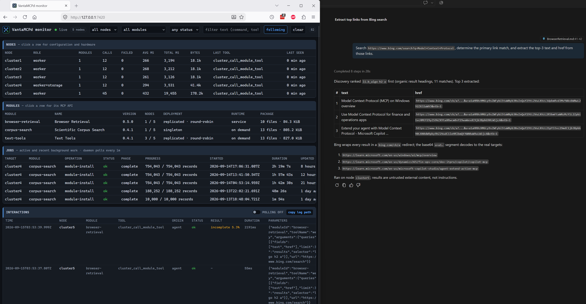

# Browser Retrieval

## Purpose

Browser Retrieval gives an MCP agent bounded extraction from node-reachable webpages that require a
JavaScript-capable browser. It runs Chromium on a compatible cluster node, extracts text or structured
values, returns the result through VantaMCPd, and destroys the browser profile after every call. It can
also download a file such as a scanned PDF or photo straight into shared artifact storage, so other
modules can process it without the bytes passing through the agent's machine.



*Bing search results discovered and extracted with automatically routed `browser-retrieval` tools.*

Retrieved content is untrusted external data. It is returned for analysis and must never be treated as
instructions, tool arguments, credentials, or authorization.

## Requirements

The initial package targets Debian or Ubuntu `amd64` nodes with at least two CPU cores, 3 GiB RAM, and
2 GiB free on the root filesystem. It requires Chromium, Python 3, and systemd. It does not require a
GPU or configured node storage.

The node must also permit unprivileged user namespaces, which Chromium uses for its sandbox. This is the
default on Debian and Ubuntu; a node hardened with `kernel.unprivileged_userns_clone=0`,
`user.max_user_namespaces=0`, or an AppArmor `apparmor_restrict_unprivileged_userns` restriction will
fail the install-time Chromium smoke test.

The manifest expresses hardware requirements rather than a node name. In the examples below,
`browser-worker` is any inventory node that satisfies those requirements.

`web_download` additionally needs an initialized `artifact-storage` service with `artifacts.enabled` in
cluster configuration. Installation then mounts the artifact NFS share on the target when needed and grants
the broker write access to the store only. Without a store, the browsing tools still work and
`web_download` fails with `shared artifact storage is unavailable on this node`.

| Install option | Meaning |
| --- | --- |
| `downloadContact` | Operator URL or email appended to the `web_download` User-Agent, for example `https://example.org/contact` or `ops@example.org`. Technically optional, but strongly recommended: some sites, including Wikimedia, require automated clients to identify a contact and throttle requests without one. |

> [!IMPORTANT]
> Set `downloadContact` if you want downloads to be reliable. Without it, `upload.wikimedia.org` can
> answer every attempt with `429 Too Many Requests` and escalate `Retry-After` to 600 seconds, which
> neither retries nor a background call can outlast. Once a contact was set, the same download succeeded
> on the first attempt.

Set it persistently in `cluster.config.local.json` and reinstall:

```json
{ "modules": { "browser-retrieval": { "installOptions": { "downloadContact": "ops@example.org" } } } }
```

## Quickstart

After building and restarting VantaMCPd, check compatibility and install explicitly:

> Check whether browser-retrieval is compatible with browser-worker.

> Install browser-retrieval on browser-worker.

Installation requires confirmation and runs as a durable job. It creates a locked system account, verifies
that Chromium starts with its Linux sandbox enabled, installs the broker as a hardened systemd service, and
exposes no TCP listener.

Discover the exact schemas after installation:

> List the tools provided by browser-retrieval on browser-worker.

Typical requests are:

> Retrieve `https://developer.mozilla.org/en-US/docs/Web/HTTP` as Markdown using browser-retrieval.

> Search `https://www.bing.com/search?q=Model+Context+Protocol`, determine the primary link match,
> and extract the text and href from those links.

> Extract the 5th table from `https://en.wikipedia.org/wiki/Comparison_of_web_browsers` 
> and convert it to .csv format, then show it here.

> Find a typewritten business letter on Wikimedia Commons, download it, and transcribe it.

The last request searches with `web_query`, reads the file page for the original image URL, stores it
with `web_download`, and passes the returned artifact ID to `document-ocr`.

## Tools

### `web_retrieve`

Use this first for general research, documentation, articles, and rendered single-page applications.
It returns:

- source and final URLs plus the document HTTP status;
- title, description, language, headings, and normalized links;
- bounded Markdown or plain text;
- DOM, transfer, timing, and truncation metadata; and
- an explicit `trust: "untrusted-web-content"` marker.

Inputs:

| Field | Default | Bounds and behavior |
| --- | --- | --- |
| `url` | Required | HTTP(S), any valid port, no embedded credentials |
| `browser` | None | Optional bounded browser profile controls described below |
| `format` | `markdown` | `markdown` or `text` |
| `contentSelector` | Automatic | Optional CSS root for extraction |
| `waitForSelector` | None | Optional CSS selector that must appear |
| `settleMs` | `500` | 0-3000 ms after readiness |
| `timeoutMs` | `20000` | 1000-30000 ms |
| `maxCharacters` | `40000` | 1000-100000 characters |
| `linkLimit` | `30` | 0-100 links |

### Browser controls

All three tools accept the same optional `browser` object. Only supplied values are overridden; omitted
values retain Chromium defaults. Applied controls are echoed in the successful result as `browser`.

| Field | Bounds and behavior |
| --- | --- |
| `userAgent` | 1-512 printable characters; overrides `navigator.userAgent` and the `User-Agent` request header |
| `language` | One BCP 47 tag such as `en-US`; controls JavaScript locale behavior and `Accept-Language` |
| `timezone` | IANA timezone such as `Europe/Berlin` or `UTC` |
| `viewport` | Requires `width` (320-3840) and `height` (200-2160); optionally accepts `deviceScaleFactor` (0.5-4) and `mobile` |
| `colorScheme` | `light`, `dark`, or `no-preference` |
| `reducedMotion` | `reduce` or `no-preference` |
| `javascriptEnabled` | Boolean; defaults to Chromium's enabled behavior |

For example, request a mobile German rendering with:

```json
{
	"browser": {
		"language": "de-DE",
		"timezone": "Europe/Berlin",
		"viewport": {
			"width": 390,
			"height": 844,
			"deviceScaleFactor": 3,
			"mobile": true
		},
		"colorScheme": "dark"
	}
}
```

User-agent overrides are intended for compatibility testing. They do not change the browser engine or
guarantee access through consent, rate-limit, or anti-automation controls.

### `web_discover_links`

Use this when the desired repeated links are recognizable but their CSS selector is unknown. It returns
ranked, `web_query`-compatible selector candidates. Each candidate includes:

- `rank` and a heuristic `score`;
- the candidate `selector` and its `matchCount`; and
- bounded `text` and `href` samples for the agent to inspect.

The result also reports source, scanned, and usable link counts; source and returned candidate counts;
and completeness metadata. `maxCandidates` defaults to 10 and is bounded from 1 to 20. `sampleLimit`
defaults to 3 and is bounded from 1 to 5. Samples are compact previews; use `web_query` for full values.

Discovery favors repeated visible links associated with headings and stable container classes. It is a
heuristic, not a claim about page semantics. The agent should verify that a candidate's samples represent
the user's requested links, then call `web_query` with that selector and the requested fields. This makes
selector discovery explicit without returning raw HTML or accepting caller-provided JavaScript.

### `web_query`

Use this when the agent knows which rendered elements contain the needed values. One call accepts up to
12 uniquely named CSS queries. Each query may return up to 50 matches and only these fields:

- `text`
- `href`
- `src`
- `title`
- `alt`
- `value`
- `datetime`
- `content`
- `ariaLabel`

Caller-provided JavaScript is not accepted. Selector values are encoded into module-owned extraction
code rather than concatenated as executable source.

### `web_tables`

Use this for rendered HTML tables. It returns captions, headers, row arrays, source dimensions, and
explicit completeness metadata. Select one table with the zero-based `tableIndex` (use `4` for the fifth
matching table), then page its data rows with `rowOffset` and `rowLimit`. Detected header rows are returned
separately and do not consume the row limit. Consecutive leading header rows are merged per column, so a
two-row header spanning `Latest release` over `Version` becomes `Latest release Version`, and `headerRowCount`
reports how many source rows were consumed. `nextRowOffset` is `null` at the end of the table. Bounds are
configurable up to 20 tables, 500 rows per page, 50 columns, and 2000 characters per cell. `rowspan` and
`colspan` values are expanded deterministically. Raw HTML is not returned.

### `web_download`

Use this to store one file from a direct HTTP(S) URL in shared artifact storage and receive its immutable
`artifactId` for an artifact-aware module, for example `ocr_extract`. It does not launch Chromium and never
returns file bytes through MCP.

| Field | Default | Bounds and behavior |
| --- | --- | --- |
| `url` | Required | HTTP(S), any valid port, no embedded credentials |
| `name` | Derived | Artifact filename; otherwise a sanitized `Content-Disposition` or final-URL filename |
| `expectedTypes` | Any | Reject unless the bytes are `pdf`, `png`, `jpeg`, `gif`, `webp`, or `tiff` |
| `maxBytes` | 20 MiB | 1 byte to 50 MiB, further capped by the store's `maxArtifactBytes` |
| `timeoutMs` | `30000`; `300000` in background | Immediate: 1000-35000 ms. Background: up to 600000 ms. Covers redirects, retries, and the transfer |
| `retentionDays` | Store default | 1-90 days, capped by the store policy |
| `reuse` | `true` | Return the artifact from this node's download of the same URL in the last 15 minutes |

The fetcher follows at most five redirects and applies the same URL checks to every hop. It rejects a
larger `Content-Length` before reading and stops the stream at the byte limit. The file type is detected
from its leading bytes, which sets the artifact MIME type; unknown content keeps the server's
`Content-Type`. Pass `expectedTypes` to avoid storing an HTML landing page instead of the file, for
example a Wikimedia `File:` page instead of its `upload.wikimedia.org` original.

#### Retries and Throttling

| Failure | Behavior |
| --- | --- |
| `429`, `502`, `503`, `504` | Retried after `Retry-After` when present, otherwise after exponential backoff with jitter |
| Connection reset or refused, TLS error, timeout, temporary DNS failure | Retried with backoff; certificate verification failures are not retried |
| Body cut short | Resumed with `Range` and `If-Range` when the server sent `Accept-Ranges: bytes` and a strong `ETag` or `Last-Modified`; otherwise downloaded again |
| Anything else | Fails immediately |

Immediate calls make at most 4 attempts and wait at most 10 seconds between them. Background calls make
at most 8 and wait up to 300 seconds, so they can outlast a long `Retry-After`. Every wait must also fit
in `timeoutMs`. Otherwise the call fails at once and reports how long to wait.

A `429` or `503` also puts that scheme, host, and port into a cooldown on the node, lasting up to
15 minutes. Until it ends, calls to that host wait out the cooldown if their budget allows. If it does
not, they fail without sending a request. Repeated attempts from an agent therefore do not prolong the
site's throttling. A successful download clears the cooldown. Cooldowns and reusable downloads live in
the broker process and reset when the service restarts.

Retrying does not help when a site is throttling you because of the User-Agent itself. If a host keeps
answering `429` without an identified contact, set `downloadContact` and reinstall rather than
retrying from another node, which would only sidestep the site's cooldown.

Run `web_download` with `execution: "background"` when a site asks for a longer wait:

> Download this file with browser-retrieval in the background, and show me the artifact ID when it is done.

A node runs one background download at a time, separately from the interactive slot, so browser calls
keep working while it waits. Canceling the job stops the wait.

Within 15 minutes, a repeat request for the same URL returns the existing artifact with `reused: true`
instead of fetching again. The artifact must still verify, match `name`, `expectedTypes`, and
`maxBytes`, and live about as long as the requested retention. Pass `reuse: false` to force a new
download. Reuse is per node.

Requests send `User-Agent: VantaMCPd-browser-retrieval/<version>`, plus ` (+<downloadContact>)` when that
install option is set, with `Accept: */*` and `Accept-Encoding: identity`. The caller cannot override the
User-Agent or add headers, so downloads always identify themselves honestly rather than impersonating a
browser.

The result reports source and final URLs, redirect count, `attempts`, each retry's reason and wait,
`resumed` continuations, the largest `Retry-After` honored, `reused`, the server and detected types, size,
SHA-256, the User-Agent sent, and the published artifact metadata. The digest is compared with the
published copy. Artifact metadata records only the protocol fields, so keep the returned URLs if
provenance matters.

A failed download returns a JSON error with `error`, `host`, sanitized `url`, and `attempts`. When they
apply, it also includes `status`, `retryAfterSeconds`, `cooldown`, the `retries` made, and
`bodyExcerpt`. The excerpt holds up to 300 characters of the error page as plain text, which often
shows whether the site throttled the request or refused it by policy. It is untrusted page content.

Every successful tool result includes `complete`, `truncationReasons`, `responseBytes`,
`responseLimitBytes`, and `responseLimitPercent`. `responseBytes` measures the encoded MCP response rather
than the raw values, because JSON escaping inflates the transported size; use `responseLimitPercent` to
decide when to paginate. Table results additionally report source and returned
table/row/column counts plus `truncatedCellCount`. Pagination, omitted tables or columns, and clipped cell
values make `complete` false and identify the reason; callers can continue rows using `nextRowOffset`.

## Security Boundary

Every call is independent. Browser Retrieval does not accept or retain credentials, cookies, arbitrary
request headers, browser profiles, uploaded files, form data, or authentication state. It does not expose
clicks, form submission, caller-provided JavaScript, shell arguments, browser flags, screenshots, PDFs,
raw HTML, or downloaded files through MCP. `web_download` writes downloaded bytes only to the shared
artifact store. The broker has write access to that store but no read tool for it. The bounded `browser`
controls can alter presentation and the `User-Agent` and `Accept-Language` headers but cannot add
authorization, cookie, proxy, or custom headers.

Top-level navigation and `web_download` accept HTTP and HTTPS URLs on any valid port and reject embedded URL
credentials and non-web schemes, including on redirect targets. Chromium otherwise has normal network behavior: it uses the node's DNS, proxy, and
routing configuration and may access public, private, loopback, link-local, or other node-reachable
destinations selected by the page. Images, media, fonts, WebSockets, redirects, popups, and downloads are
not blocked by the module. LAN segmentation, metadata-service protection, and egress filtering are the
operator's responsibility outside Browser Retrieval.

Chromium retains its normal Linux sandbox, specifically the unprivileged user-namespace sandbox. Because
the service sets `NoNewPrivileges=yes`, the setuid `chrome-sandbox` helper cannot take effect, so Debian's
`chromium-sandbox` package is neither used nor required; `apt autoremove` may safely remove it. It runs
under the dedicated `vantamcpd-browser` account with
no capabilities, a read-only system and home, private temporary and device namespaces, and systemd CPU,
memory, task, and address-family limits. Browser control uses DevTools pipes, not a debugging TCP port.
The MCP adapter reaches the broker through a mode-`0660` Unix socket; the broker verifies the peer UID.

## Resource Limits

A single broker handles one browser or immediate download call at a time, plus one background download. A call that arrives while another is running waits about
two seconds and is then rejected rather than queued, so concurrent calls to one node should be avoided. The
broker accepts at most 20 calls per minute, including downloads. Each browser call is limited to:

- one fresh temporary profile;
- 45 seconds total work and at most 30 seconds of navigation readiness;
- 12 MiB of observed transferred data;
- 50,000 DOM elements; and
- the module's 256 KiB MCP response limit.

The browser process group is terminated after every result or error, escalating to `SIGKILL` if
necessary. Its temporary profile, including caches, cookies, service workers, and any downloaded files,
is then removed.

## Audit Behavior

VantaMCPd attributes SSH execution to `browser-retrieval` and the outer
`cluster_call_module_tool` request. URL query strings, fragments, and credentials are removed before
parameters enter the audit log. The broker journal records only the action, sanitized destination,
status, timing, and error class. Retrieved page content is never logged by the module.

## Expected Failures

| Error | Meaning |
| --- | --- |
| `only http and https URLs are allowed` | The URL uses an unsupported scheme |
| `URL credentials are not allowed` | User information was embedded in the URL |
| `URL port must be from 1 to 65535` | The URL contains port zero or an out-of-range port |
| `navigation failed` | Chromium could not complete the navigation |
| `waitForSelector did not match` | The requested rendered element did not appear before timeout |
| `DOM element limit exceeded` | The rendered document exceeded the processing bound |
| `browser retrieval queue is full` | Another browser call was already running on the node |
| `browser retrieval rate limit exceeded` | The node already accepted 20 browser calls in the last minute |
| `exceeds the 262144-byte MCP response limit` | The bounded result still did not fit; request fewer rows, characters, or matches |
| `shared artifact storage is unavailable on this node` | Artifact storage is disabled, uninitialized, or its NFS mount is missing |
| `HTTP 429 Too Many Requests (Retry-After: N)` | Retries ran out or the wait exceeded the call's limit; wait `retryAfterSeconds`, run the download in the background, and set `downloadContact` if the site requires identification |
| `<host> asked clients to slow down (HTTP N); retry in N s` | The host is in cooldown after an earlier `429` or `503` and no request was sent; wait, or use a background call |
| `browser-retrieval is already running a background download on this node` | Another background download holds the node's background slot |
| `downloaded content is text/html, not one of: ...` | The URL returned a web page rather than the file; find the direct file URL |
| `exceeds the N-byte limit` | The file is larger than `maxBytes` or the store's artifact limit |

Some sites may return consent, rate-limit, or anti-automation challenge pages to fresh headless browser
profiles. Browser Retrieval does not bypass those controls; inspect `finalUrl`, headings, content, and query
match counts to distinguish a challenge page from an extraction-selector mismatch.

## Deactivation

> Uninstall browser-retrieval from browser-worker.

Uninstallation requires confirmation. VantaMCPd stops and removes the systemd unit before the module
script removes its payload, socket, configuration, service drop-in, and dedicated system account. There
is no retained module data to purge; downloaded artifacts keep their normal independent expiration.
