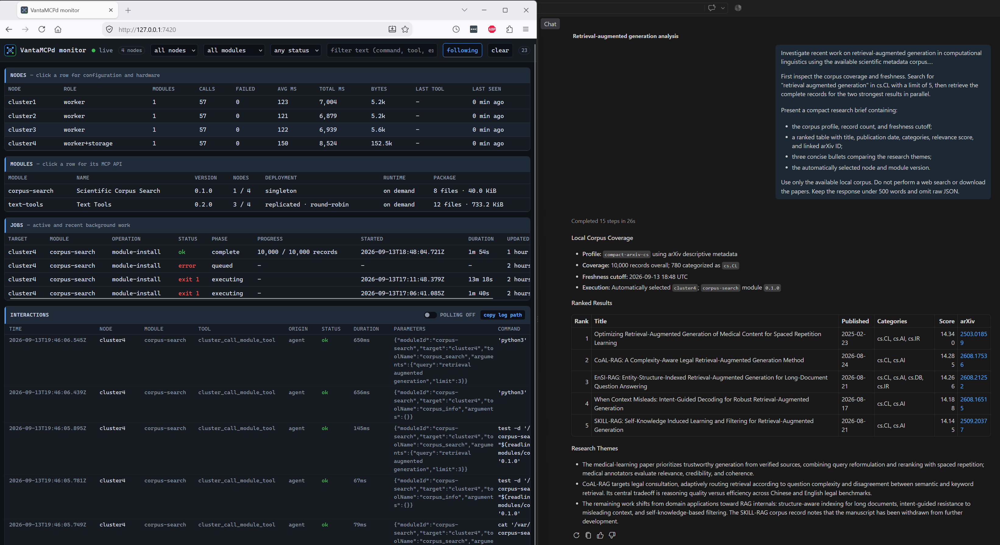

# Scientific Corpus Search

`corpus-search` provisions a sampled arXiv descriptive-metadata corpus on a node's configured storage
volume and exposes bounded SQLite FTS5/BM25 lookup through MCP. It stores metadata and external links;
it does not download or serve papers, PDFs, or source archives.



*A "retrieval-augmented generation" analysis using automatically routed `corpus-search` tools.*

It uses singleton deployment, so the cluster may have one installed instance. Its on-demand runtime
starts a fresh Python MCP process over SSH stdio for each discovery or tool call and closes it afterward.
The SQLite database remains on node storage between calls, daemon restarts, and node reboots.

## Quickstart

The shortest path from an available storage node to a verified first search is:

1. Check compatibility and free storage:

	> Check whether corpus-search is compatible with cluster4.

2. Install a profile. Small is the 1% default; Medium is a practical broader starting point:

	> Install corpus-search on cluster4 using the Medium profile.

3. Keep the returned job ID and follow the durable installation:

	> Show the status and recent log output for job `<job-id>`.

4. Wait for `status: succeeded`, `phase: complete`, and the message `Corpus database activated.` The
	module receipt is not activated before the replacement database passes integrity and FTS checks.

5. Verify the installed profile and coverage:

	> Describe the installed corpus-search dataset, including its profile, sample percentage, topics,
	> cutoff, record count, database size, and largest categories.

	Confirm that `profileId` is the requested profile, `records` is greater than zero, and `cutoff` is
	recent enough for the intended analysis.

6. Run a first search, then retrieve complete records for useful results:

	> Search corpus-search for `retrieval augmented generation` and return the top 5 papers.
	> Retrieve the complete corpus record for arXiv `<result-id>`.

	Queries accept quoted phrases, `-exclusions`, `OR` alternatives, `prefix*` terms, and `title:` or
	`category:` field restrictions, and a misspelled word is corrected when a query finds nothing:

	> Find papers about `"large language model"` applied to robotics, excluding surveys.

The target node must have configured node-local storage with at least 10 GiB free. All profiles download
and retain the same ZIP and extracted JSON, so Small reduces database ingestion but does not avoid the
source-data storage requirement or the initial download/extraction work.

## Corpus Configuration

The profile selects how much of the matching bulk snapshot is ingested:

| Profile ID | Snapshot sample | Intended use |
| --- | ---: | --- |
| `small-arxiv-cs` | 1% | Default, lightweight local search |
| `medium-arxiv-cs` | 25% | Broader research coverage |
| `large-arxiv-cs` | 100% | Every matching record in the snapshot |

All three profiles use the same deterministic sample seed. Selection hashes each arXiv ID, making the
sample stable across reinstalls and ensuring that the 1% population is contained in the 25% population,
which is contained in the 100% population. Percentages apply after topic filtering, so record counts
depend on the current snapshot and selected topics rather than a fixed target.

The packaged topic list covers fifteen arXiv categories, using the identifiers from arXiv's own
[category taxonomy](https://arxiv.org/category_taxonomy):

| Category | Name | Category | Name |
| --- | --- | --- | --- |
| `cs.AI` | Artificial Intelligence | `cs.DB` | Databases |
| `cs.LG` | Machine Learning | `cs.DC` | Distributed, Parallel, and Cluster Computing |
| `cs.CL` | Computation and Language | `cs.CR` | Cryptography and Security |
| `cs.IR` | Information Retrieval | `cs.NE` | Neural and Evolutionary Computing |
| `stat.ML` | Machine Learning (Statistics) | `cs.HC` | Human-Computer Interaction |
| `cs.CV` | Computer Vision and Pattern Recognition | `cs.PL` | Programming Languages |
| `cs.RO` | Robotics | `cs.OS` | Operating Systems |
| `cs.SE` | Software Engineering | | |

`cs.LG` and `stat.ML` are separate identifiers for closely related work and are heavily cross-listed with
each other; both are included so that neither archive's submissions are missed. Records may carry further
cross-list categories outside this list, which are retained in each record and are searchable through the
`category` filter even though they do not themselves select a record for ingestion. Use
[`corpus_categories`](#corpus_categories) to see which identifiers a provisioned corpus actually contains
and how many records each one reaches.

The active configuration combines a `profileId` with an optional topic override:

| Option | Bounds | Meaning |
| --- | --- | --- |
| `profileId` | `small-arxiv-cs`, `medium-arxiv-cs`, or `large-arxiv-cs`; default Small | Snapshot sampling percentage |
| `categories` | 1-50 arXiv category names | Replace the packaged topic list; use identifiers such as `cs.AI`, `stat.ML`, or `math.GT` |

Every installation starts from the Cornell University arXiv metadata snapshot ZIP. The installer caches
the ZIP, extracts its JSONL member, streams matching records into SQLite, and retains both source files
beside the database. It then uses arXiv's OAI-PMH feed to add records newer than the snapshot, applying
the same topics and sampling rule. OAI requests are serialized with at least three seconds between them;
JSON offsets and OAI resumption tokens are checkpointed for recovery.

## Install

The target needs Debian or Ubuntu on `armhf`, `arm64`, or `amd64`, at least 256 MB RAM, and configured
node-local storage with at least 10 GiB free. This accommodates the approximately 1.71 GiB compressed
metadata snapshot, its approximately 5.15 GiB uncompressed form, and the generated SQLite database.
The module declares `bash`, Python 3, SQLite, and CA certificates; VantaMCPd installs missing declared
packages during preflight.

FTS index rebuilding and `ANALYZE` spill a temporary file roughly the size of the index. The installer
points `SQLITE_TMPDIR` at the storage volume so that this lands beside the corpus rather than in
`/var/tmp` on the root filesystem, which on a single-board computer is typically a small SD card.

The durable job timeout is six hours. Actual duration depends on network, CPU, storage, profile, and
snapshot size. Small and Medium still download and extract the complete source snapshot; profile size
primarily changes ingestion and FTS indexing time.

In Copilot Chat Agent mode, check placement before starting the download:

> Check whether corpus-search is compatible with cluster4.

Then install it on one explicit storage-backed node:

> Install corpus-search on cluster4.

The default Small profile ingests a 1% sample. Select Medium for a 25% sample:

> Install corpus-search on cluster4 using the Medium profile.

To ingest every matching record for a custom topic list:

> Install corpus-search on cluster4 using the Large profile with only `cs.AI`, `cs.LG`, and `cs.CL`.

The corresponding MCP arguments use manifest-declared install options:

```json
{
	"moduleId": "corpus-search",
	"targets": ["cluster4"],
	"options": {
		"profileId": "large-arxiv-cs",
		"categories": ["cs.AI", "cs.LG", "cs.CL"]
	},
	"confirm": true
}
```

Installation requires approval and runs as a durable background job. The initial tool response contains
a job ID rather than waiting for provisioning to finish, and the job continues if the MCP client
disconnects. Progress changes units by phase:

| Phase | Progress unit | Meaning |
| --- | --- | --- |
| `download` | bytes | Download or resume the cached snapshot ZIP |
| `extract` | bytes | Decompress the JSONL snapshot beside the ZIP |
| `ingest` | JSON bytes scanned | Filter topics, apply deterministic sampling, and insert metadata into SQLite |
| `catchup` | topics | Harvest post-snapshot metadata through OAI-PMH |
| `complete` | records | Activate the verified database and module receipt |

After `catchup` reaches its topic total, the displayed phase may remain there while SQLite rebuilds FTS,
runs `ANALYZE`, and performs integrity checks. Completion is indicated only by the terminal job status and
`Corpus database activated.` message.

> Show the status and recent log output for the corpus-search installation job.

## Change the Profile, Topics, or Node

Deployment is singleton, so there is no in-place reconfiguration: uninstall the current instance, then
reinstall with the desired options.

Editing `installOptions` alone changes nothing on an installed node. Automatic module updates compare
only the module version, so a node already running the catalog version is skipped before install options
are read. Configured options apply to the next install that actually runs.

To switch cluster4 from Medium to Large:

1. Set the profile in `cluster.config.local.json`:

	```json
	{
		"modules": {
			"corpus-search": {
				"installOptions": { "profileId": "large-arxiv-cs" }
			}
		}
	}
	```

2. Restart the VantaMCPd MCP server. Configuration is loaded once at startup.
3. Uninstall the current instance. This removes the service, install directory, and receipt, and retains
	the corpus data directory on the storage mount.

	> Uninstall corpus-search from cluster4.

4. Reinstall on the same node. This starts a new durable provisioning job.

	> Install corpus-search on cluster4.

Steps 1 and 2 are only needed to change the default. To reinstall without editing the inventory, pass the
options on the install call instead; explicit `cluster_install_module` options override configured
defaults.

Changing the profile or topics changes the profile hash, so the retained database cannot seed OAI
catch-up. Provisioning rebuilds and verifies the sampled corpus from the retained snapshot JSON before
activation, which skips the download and extract phases when those source files are still on disk. A
reinstall with a matching profile and snapshot reuses the existing database and only runs catch-up.

Uninstall never deletes corpus data. Use `cluster_purge_module_data` to reclaim the storage mount, and
only when the corpus is no longer wanted.

## Tools

| Tool | Purpose |
| --- | --- |
| `corpus_search` | Search titles, abstracts, authors, and categories using phrases, exclusions, alternatives, and field restrictions |
| `corpus_get` | Retrieve one exact arXiv metadata record |
| `corpus_categories` | Resolve a plain-language subject to an arXiv category identifier and see how populated it is |
| `corpus_info` | Inspect profile, provenance, record counts, storage size, and refresh time |

List the tools advertised by the installed module:

> List the tools provided by corpus-search on cluster4.

The target may be omitted because the module has exactly one active installation:

> List the tools provided by corpus-search.

### `corpus_search`

| Input | Required | Bounds | Meaning |
| --- | --- | --- | --- |
| `query` | yes | 1-500 characters, 1-32 searchable terms | Terms matched across title, abstract, authors, and categories |
| `category` | no | 1-40 characters | Exact arXiv category membership, including cross-lists |
| `publishedFrom` | no | `YYYY-MM-DD` | Inclusive lower bound on original publication date |
| `publishedTo` | no | `YYYY-MM-DD` | Inclusive upper bound on original publication date |
| `fuzzy` | no | boolean, default `true` | Retry a zero-result query with corrected spelling |
| `limit` | no | 1-50, default 10 | Maximum results in this page |
| `offset` | no | 0-10,000, default 0 | Results to skip for pagination |

#### Query syntax

Every term is required unless stated otherwise. The supported operators are a deliberate subset of the
familiar web-search conventions:

| Form | Meaning |
| --- | --- |
| `robot learning` | Both terms must appear somewhere in the record |
| `"robot learning"` | The words must appear adjacent, in that order |
| `-survey` | Exclude records containing the term |
| `robot OR drone` | Either term satisfies this position |
| `transform*` | Match any word starting with the prefix |
| `title:diffusion` | Restrict the term to one field: `title`, `abstract`, `author`, or `category` |

The forms combine, so `title:"language model" robotics -survey` is a single valid query. A leading `+` is
accepted and redundant. An unrecognized prefix such as `doi:` is treated as ordinary text rather than a
field, so it neither errors nor silently drops the term.

The words `AND`, `OR`, and `NOT` are recognized in any case, and `NOT term` is a synonym for `-term`.
Web search engines require uppercase here to keep the common words searchable, but silently demanding a
literal `or` is the worse failure: it returns plausible results for a query that was never run. To search
for one of these words literally, quote it, as in `"not"`.

Callers never reach FTS5 syntax. The parser recognizes the operators above and emits the match expression
itself, placing user text only inside escaped string literals, so query punctuation cannot alter the
search structure. A query consisting only of exclusions is rejected, because it would ask the corpus to
return everything except a few records.

#### Spelling correction

Terms are not stemmed or expanded, so a typo would normally return nothing. When a query produces no
results, the module retries once with each unrecognized word replaced by the closest spelling that
actually occurs in the corpus, ranked by edit distance and then by how many records contain it.

Correction is skipped entirely when the query already matched, when paginating past the first page, and
when `fuzzy` is `false`. Only single required words are corrected; quoted phrases, prefix terms, and
exclusions are left exactly as written. Candidates come from the corpus's own indexed vocabulary rather
than a dictionary, so corrections always name a term that is present.

When a substitution is made the response gains a `corrections` array, and it is absent otherwise:

```json
{
	"query": "retreival augmented generation",
	"corrections": [{ "from": "retreival", "to": "retrieval" }],
	"results": []
}
```

Report the correction when presenting results, since the answer no longer matches what was asked for.

When a first page still matches nothing, the response carries a `hint` naming the syntax and the tools
that explain the corpus, so a caller that never read this page can recover without guessing:

```json
{
	"query": "quantum topology sheaf",
	"results": [],
	"hint": "No records matched. Terms are combined with AND and matched literally, without stemming. ..."
}
```

Neither `corrections` nor `hint` appears on a query that returned results.

Results are ordered by BM25 relevance with title matches weighted most heavily, then by publication date.
A higher returned `score` is a stronger match within that result set. Scores are query-local ranking
values and should not be compared across different queries. Terms are matched as written: hyphenation,
pluralization, and abbreviations are not expanded, so use `OR` or a prefix term when those variants
matter.

Common requests:

> Search corpus-search for `retrieval augmented generation` in category `cs.CL` and return the top 5 papers.

> Find papers matching `robot learning` in `cs.RO`, published from `2026-08-20` through `2026-09-10`.

> Find papers about `"large language model"` applied to robotics, excluding surveys and benchmarks.

> Search the corpus for `diffusion` in the title only, for either `policy` or `planning`.

> Search the scientific corpus for `language model`, return 10 results starting at offset 20, and include
> each paper's arXiv link.

> Find recent `database query optimization` papers across all available categories and group the results
> by primary category.

Each result includes the arXiv ID, title, authors, categories, dates, optional DOI/journal/comment fields,
abstract and PDF links, a highlighted abstract snippet, score, source query, profile slice, and fetch time.
Search results omit the complete abstract to keep pages compact. The response also echoes `query`,
`limit`, and `offset`; `hasMore` is true when a full page was returned and another page may exist.

An abbreviated structured result looks like:

```json
{
	"query": "retrieval augmented generation",
	"results": [
		{
			"id": "2608.21252",
			"title": "EnSI-RAG: Entity-Structure-Indexed Retrieval-Augmented Generation for Long-Document Question Answering",
			"authors": ["Xuanyu Meng", "Jiashuo Sun", "Jash Rajesh Parekh", "Jiawei Han"],
			"categories": ["cs.CL", "cs.AI", "cs.DB", "cs.IR"],
			"primaryCategory": "cs.CL",
			"published": "2026-08-21T00:00:00Z",
			"abstractUrl": "https://arxiv.org/abs/2608.21252",
			"pdfUrl": "https://arxiv.org/pdf/2608.21252",
			"snippet": "...Existing [retrieval]-[augmented] [generation]...",
			"score": 14.266
		}
	],
	"limit": 5,
	"offset": 0,
	"hasMore": true
}
```

The underlying generic proxy call is:

```json
{
	"moduleId": "corpus-search",
	"target": "cluster4",
	"toolName": "corpus_search",
	"arguments": {
		"query": "retrieval augmented generation",
		"category": "cs.CL",
		"limit": 5
	}
}
```

The proxy response identifies the selected node and module version, then places the tool's structured
result in `output`:

```json
{
	"ok": true,
	"node": "cluster4",
	"moduleId": "corpus-search",
	"moduleVersion": "0.4.1",
	"toolName": "corpus_search",
	"deployment": { "mode": "singleton" },
	"selection": "explicit",
	"output": { "query": "retrieval augmented generation", "results": [], "limit": 5, "offset": 0, "hasMore": false }
}
```

### `corpus_get`

Use `corpus_get` after search when the complete abstract or exact provenance fields are needed:

> Retrieve the complete corpus record for arXiv `2608.21252`.

The `id` may be a bare modern or legacy arXiv identifier, an `arxiv.org/abs/` URL, or a versioned ID such
as `2608.21252v2`. URL prefixes and version suffixes are normalized before lookup. The response contains
the full abstract in addition to the metadata returned by search. It does not fetch the linked paper.

```json
{
	"moduleId": "corpus-search",
	"toolName": "corpus_get",
	"arguments": { "id": "https://arxiv.org/abs/2608.21252v2" }
}
```

### `corpus_categories`

Category filters are exact identifiers, so a request phrased in plain language has to be resolved first.
`corpus_categories` does that against the corpus itself rather than from recall, and shows how populated
each category actually is:

> Which categories in the scientific corpus cover robotics?

> Search the corpus for papers on the use of large language models in robotics.

| Input | Required | Bounds | Meaning |
| --- | --- | --- | --- |
| `contains` | no | 1-80 characters | Case-insensitive substring matched against the identifier and the readable name |
| `ingestedOnly` | no | boolean, default `false` | Restrict results to the profile's ingestion topics, excluding cross-listed categories |

Each entry returns the `category` identifier, its `name` and `group` from arXiv's taxonomy,
`ingestionTopic` for membership in the profile's topic list, `records` counting every occurrence
including cross-lists, and `primaryRecords` counting only records whose primary category it is. Entries
are ordered by record count. The response also returns `total`, the profile's `ingestionTopics`, and
`countsIncludeCrossLists`.

```json
{
	"categories": [
		{
			"category": "cs.RO",
			"name": "Robotics",
			"group": "Computer Science",
			"ingestionTopic": true,
			"records": 41822,
			"primaryRecords": 29140
		}
	],
	"total": 1,
	"countsIncludeCrossLists": true,
	"ingestionTopics": ["cs.AI", "cs.CL"]
}
```

The gap between `records` and `primaryRecords` is the cross-list reach: papers filed primarily elsewhere
that still carry the category. Because the `category` filter matches the complete list, all of them are
reachable. A category with `ingestionTopic: false` was never used to select records for ingestion but is
still searchable wherever it appears as a cross-list, so its counts reflect incidental coverage rather
than deliberate sampling.

`countsIncludeCrossLists` is `false` for a corpus provisioned before these counts were recorded. In that
case `records` is `null` and only `primaryRecords` is populated; reinstalling repopulates it.

### `corpus_info`

Use `corpus_info` before analysis when corpus scope or freshness matters:

> Describe the installed corpus-search dataset, including its profile, cutoff, record count, size, and
> largest categories.

It takes no arguments and returns the schema/profile IDs, profile hash, sample percentage, content mode,
topics, snapshot and OAI source URLs, snapshot/catch-up cutoffs, refresh timestamp, database bytes, total
records, and counts by primary category. `contentMode` is `profile` for packaged topics and `topics` when
the install used a `categories` override.

## Example Research Workflow

An agent can discover and compose the bounded tools without the prompt naming either the module or its
installation node. VantaMCPd automatically routes each call to the singleton instance:

> Investigate recent work on retrieval-augmented generation in computational linguistics using the
> available scientific metadata corpus. First inspect the corpus coverage and freshness. Search for
> `retrieval augmented generation` in `cs.CL` with a limit of 5, then retrieve the complete records for
> the two strongest results in parallel. Produce a compact research brief with corpus provenance, a
> ranked comparison table, three synthesis bullets, and arXiv links. Use only the available local corpus;
> do not perform a web search or download the papers.

The initial info call establishes coverage and cutoff, search selects candidates, and the two exact-ID
lookups supply complete abstracts for synthesis. The module calls remain read-only, and VantaMCPd's
response metadata identifies the automatically selected node and module version.

## Limits and Safety

Search inputs, result counts, offsets, and total MCP output bytes are bounded. The service validates
every argument, opens the corpus database read-only, and exposes neither paths nor SQL. Query operators
are recognized by the module's own parser, which emits the match expression and confines caller text to
escaped string literals, so raw FTS5 syntax never reaches the engine. It does not execute caller-provided
code, contact arXiv during queries, or write search artifacts. A missing database, invalid
date/category/ID, out-of-range limit, or unknown record is returned as an MCP tool error.

Each call validates the remote installation receipt and active version before launching the module.
The proxy prefers `structuredContent`, so successful JSON is not duplicated as escaped text.

## Data Lifecycle

Installation is a durable background job. The module is activated only after the new database passes
SQLite integrity and FTS checks. Partial ZIP downloads, JSONL byte offsets, and OAI resumption tokens
support recovery. A matching retained database and snapshot skip baseline reingestion while still
running OAI catch-up; a previous active database remains available until replacement succeeds.

Canceling or failing an install does not discard the source ZIP, extracted JSON, checkpoint, retained
database, or previously active version. Reissuing the same profile can resume a partial ZIP download,
reuse a completed extraction, continue JSON ingestion from its byte checkpoint, or continue OAI-PMH from
its resumption token. A changed profile or topic list rebuilds the sampled database because its content
identity differs.

Uninstall the executable payload and receipt with:

> Uninstall corpus-search from cluster4.

Uninstallation requires approval and retains the corpus under the configured storage mount, allowing a
later install to reuse the data. To remove it permanently, uninstall first and then use the separately
confirmed `cluster_purge_module_data` operation. Purge is restricted to the module's marked data
directory.

Baseline metadata comes from Cornell University's weekly
[arXiv metadata snapshot](https://www.kaggle.com/datasets/Cornell-University/arxiv), followed by newer
records from [arXiv OAI-PMH](https://info.arxiv.org/help/oa/index.html) under the
[arXiv API terms](https://info.arxiv.org/help/api/tou.html). Search results retain links to the arXiv
abstract and PDF pages.

## Troubleshooting

| Symptom | Check or action |
| --- | --- |
| Preflight reports insufficient storage | Configure a distinct node-local storage mount with at least 10 GiB free; root filesystem space does not satisfy this requirement |
| Job appears paused after `catchup` reaches all topics | Check its heartbeat and log; FTS rebuild, analysis, and integrity verification do not currently emit separate progress markers |
| Install fails or is canceled | Read the job log, correct the cause, and reinstall with the same profile to reuse retained downloads and checkpoints |
| Search returns no results | Inspect `corpus_info` for profile/topics and `corpus_categories` for the identifier; check the response for a `corrections` array, then broaden with `OR` or a prefix term |
| Root filesystem fills during provisioning | Confirm the installed version is 0.4.1 or later; earlier versions let SQLite spill its index rebuild into `/var/tmp` on the root filesystem instead of the storage volume |
| Dashboard shows an old catalog or module version | Run `npm run build`, restart the local VantaMCPd MCP server, then refresh the dashboard; the inventory and catalog are loaded by that process |
| A different profile or topic set is needed | Uninstall first, then reinstall with the new options; singleton placement rejects a second active instance |

## Local Development

Run the standard-library and SQLite FTS5 smoke test from the module directory:

```bash
PYTHONDONTWRITEBYTECODE=1 python3 server.py --self-test
```

Run the fixture-backed provisioning and complete MCP protocol tests from the repository root:

```bash
node --test test/corpus-search.test.mjs
```

The fixture tests do not contact Kaggle or arXiv. They build a temporary snapshot ZIP and corpus,
exercise bulk ingestion, OAI catch-up, every tool, query operators, spelling correction, and input
bounds, then remove the data afterward.