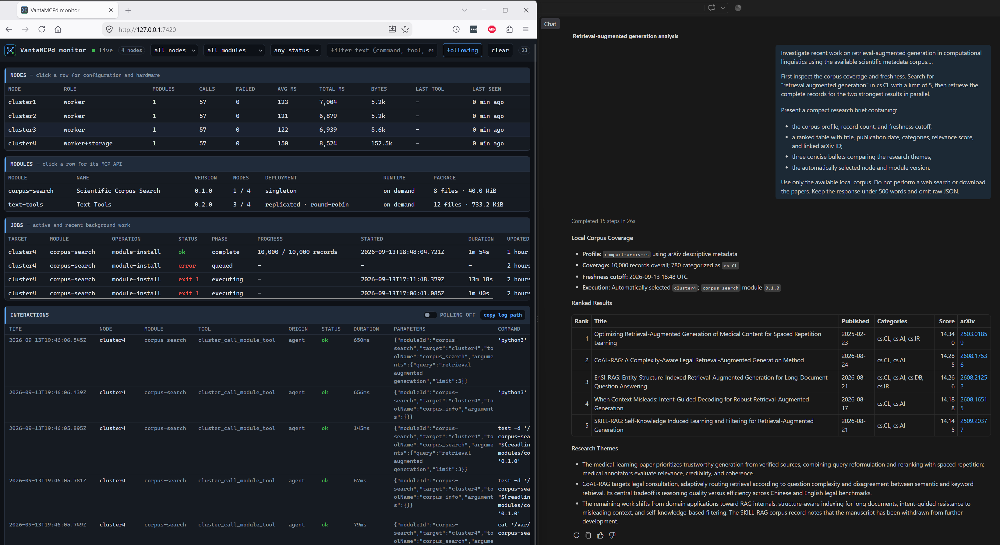

# Corpus Search

`corpus-search` provisions a sampled, provenance-aware metadata corpus on a node's configured storage
volume and exposes bounded SQLite FTS5/BM25 lookup through MCP. It stores descriptive metadata and
external links; it does not download or serve papers, PDFs, article text, or source archives.

A corpus is built from one or more *sources*, each enabled independently. Every record carries the
source and licence it came from.



*A "retrieval-augmented generation" analysis using automatically routed `corpus-search` tools.*

It uses singleton deployment, so the cluster may have one installed instance. Its on-demand runtime
starts a fresh Python MCP process over SSH stdio for each discovery or tool call and closes it afterward.
The SQLite database remains on node storage between calls, daemon restarts, and node reboots.

## Content Sources

Three sources are available today. Each is enabled by naming one of its profiles at install time, and a
corpus may hold any combination of them:

| Source | Profiles | Content | Download | Subjects | Stays current by | Licence |
| --- | --- | --- | ---: | --- | --- | --- |
| [arXiv](#arxiv) | `small-arxiv-cs`<br>`medium-arxiv-cs`<br>`large-arxiv-cs` | Paper metadata: title, abstract, authors, categories, dates, DOI, journal reference, abstract and PDF links | 1.71 GiB | arXiv categories | [`corpus_refresh`](#corpus_refresh) over OAI-PMH | [arXiv API terms](https://info.arxiv.org/help/api/tou.html) |
| [PubChemLite](#pubchemlite) | `pubchemlite-exposomics` | Compound metadata: name, synonym, formula, InChIKey, monoisotopic mass, XLogP, structure strings, PubChem annotation coverage and link | 191 MiB | PubChem annotation categories | Reinstall for a newer release | [CC BY 4.0](https://creativecommons.org/licenses/by/4.0/) |
| [Wikipedia](#wikipedia) | `wikipedia-en-titles` | Every main-namespace article title and its link, redirects included, without article text | 104 MB | none | Reinstall for a newer dump | [CC BY-SA 4.0](https://creativecommons.org/licenses/by-sa/4.0/) |

Name the profiles you want; the corpus is their union:

> Install corpus-search on storage-a with the profiles `large-arxiv-cs` and `wikipedia-en-titles`.

What each source is for:

- **arXiv** answers questions about research: what has been published on a topic, by whom, when, and
	with what abstract. It is the source behind the category filter and the date filters.
- **PubChemLite** answers questions about chemical substances: which compound a name or synonym refers
	to, its formula and InChIKey, and how well annotated it is for safety, toxicity, food or drug use.
- **Wikipedia** answers questions about naming: whether an article exists, what its exact canonical
	title is, and which URL to hand to a retrieval tool. It holds no article text, so it complements
	`browser-retrieval` rather than replacing it.

[Profiles and Install Options](#profiles-and-install-options) covers how to select and combine them,
[Source Reference](#source-reference) documents each one in detail, and
[Future Expansion](#future-expansion) records the datasets under consideration.

## Quickstart

The shortest path from an available storage node to a verified first search is:

1. Check compatibility and free storage:

	> Check whether corpus-search is compatible with storage-a.

2. Choose the content from [Content Sources](#content-sources) and install its profiles. Small is the
	1% arXiv default; Medium is a practical broader starting point:

	> Install corpus-search on storage-a using the Medium profile.

	> Install corpus-search on storage-a with the Medium profile and the English Wikipedia titles.

3. Keep the returned job ID and follow the durable installation:

	> Show the status and recent log output for job `<job-id>`.

4. Wait for `status: succeeded`, `phase: complete`, and the message `Corpus database activated.` The
	module receipt is not activated before the replacement database passes integrity and FTS checks.

5. Verify the installed sources and coverage:

	> Describe the installed corpus-search dataset, including its profiles, sources, sample percentage,
	> topics, cutoff, record count, database size, and largest categories.

	Confirm that `profileIds` lists the requested profiles, that `sources` names the content you expected,
	`records` is greater than zero, and `cutoff` is recent enough for the intended analysis.

6. Run a first search, then retrieve complete records for useful results:

	> Search corpus-search for `retrieval augmented generation` and return the top 5 papers.
	> Retrieve the complete corpus record for arXiv `<result-id>`.

	Queries accept quoted phrases, `-exclusions`, `OR` alternatives, `prefix*` terms, and `title:` or
	`category:` field restrictions, and a misspelled word is corrected when a query finds nothing:

	> Find papers about `"large language model"` applied to robotics, excluding surveys.

The target node must have configured node-local storage with at least 10 GiB free. Each named profile
downloads and retains its own source data, so composing profiles adds their requirements together. All
three arXiv profiles retain the same ZIP and extracted JSON, so Small reduces database ingestion but does
not avoid the source-data storage requirement or the initial download and extraction work.

## Profiles and Install Options

A profile configures exactly one source. An installation names the set of profiles it wants, and the
corpus is their union, so sources stay independent of each other and are selected additively:

| Profile ID | Source | Sample | Intended use |
| --- | --- | ---: | --- |
| `small-arxiv-cs` | [arXiv](#arxiv) | 1% | Default, lightweight local search |
| `medium-arxiv-cs` | [arXiv](#arxiv) | 25% | Broader research coverage |
| `large-arxiv-cs` | [arXiv](#arxiv) | 100% | Every matching record in the snapshot |
| `pubchemlite-exposomics` | [PubChemLite](#pubchemlite) | 100% | Compound name, formula and InChIKey resolution |
| `wikipedia-en-titles` | [Wikipedia](#wikipedia) | 100% | Exact article-title resolution and existence checks |

Naming more than one profile composes them:

> Install corpus-search on storage-a with the profiles `medium-arxiv-cs` and `wikipedia-en-titles`.

No more than one profile per source may be named, since two samples of the same source would be one
corpus contradicting itself. The order they are named in does not matter: the set has a single identity,
so the same selection written either way reuses the same corpus.

The active configuration combines `profileIds` with an optional topic override:

| Option | Bounds | Meaning |
| --- | --- | --- |
| `profileIds` | 1-4 packaged profile IDs; defaults to `["small-arxiv-cs"]` | The sources to ingest, one profile each |
| `categories` | 1-50 arXiv category names | Replace the packaged topic list; use identifiers such as `cs.AI`, `stat.ML`, or `math.GT` |

A topic override applies to every named profile whose source has a subject scheme. It is rejected when
no named profile has one, because a title index cannot be narrowed by arXiv category.

## Source Reference

Each source is an adapter that owns its acquisition, record parsing, identifier scheme, subject scheme,
licence, and terms. The pipeline, the database, and the tools are the same for all of them, so the
search, category, and lookup behaviour documented under [Tools](#tools) does not change as sources are
added.

Records are identified the way their source identifies them. arXiv records keep bare arXiv identifiers,
so every identifier issued before other sources existed is still valid. Every other source prefixes its
identifiers, as in `wikipedia:Robot_learning`. [`corpus_get`](#corpus_get) accepts either form, and also
accepts the canonical URL of a record.

Provenance is recorded per source rather than per corpus. [`corpus_info`](#corpus_info) returns a
`sources` array giving each source's name, sample percentage, topics, source and catch-up URLs, terms
URL, licence, snapshot and catch-up cutoffs, record count, and last refresh. Search results and records
carry `source` and `license`, so a synthesized answer can attribute and licence each record it used.
Licensing differs by source and is the caller's responsibility to respect.

### arXiv

| | |
| --- | --- |
| Identifier | `arxiv` |
| Profiles | `small-arxiv-cs` (1%), `medium-arxiv-cs` (25%), `large-arxiv-cs` (100%) |
| Baseline | [Cornell arXiv metadata snapshot](https://www.kaggle.com/datasets/Cornell-University/arxiv), 1.71 GiB compressed and about 5.15 GiB extracted |
| Catch-up | [arXiv OAI-PMH](https://info.arxiv.org/help/oa/index.html) |
| Record IDs | Bare arXiv identifiers, as in `2608.21252` |
| Subjects | [arXiv categories](https://arxiv.org/category_taxonomy) |
| Licence | Metadata under the [arXiv API terms of use](https://info.arxiv.org/help/api/tou.html); per-article licences vary |

Every arXiv installation starts from the snapshot ZIP. The installer caches the ZIP, extracts its JSONL
member, streams matching records into SQLite, and retains both source files beside the database. It then
uses arXiv's OAI-PMH feed to add records newer than the snapshot, applying the same topics and sampling
rule. OAI requests are serialized with at least three seconds between them; JSON offsets and OAI
resumption tokens are checkpointed for recovery.

All arXiv profiles use the same deterministic sample seed. Selection hashes each arXiv ID, making the
sample stable across reinstalls and ensuring that the 1% population is contained in the 25% population,
which is contained in the 100% population. Percentages apply after topic filtering, so record counts
depend on the current snapshot and selected topics rather than a fixed target.

The packaged topic list covers fifteen arXiv categories, using the identifiers from arXiv's own
[category taxonomy](https://arxiv.org/category_taxonomy):

| Category | Name | Category | Name |
| --- | --- | --- | --- |
| `cs.AI` | Artificial Intelligence | `cs.DB` | Databases |
| `cs.LG` | Machine Learning | `cs.DC` | Distributed, Parallel, and Cluster Computing |
| `cs.CL` | Computation and Language | `cs.CR` | Cryptography and Security |
| `cs.IR` | Information Retrieval | `cs.NE` | Neural and Evolutionary Computing |
| `stat.ML` | Machine Learning (Statistics) | `cs.HC` | Human-Computer Interaction |
| `cs.CV` | Computer Vision and Pattern Recognition | `cs.PL` | Programming Languages |
| `cs.RO` | Robotics | `cs.OS` | Operating Systems |
| `cs.SE` | Software Engineering | | |

`cs.LG` and `stat.ML` are separate identifiers for closely related work and are heavily cross-listed with
each other; both are included so that neither archive's submissions are missed. Records may carry further
cross-list categories outside this list, which are retained in each record and are searchable through the
`category` filter even though they do not themselves select a record for ingestion. Use
[`corpus_categories`](#corpus_categories) to see which identifiers a provisioned corpus actually contains
and how many records each one reaches.

### PubChemLite

| | |
| --- | --- |
| Identifier | `pubchem` |
| Profiles | `pubchemlite-exposomics` (100%) |
| Baseline | [PubChemLite for Exposomics](https://doi.org/10.5281/zenodo.5995885), one CSV of roughly 191 MiB holding about 470,000 compounds |
| Catch-up | None; reinstall to adopt a newer release |
| Record IDs | `pubchem:` and the PubChem CID, as in `pubchem:2244` |
| Subjects | PubChem annotation categories |
| Licence | [CC BY 4.0](https://creativecommons.org/licenses/by/4.0/) |

PubChemLite is a curated subset of PubChem, ranked by how well each compound is annotated rather than
by how recently it was deposited. That makes it the part of PubChem worth holding locally: the
compounds an agent is actually likely to be asked about, in a single file small enough for a
single-board node, instead of the full hundred-million-record database.

A record carries the compound name, a synonym, the molecular formula, the InChIKey, the monoisotopic
mass, the XLogP partition coefficient, and the SMILES and InChI structure strings. Searching resolves
an approximate or trade name to a canonical one and yields the CID and the PubChem URL, which is the
chemistry counterpart of what the Wikipedia titles do for article names.

The structure strings are stored on each record but deliberately left out of the full-text index. An
InChI tokenizes into dozens of fragments that no plain-language query will ever match, so indexing
them would inflate the index without making any question answerable. They are returned by
[`corpus_get`](#corpus_get) in the record's `comment` field.

Unlike the Wikipedia titles, this source brings a subject scheme of its own, so
[`corpus_categories`](#corpus_categories) works against it. Each category counts the PubChem
annotations a compound has under that heading, and a compound's primary category is the heading it is
most annotated under:

| Category | Name | Category | Name |
| --- | --- | --- | --- |
| `AgroChemInfo` | Agrochemical Information | `SafetyInfo` | Safety and Hazards |
| `BioPathway` | Biological Pathways | `ToxicityInfo` | Toxicity Information |
| `DrugMedicInfo` | Drug and Medication Information | `KnownUse` | Known Uses |
| `FoodRelated` | Food Related | `DisorderDisease` | Disorders and Diseases |
| `PharmacoInfo` | Pharmacology and Biochemistry | `Identification` | Identification |
| `NORMANSLE` | NORMAN Suspect List Exchange | | |

These categories describe a record rather than select it, so unlike arXiv topics they cannot be
narrowed with the `categories` install option: the profile always ingests the complete release. Use
the `category` filter at query time instead.

> Search the corpus for `chlorpyrifos` and report which annotation categories cover it.

Releases are published as versions of a Zenodo record rather than through an incremental feed.
Acquisition reads the concept record first, which always resolves to the newest version and names its
download URL, size and checksum, so a reinstall recognizes an unchanged release without fetching the
CSV. The recorded `doi` on each record is the versioned dataset DOI it came from, which is what a
citation of these values should reference.

### Wikipedia

| | |
| --- | --- |
| Identifier | `wikipedia` |
| Profiles | `wikipedia-en-titles` (100%) |
| Baseline | [`enwiki-latest-all-titles-in-ns0.gz`](https://dumps.wikimedia.org/enwiki/latest/), 104 MB compressed |
| Catch-up | None; reinstall to adopt a newer dump |
| Record IDs | `wikipedia:` and the underscored title, as in `wikipedia:Robot_learning` |
| Subjects | None |
| Licence | [CC BY-SA 4.0](https://creativecommons.org/licenses/by-sa/4.0/) |

This source ingests the main-namespace title index, not article text. That is the choice that makes it
fit a constrained single-board node: roughly 104 MB downloaded rather than the 25.7 GB of the full
article dump, while still answering what a title index is actually needed for. An agent can confirm that
an article exists, recover its exact canonical title from an approximate one, and obtain the URL to hand
to a retrieval tool, all without a web request.

The dump lists every page title in the main namespace, redirects included, so a lookup resolves common
alternative spellings as well as canonical titles. Because a title index carries no abstract, a search
result from it uses the title as its own snippet, and [`corpus_categories`](#corpus_categories) returns
nothing for this source.

### Future Expansion

These datasets have record shapes the module could hold without changing its schema or tools, and are
recorded here as candidates rather than commitments. Each would arrive as a source adapter and one or
more profiles, with its own licence and terms recorded alongside its records.

| Candidate | Fit | Considerations |
| --- | --- | --- |
| [Abramowitz and Stegun](https://archive.org/details/handbookofmathe0000abra) | The classic handbook of mathematical functions, digitized with a chapter, table and formula structure that maps onto titled, linkable records | Public domain as a work of the US government, published by the National Bureau of Standards in 1964. It exists as page scans, so ingestion would need the OCR and table extraction this module deliberately leaves to other modules, and the value is stable citations and table locations rather than computable values |
| [The Arcane Algorithm Archive](https://www.algorithm-archive.org/) | Each chapter is a titled, linkable Markdown document under a section taxonomy, so a chapter is already the record shape here, and it gives an agent a citable definition of an algorithm instead of a recalled one | Roughly forty chapters rather than hundreds of algorithms, so it adds precision rather than breadth; licensing is mixed, with prose under CC BY-SA 4.0 but code examples under MIT and graphics licensed per chapter, so only the prose lead of each chapter would be ingested; the [repository](https://github.com/algorithm-archivists/algorithm-archive) has been dormant since 2022 and publishes no incremental feed, so refreshing it means reinstalling |

NIST's Physical Reference Data collections — the DLMF, the Atomic Spectra Database, XCOM, the X-ray
attenuation and stopping-power tables, and the Chemistry WebBook — were considered and rejected. They
are technically an excellent fit, but they are [NIST Standard Reference
Data](https://www.nist.gov/srd/public-law), which the Standard Reference Data Act
([15 U.S.C. § 290e](https://www.govinfo.gov/content/pkg/USCODE-2014-title15/pdf/USCODE-2014-title15-chap7A-sec290e.pdf))
allows the Secretary of Commerce to copyright. NIST states that none of it "may be reproduced, stored
in a retrieval system or transmitted ... without prior permission", and building a local searchable
corpus is exactly that. They are out of scope unless permission is obtained.

A source is a plausible fit when its records are titled, individually identified, externally linkable,
openly licensed, and small enough that a sampled corpus stays within a node's storage budget. One that
also brings its own subject scheme gets `corpus_categories` for free, as PubChemLite does; one that
does not is still fully searchable, as the Wikipedia titles are. Each would ship as its own profile,
selectable alongside the existing ones rather than replacing them. Full text, binary assets, and
anything requiring per-request authorization remain outside the module's scope.

## Install

The target needs Debian or Ubuntu on `armhf`, `arm64`, or `amd64`, at least 256 MB RAM, and configured
node-local storage with at least 10 GiB free. This accommodates the approximately 1.71 GiB compressed
metadata snapshot, its approximately 5.15 GiB uncompressed form, and the generated SQLite database.
The `pubchemlite-exposomics` and `wikipedia-en-titles` profiles are far lighter, retaining a single
file of roughly 191 MiB and 104 MB respectively, but the declared requirement is the same because it
is the module's, not any one profile's.
The module declares `bash`, Python 3, SQLite, and CA certificates; VantaMCPd installs missing declared
packages during preflight.

FTS index rebuilding and `ANALYZE` spill a temporary file roughly the size of the index. The installer
points `SQLITE_TMPDIR` at the storage volume so that this lands beside the corpus rather than in
`/var/tmp` on the root filesystem, which on a single-board computer is typically a small SD card.

The durable job timeout is twelve hours. Actual duration depends on network, CPU, storage, profile, and
snapshot size. Small and Medium still download and extract the complete source snapshot; profile size
primarily changes ingestion and FTS indexing time. A single-board node building every source at once
needs much of that budget, because insert rates fall as the table grows past a few million rows. Adding
a source to a corpus that already exists is far cheaper: the sources already present are copied rather
than reingested, and only the new one is indexed.

In Copilot Chat Agent mode, check placement before starting the download:

> Check whether corpus-search is compatible with storage-a.

Then install it on one explicit storage-backed node:

> Install corpus-search on storage-a.

The default Small profile ingests a 1% sample. Select Medium for a 25% sample:

> Install corpus-search on storage-a using the Medium profile.

To ingest every matching record for a custom topic list:

> Install corpus-search on storage-a using the Large profile with only `cs.AI`, `cs.LG`, and `cs.CL`.

The corresponding MCP arguments use manifest-declared install options:

```json
{
	"moduleId": "corpus-search",
	"targets": ["storage-a"],
	"options": {
		"profileIds": ["large-arxiv-cs"],
		"categories": ["cs.AI", "cs.LG", "cs.CL"]
	},
	"confirm": true
}
```

Installation requires approval and runs as a durable background job. The initial tool response contains
a job ID rather than waiting for provisioning to finish, and the job continues if the MCP client
disconnects. Progress changes units by phase:

| Phase | Progress unit | Meaning |
| --- | --- | --- |
| `seed` | bytes | Copy the retained corpus, when at least one source survives unchanged |
| `download` | bytes | Download or resume the cached snapshot ZIP |
| `extract` | bytes | Decompress the JSONL snapshot beside the ZIP |
| `ingest` | bytes, titles or compounds, by source | Filter, apply deterministic sampling, and insert metadata into SQLite |
| `catchup` | topics | Harvest post-snapshot metadata through OAI-PMH |
| `index` | - | Build the full-text index for a reingested source, leaving the sources beside it alone |
| `summarize` | - | Count records and categories in a single pass over the corpus |
| `optimize` | - | Update query planner statistics |
| `verify` | records | Run the structural and full-text checks on the built database |
| `activate` | records | Check-point the write-ahead log and swap the database into place |
| `complete` | records | Activate the verified database and module receipt |

The phases after `catchup` each cover a pass over the whole corpus, so on a low-end node they can take a
while without the record count changing. Completion is indicated by the terminal job status and the
`Corpus database activated.` message.

> Show the status and recent log output for the corpus-search installation job.

## Change the Profiles, Topics, or Node

Deployment is singleton, so there is no in-place reconfiguration: uninstall the current instance, then
reinstall with the desired options.

Editing `installOptions` alone changes nothing on an installed node. Automatic module updates compare
only the module version, so a node already running the catalog version is skipped before install options
are read. Configured options apply to the next install that actually runs.

To switch storage-a from Medium to Large and add article titles:

1. Set the profiles in `cluster.config.local.json`:

	```json
	{
		"modules": {
			"corpus-search": {
				"installOptions": { "profileIds": ["large-arxiv-cs", "wikipedia-en-titles"] }
			}
		}
	}
	```

2. Restart the VantaMCPd MCP server. Configuration is loaded once at startup.
3. Uninstall the current instance. This removes the service, install directory, and receipt, and retains
	the corpus data directory on the storage mount.

	> Uninstall corpus-search from storage-a.

4. Reinstall on the same node. This starts a new durable provisioning job.

	> Install corpus-search on storage-a.

Steps 1 and 2 are only needed to change the default. To reinstall without editing the inventory, pass the
options on the install call instead; explicit `cluster_install_module` options override configured
defaults.

Reuse is decided per source, not for the corpus as a whole. Adding a profile leaves the sources already
present untouched and ingests only the new one; dropping a profile deletes only that source's records.
A source is reingested when its own profile changes, when its topic list changes, or when its upstream
artefact has been republished. Only a reingested source is indexed afterwards, so adding a small source
to a large corpus costs its own ingestion rather than a rebuild of everything already there.

Uninstall never deletes corpus data. Use `cluster_purge_module_data` to reclaim the storage mount, and
only when the corpus is no longer wanted.

## Tools

Every tool queries the whole corpus regardless of which sources it holds. The `source` filter narrows a
call to one of them, using the identifiers from [Content Sources](#content-sources).

| Tool | Purpose |
| --- | --- |
| `corpus_search` | Search titles, abstracts, authors, and categories using phrases, exclusions, alternatives, and field restrictions |
| `corpus_get` | Retrieve one exact record by its identifier or canonical URL |
| `corpus_categories` | Resolve a plain-language subject to a category identifier and see how populated it is |
| `corpus_info` | Inspect profiles, per-source provenance, record counts, storage size, and refresh time |
| `corpus_refresh` | Catch the corpus up with the sources that publish an incremental feed |

List the tools advertised by the installed module:

> List the tools provided by corpus-search on storage-a.

The target may be omitted because the module has exactly one active installation:

> List the tools provided by corpus-search.

### `corpus_search`

| Input | Required | Bounds | Meaning |
| --- | --- | --- | --- |
| `query` | yes | 1-500 characters, 1-32 searchable terms | Terms matched across title, abstract, authors, and categories |
| `source` | no | a source identifier | Restrict to one source, such as `arxiv`, `pubchem` or `wikipedia` |
| `category` | no | 1-40 characters | Exact category membership, including arXiv cross-lists |
| `publishedFrom` | no | `YYYY-MM-DD` | Inclusive lower bound on original publication date |
| `publishedTo` | no | `YYYY-MM-DD` | Inclusive upper bound on original publication date |
| `fuzzy` | no | boolean, default `true` | Retry a zero-result query with corrected spelling |
| `limit` | no | 1-50, default 10 | Maximum results in this page |
| `offset` | no | 0-10,000, default 0 | Results to skip for pagination |

#### Query syntax

Every term is required unless stated otherwise. The supported operators are a deliberate subset of the
familiar web-search conventions:

| Form | Meaning |
| --- | --- |
| `robot learning` | Both terms must appear somewhere in the record |
| `"robot learning"` | The words must appear adjacent, in that order |
| `-survey` | Exclude records containing the term |
| `robot OR drone` | Either term satisfies this position |
| `transform*` | Match any word starting with the prefix |
| `title:diffusion` | Restrict the term to one field: `title`, `abstract`, `author`, or `category` |

The forms combine, so `title:"language model" robotics -survey` is a single valid query. A leading `+` is
accepted and redundant. An unrecognized prefix such as `doi:` is treated as ordinary text rather than a
field, so it neither errors nor silently drops the term.

The words `AND`, `OR`, and `NOT` are recognized in any case, and `NOT term` is a synonym for `-term`.
Web search engines require uppercase here to keep the common words searchable, but silently demanding a
literal `or` is the worse failure: it returns plausible results for a query that was never run. To search
for one of these words literally, quote it, as in `"not"`.

Callers never reach FTS5 syntax. The parser recognizes the operators above and emits the match expression
itself, placing user text only inside escaped string literals, so query punctuation cannot alter the
search structure. A query consisting only of exclusions is rejected, because it would ask the corpus to
return everything except a few records.

#### Spelling correction

Terms are not stemmed or expanded, so a typo would normally return nothing. When a query produces no
results, the module retries once with each unrecognized word replaced by the closest spelling that
actually occurs in the corpus, ranked by edit distance and then by how many records contain it.

Correction is skipped entirely when the query already matched, when paginating past the first page, and
when `fuzzy` is `false`. Only single required words are corrected; quoted phrases, prefix terms, and
exclusions are left exactly as written. Candidates come from the corpus's own indexed vocabulary rather
than a dictionary, so corrections always name a term that is present.

When a substitution is made the response gains a `corrections` array, and it is absent otherwise:

```json
{
	"query": "retreival augmented generation",
	"corrections": [{ "from": "retreival", "to": "retrieval" }],
	"results": []
}
```

Report the correction when presenting results, since the answer no longer matches what was asked for.

When a first page still matches nothing, the response carries a `hint` naming the syntax and the tools
that explain the corpus, so a caller that never read this page can recover without guessing:

```json
{
	"query": "quantum topology sheaf",
	"results": [],
	"hint": "No records matched. Terms are combined with AND and matched literally, without stemming. ..."
}
```

Neither `corrections` nor `hint` appears on a query that returned results.

Results are ordered by BM25 relevance with title matches weighted most heavily, then by publication date.
A higher returned `score` is a stronger match within that result set. Scores are query-local ranking
values and should not be compared across different queries. Terms are matched as written: hyphenation,
pluralization, and abbreviations are not expanded, so use `OR` or a prefix term when those variants
matter.

Common requests:

> Search corpus-search for `retrieval augmented generation` in category `cs.CL` and return the top 5 papers.

> Find papers matching `robot learning` in `cs.RO`, published from `2026-08-20` through `2026-09-10`.

> Find papers about `"large language model"` applied to robotics, excluding surveys and benchmarks.

> Search the corpus for `diffusion` in the title only, for either `policy` or `planning`.

> Search the corpus for `language model`, return 10 results starting at offset 20, and include
> each paper's arXiv link.

> Find recent `database query optimization` papers across all available categories and group the results
> by primary category.

#### Cross-source questions

A corpus holding several sources answers questions no single one could. The sources meet at the subject
rather than at a shared identifier, so a cross-source question is usually two or three bounded calls
whose results are joined by the caller:

> Resolve `glyphosate OR atrazine` in category `AgroChemInfo`, then find arXiv work on machine learning
> for molecular property prediction, and give me the Wikipedia article for each compound.

That single request uses all three: PubChemLite resolves the common names to CIDs `3496` and `2256`
with their formulas and annotation coverage, arXiv supplies the method papers, and the Wikipedia titles
supply canonical article URLs to hand to `browser-retrieval`.

The bridge between the research and chemistry sources is real rather than incidental: arXiv records
cross-listed into `q-bio.BM` or `physics.chem-ph` are exactly the papers whose subjects are the
compounds PubChemLite holds.

> Which compounds in the corpus are annotated for both food relevance and toxicity, and is there arXiv
> work on predicting that kind of toxicity?

One caution when a corpus holds the Wikipedia titles. They outnumber the other sources by more than an
order of magnitude and each is a very short document, so BM25 length normalization ranks them above
longer records for a bare one-word query. Scope the query when that is not what you want:

> Search the corpus for `caffeine` in PubChemLite only.

Each result includes the record ID, its `source` and `license`, title, authors, categories, dates,
optional DOI/journal/comment fields, abstract and PDF links, a highlighted abstract snippet, score,
source query, profile slice, and fetch time. Search results omit the complete abstract to keep pages
compact. The response also echoes `query`, `limit`, and `offset`; `hasMore` is true when a full page was
returned and another page may exist.

A query reaches every source in the corpus. Pass `source` to restrict it to one, using the identifiers
reported by [`corpus_info`](#corpus_info):

> Search the corpus for `robot learning` in Wikipedia titles only.

An abbreviated structured result looks like:

```json
{
	"query": "retrieval augmented generation",
	"results": [
		{
			"id": "2608.21252",
			"source": "arxiv",
			"license": "arXiv metadata under the arXiv API terms of use; per-article licences vary",
			"title": "EnSI-RAG: Entity-Structure-Indexed Retrieval-Augmented Generation for Long-Document Question Answering",
			"authors": ["Xuanyu Meng", "Jiashuo Sun", "Jash Rajesh Parekh", "Jiawei Han"],
			"categories": ["cs.CL", "cs.AI", "cs.DB", "cs.IR"],
			"primaryCategory": "cs.CL",
			"published": "2026-08-21T00:00:00Z",
			"abstractUrl": "https://arxiv.org/abs/2608.21252",
			"pdfUrl": "https://arxiv.org/pdf/2608.21252",
			"snippet": "...Existing [retrieval]-[augmented] [generation]...",
			"score": 14.266
		}
	],
	"limit": 5,
	"offset": 0,
	"hasMore": true
}
```

The underlying generic proxy call is:

```json
{
	"moduleId": "corpus-search",
	"target": "storage-a",
	"toolName": "corpus_search",
	"arguments": {
		"query": "retrieval augmented generation",
		"category": "cs.CL",
		"limit": 5
	}
}
```

The proxy response identifies the selected node and module version, then places the tool's structured
result in `output`:

```json
{
	"ok": true,
	"node": "storage-a",
	"moduleId": "corpus-search",
	"moduleVersion": "0.5.3",
	"toolName": "corpus_search",
	"deployment": { "mode": "singleton" },
	"selection": "explicit",
	"output": { "query": "retrieval augmented generation", "results": [], "limit": 5, "offset": 0, "hasMore": false }
}
```

### `corpus_get`

Use `corpus_get` after search when the complete abstract or exact provenance fields are needed:

> Retrieve the complete corpus record for arXiv `2608.21252`.

> Get the corpus record for the Wikipedia article `Robot learning`.

> Look up the compound record for `pubchem:2244`.

For an arXiv record the `id` may be a bare modern or legacy arXiv identifier, an `arxiv.org/abs/` URL, or
a versioned ID such as `2608.21252v2`. URL prefixes and version suffixes are normalized before lookup.
A record from another source is addressed by its prefixed identifier, such as `wikipedia:Robot_learning`,
or by its canonical URL. The response contains the full abstract in addition to the metadata returned by
search. It does not fetch the linked paper or article.

```json
{
	"moduleId": "corpus-search",
	"toolName": "corpus_get",
	"arguments": { "id": "https://arxiv.org/abs/2608.21252v2" }
}
```

### `corpus_categories`

Category filters are exact identifiers, so a request phrased in plain language has to be resolved first.
`corpus_categories` does that against the corpus itself rather than from recall, and shows how populated
each category actually is:

> Which categories in the corpus cover robotics?

> Search the corpus for papers on the use of large language models in robotics.

| Input | Required | Bounds | Meaning |
| --- | --- | --- | --- |
| `contains` | no | 1-80 characters | Case-insensitive substring matched against the identifier and the readable name |
| `ingestedOnly` | no | boolean, default `false` | Restrict results to the profile's ingestion topics, excluding cross-listed categories |
| `source` | no | a source identifier | Restrict counts to one source; a source with no subject scheme returns no categories |

Each entry returns the `category` identifier, its `name` and `group` from arXiv's taxonomy,
`ingestionTopic` for membership in the profile's topic list, `records` counting every occurrence
including cross-lists, and `primaryRecords` counting only records whose primary category it is. Entries
are ordered by record count. The response also returns `total`, the profile's `ingestionTopics`, and
`countsIncludeCrossLists`.

```json
{
	"categories": [
		{
			"category": "cs.RO",
			"name": "Robotics",
			"group": "Computer Science",
			"ingestionTopic": true,
			"records": 41822,
			"primaryRecords": 29140
		}
	],
	"total": 1,
	"countsIncludeCrossLists": true,
	"ingestionTopics": ["cs.AI", "cs.CL"]
}
```

The gap between `records` and `primaryRecords` is the cross-list reach: papers filed primarily elsewhere
that still carry the category. Because the `category` filter matches the complete list, all of them are
reachable. A category with `ingestionTopic: false` was never used to select records for ingestion but is
still searchable wherever it appears as a cross-list, so its counts reflect incidental coverage rather
than deliberate sampling.

`countsIncludeCrossLists` is `false` for a corpus provisioned before these counts were recorded. In that
case `records` is `null` and only `primaryRecords` is populated; reinstalling repopulates it.

### `corpus_info`

Use `corpus_info` before analysis when corpus scope or freshness matters:

> Describe the installed corpus-search dataset, including its profile, cutoff, record count, size, and
> largest categories.

It takes no arguments and returns the schema and profile IDs, profile hash, sample percentage, content
mode, topics, snapshot and OAI source URLs, snapshot/catch-up cutoffs, refresh timestamp, database bytes,
total records, counts by primary category, and a `sources` array. `profileIds` lists every profile the
installation composed. `contentMode` is `profile` for packaged topics and `topics` when the install used
a `categories` override.

The top-level fields describe the corpus through its primary source, which keeps them meaningful for a
single-source corpus. The `sources` array describes each ingested source individually:

```json
{
	"records": 754043,
	"profileIds": ["large-arxiv-cs"],
	"sources": [
		{
			"source": "arxiv",
			"name": "arXiv bulk metadata snapshot with OAI-PMH catch-up",
			"samplePercent": 100,
			"topics": ["cs.AI", "cs.LG"],
			"sourceUrl": "https://www.kaggle.com/api/v1/datasets/download/Cornell-University/arxiv",
			"catchUpSourceUrl": "https://oaipmh.arxiv.org/oai",
			"termsUrl": "https://info.arxiv.org/help/api/tou.html",
			"license": "arXiv metadata under the arXiv API terms of use; per-article licences vary",
			"snapshotCutoff": "2026-09-07T00:00:00Z",
			"cutoff": "2026-09-14",
			"records": 754043,
			"refreshedAt": "2026-09-14T09:12:44Z"
		}
	]
}
```

A corpus provisioned before per-source provenance was recorded reports a single reconstructed `arxiv`
entry; reinstalling or refreshing it populates the recorded values.

### `corpus_refresh`

Installation is the expensive operation; staying current does not have to be. `corpus_refresh` harvests
records published since the recorded cutoff and indexes them into the activated database in place,
without re-downloading a snapshot or rebuilding the corpus:

> Bring the installed corpus-search dataset up to date.

| Input | Required | Bounds | Meaning |
| --- | --- | --- | --- |
| `source` | no | a source identifier | Refresh only this source instead of every source with a feed |

It contacts the upstream service and can run for a long time, so it is declared as a background call and
runs only as a durable job. Request it as background work and follow the returned job ID the same way as
an installation:

> Refresh the corpus in the background, then show me the job status.

Only a source with an incremental feed can be refreshed. arXiv has OAI-PMH; the Wikipedia title index has
no incremental feed and is reported as skipped, with reinstallation being the way to adopt a newer dump.
The response reports what was refreshed and what was not:

```json
{
	"refreshed": [{ "source": "arxiv", "from": "2026-09-14", "until": "2026-10-02", "added": 3184, "records": 757227 }],
	"skipped": [{ "source": "wikipedia", "reason": "this source publishes no incremental feed; reinstall to adopt a newer snapshot" }],
	"added": 3184,
	"records": 757227,
	"cutoff": "2026-10-02T23:59:59Z"
}
```

Updates are written to the live database under a rollback journal and indexed record by record, so
searches keep being served while a refresh runs and no second copy of the corpus is needed on the storage
volume. A refresh cannot change the profiles, topics, or sampling: it verifies that the installed
profiles still match the activated corpus and fails rather than silently changing its scope. Reinstall
to change any of those, including to add a source.

## Example Research Workflow

An agent can discover and compose the bounded tools without the prompt naming either the module or its
installation node. VantaMCPd automatically routes each call to the singleton instance:

> Investigate recent work on retrieval-augmented generation in computational linguistics using the
> available metadata corpus. First inspect the corpus coverage and freshness. Search for
> `retrieval augmented generation` in `cs.CL` with a limit of 5, then retrieve the complete records for
> the two strongest results in parallel. Produce a compact research brief with corpus provenance, a
> ranked comparison table, three synthesis bullets, and arXiv links. Use only the available local corpus;
> do not perform a web search or download the papers.

The initial info call establishes coverage and cutoff, search selects candidates, and the two exact-ID
lookups supply complete abstracts for synthesis. The module calls remain read-only, and VantaMCPd's
response metadata identifies the automatically selected node and module version.

## Limits and Safety

Search inputs, result counts, offsets, and total MCP output bytes are bounded. The service validates
every argument, opens the corpus database read-only, and exposes neither paths nor SQL. Query operators
are recognized by the module's own parser, which emits the match expression and confines caller text to
escaped string literals, so raw FTS5 syntax never reaches the engine. It does not execute caller-provided
code, contact any source during queries, or write search artifacts. A missing database, invalid
date/category/source/ID, out-of-range limit, or unknown record is returned as an MCP tool error.
`corpus_refresh` is the one tool that writes and the one tool that reaches the network, which is why it
is restricted to background execution.

Each call validates the remote installation receipt and active version before launching the module.
The proxy prefers `structuredContent`, so successful JSON is not duplicated as escaped text.

## Data Lifecycle

Installation is a durable background job. The module is activated only after the new database passes
SQLite integrity and FTS checks. Partial downloads, JSONL byte offsets, title-index line offsets, and
OAI resumption tokens support recovery. A matching retained database and unchanged source artefacts skip
baseline reingestion while still running catch-up; a previous active database remains available until
replacement succeeds. A retained database written by an earlier schema version is migrated in place on
the working copy rather than reingested, so an upgrade does not cost a rebuild.

Canceling or failing an install does not discard the source archives, extracted JSON, checkpoint,
retained database, or previously active version. Reissuing the same profile can resume a partial
download, reuse a completed extraction, continue ingestion from its checkpoint, or continue OAI-PMH from
its resumption token. A source whose profile, topic list, or upstream artefact changed is rebuilt, while
the sources beside it in the same corpus are carried over untouched.

Uninstall the executable payload and receipt with:

> Uninstall corpus-search from storage-a.

Uninstallation requires approval and retains the corpus under the configured storage mount, allowing a
later install to reuse the data. To remove it permanently, uninstall first and then use the separately
confirmed `cluster_purge_module_data` operation. Purge is restricted to the module's marked data
directory.

Baseline arXiv metadata comes from Cornell University's weekly
[arXiv metadata snapshot](https://www.kaggle.com/datasets/Cornell-University/arxiv), followed by newer
records from [arXiv OAI-PMH](https://info.arxiv.org/help/oa/index.html) under the
[arXiv API terms](https://info.arxiv.org/help/api/tou.html). Compound metadata comes from
[PubChemLite for Exposomics](https://doi.org/10.5281/zenodo.5995885) under CC BY 4.0, described in
[J. Cheminform.](https://doi.org/10.1186/s13321-021-00489-0). Wikipedia titles come from the Wikimedia
[database dumps](https://dumps.wikimedia.org/enwiki/latest/) under CC BY-SA 4.0. Search results retain
links to each record's canonical page.

## Troubleshooting

| Symptom | Check or action |
| --- | --- |
| Preflight reports insufficient storage | Configure a distinct node-local storage mount with at least 10 GiB free; root filesystem space does not satisfy this requirement |
| Job appears paused after `catchup` reaches all topics | Expected: the `summarize`, `optimize` and `verify` phases each read the whole corpus. Check the heartbeat and log rather than the record count |
| Install fails or is canceled | Read the job log, correct the cause, and reinstall with the same profile to reuse retained downloads and checkpoints |
| Search returns no results | Inspect `corpus_info` for profile/topics and `corpus_categories` for the identifier; check the response for a `corrections` array, then broaden with `OR` or a prefix term |
| A one-word query returns mostly Wikipedia titles | Expected when the title index is installed: it holds far more records than the other sources and each is short, which BM25 favours. Pass `source` to scope the query, or add a second term |
| A compound search returns derivatives rather than the compound | PubChemLite titles are systematic names and the common name is a synonym, so `caffeine` matches every caffeine derivative. Quote the full name or use `corpus_get` with the CID once one result identifies it |
| A source is reported as skipped by `corpus_refresh` | That source publishes no incremental feed; reinstall the profile to adopt a newer snapshot of it |
| `corpus_refresh` is rejected as an immediate call | It is declared background-only; reissue it with background execution and follow the returned job ID |
| `corpus_refresh` reports a profile mismatch | A packaged profile changed since installation; reinstall rather than refreshing to move the corpus to the new scope |
| Install is rejected for naming two profiles | Only one profile per source may be named; drop the duplicate arXiv profile from the list |
| Root filesystem fills during provisioning | Confirm the installed version is 0.4.1 or later; earlier versions let SQLite spill its index rebuild into `/var/tmp` on the root filesystem instead of the storage volume |
| Dashboard shows an old catalog or module version | Run `npm run build`, restart the local VantaMCPd MCP server, then refresh the dashboard; the inventory and catalog are loaded by that process |
| A different profile or topic set is needed | Uninstall first, then reinstall with the new options; singleton placement rejects a second active instance |

## Local Development

Run the standard-library and SQLite FTS5 smoke test from the module directory:

```bash
PYTHONDONTWRITEBYTECODE=1 python3 server.py --self-test
```

Run the fixture-backed provisioning and complete MCP protocol tests from the repository root:

```bash
node --test test/corpus-search.test.mjs
```

The fixture tests do not contact Kaggle, arXiv, Zenodo, or Wikimedia. They build a temporary snapshot
ZIP, a temporary title dump, a temporary compound CSV, and a corpus, then exercise bulk ingestion, OAI
catch-up, schema migration from the previous version, multi-source search and lookup, per-source
indexing, in-place refresh, every tool, query operators, spelling correction, and input bounds, and
remove the data afterward.