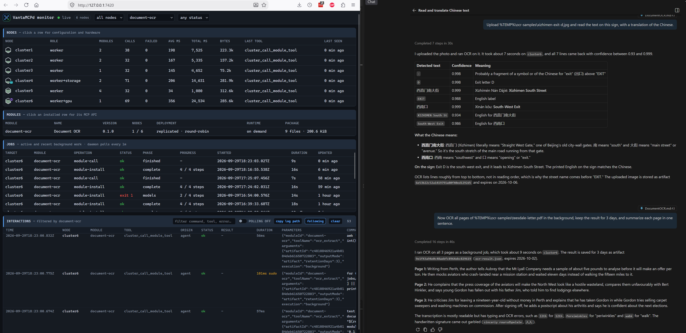

# Document OCR

Document OCR extracts printed text, confidence, and source-image polygons from PNG, JPEG, WebP, and
scanned PDF artifacts. Results retain PDF page numbers. It uses PaddleOCR mobile detection and
recognition models in a rootless CUDA Podman container; it does not interpret forms, tables, formulas,
or handwriting, generate searchable PDFs, or accept URLs and node paths.



*A local photo and a scanned PDF automatically routed to `document-ocr` on a GPU node, with the background job and cluster interactions visible in the live monitor.*

## Requirements and installation

- Debian 13 on amd64, NVIDIA CUDA GPU with at least 8 GB recorded VRAM, 8 GB system RAM, 2 CPU cores,
  12 GB free root disk, rootless Podman, slirp4netns, and NVIDIA CDI. The 8 GB VRAM threshold is
  conservative until measured; 4 GB GPUs are not yet advertised as compatible.
- The CPU exposed to the node must support AVX, AVX2, and FMA for the pinned Paddle GPU image. For
  Proxmox guests, use an AVX-capable host with the VM CPU type set to `host`; shut down and start the
  VM after changing its CPU type. Check the guest with
  `grep -m1 '^flags' /proc/cpuinfo | tr ' ' '\n' | grep -E '^(avx|avx2|fma)$'`.
  Module compatibility preflight does not check these CPU flags.
- The module user needs a systemd-logind runtime directory at `/run/user/<uid>` for rootless Podman.
  Do not place `XDG_RUNTIME_DIR` on persistent storage; stale user namespaces can block Podman after a reboot.
- An initialized, accessible shared artifact store with NFS enabled in cluster configuration.
  Installation provisions the client mount on the target when needed; without a working share,
  extraction fails clearly.
- The installer is a durable job. It builds a versioned rootless container image, downloads model
  weights into a local cache, and checks CUDA model initialization before activation. It may take
  several minutes and uses isolated slirp4netns networking for model downloads; calls use `--network=none`.

Build and restart VantaMCPd, check `document-ocr` compatibility on the intended GPU node, then install
on that explicit target after approval. Follow the returned job until complete. Discover its tools
through `cluster_list_module_tools`. To process a local PDF, upload its bytes with
`cluster_upload_artifact` and pass the returned ID to `ocr_extract`:

```json
{"artifactId":"0123456789abcdef0123456789abcdef","pages":[1,2],"outputMode":"artifact"}
```

Use `execution: "background"` for multi-page PDFs. Immediate calls have a 125-second worker limit;
background calls have a 900-second limit. A call starts a new container and loads the model, so small
images incur cold-start cost. One call per installation holds the local GPU lock; concurrent requests
fail fast rather than oversubscribing the card. Other GPU modules are not covered by this lock.
`language: "auto"` uses PP-OCRv5 mobile recognition; `language: "en"` uses the English PP-OCRv4
mobile recognition model. Both are loaded at install time for offline calls.

## Examples

Each request below can be pasted into an agent connected to VantaMCPd; `gpu-worker` stands for your
GPU node. Results come from real scans and photos. On a mid-range CUDA GPU, a call typically takes 5–7
seconds whether it reads one image or three PDF pages, because most of that time is container start and
model loading. Put related pages in one PDF instead of making many single-image calls.

**Set up and check the node**

> Check whether document-ocr is compatible with gpu-worker, then install it there.

> What OCR model, file formats, and limits does document-ocr provide?

The first request runs as a durable installation job that builds the container image and caches the
models. The second request returns the model name, `pdf`/`png`/`jpeg`/`webp`, the page, pixel, and
size limits, and whether shared artifact storage is available.

**Read a local photo**

> Read the text on the sign in `C:\Photos\exit-sign.jpg`.

The agent uploads the file as an artifact and then runs OCR on it. For a bilingual subway exit sign
(Xizhimen South Street, South-West Exit), it returns every line, including the Chinese text:

```text
-
D
西直门南大街
EXIT
西南口
XIZHIMEN South St
South-West Exit
```

**English only**

> Read only the English text on that sign.

The agent switches to the English recognition model. The Chinese lines are dropped, and the English
lines get higher confidence (for example, `XIZHIMEN South St` rises from 0.93 to 0.97). Use this mode
for English-only documents. Keep the default for anything that might contain Chinese, Japanese, or
Korean text.

**Find a document on the web and read it**

> Find a typewritten business letter on Wikimedia Commons and transcribe it.

The agent uses browser-retrieval to search the site and find the original image URL, then stores the
image in artifact storage with `web_download` and runs OCR on the returned artifact ID. The image never
passes through the agent's machine. For a 1961 letter photographed on top of its envelope, the typed body
comes back cleanly:

```text
DEAR MR. WALSER:
WE ARE SORRY TO TELL YOU THAT WE CANNOT FURNISH STEEL BUTT
PLATES FOR OUR OLDER MODEL STEVENS RIFLES AS REQUESTED IN
YOUR LETTER OF JANUARY 9TH.
ALTHOUGH WE CANNOT BE HELPFUL AT THIS TIME, WE LOOK FORWARD
TO BEING OF SERVICE TO YOU IN THE FUTURE.
CORDIALLY YOURS,
```

OCR returns lines roughly from top to bottom, not in reading order. The handwritten address on the
envelope (`Clyde Walser`, `Box375`) therefore appears between body lines, and stamps and logos
produce short fragments such as `F` or `551/`.

**Leave out stamps, signatures, and handwriting**

> Transcribe only the typed text of that letter; skip stamps, logos, and handwriting.

Every line has a confidence score. Typed text usually scores above 0.85, while stamps, ornaments, and
most handwriting score well below that. An agent can keep lines above about 0.8 and use each line's
position to set apart text from the envelope or letterhead.

**A multi-page scan, in the background**

> OCR all pages of `C:\Scans\letter.pdf` in the background and save the result for 3 days. When it
> finishes, give me the text of each page.

The agent uploads the PDF, starts a background job, and collects the result when the job finishes.
Because the output is saved as an artifact, the full text of a long document never has to fit in the
conversation. For a three-page typed letter, the agent reports each page with its page number:

```text
Page 1  Dear Aubrey.
        Yours of the I2th received & I got into touch with the
        Mt Lyall Company & their reply was as follows. ...
Page 2  This sensational"tripe
        that has filled the papers for weeks, will ...
Page 3  and was very glad to sell out & get something easier & more certain. ...
```

The OCR reproduces the page as written, including the typist's misspellings (`somehwre`,
`treacgerous`) and misread characters such as `I2th` for `12th`. The saved result can be read back
later or passed to another module, for example text-tools to search the transcript.

**Specific pages**

> Read only page 3 of that PDF.

Only page 3 is processed, and it keeps its original page number. A page that does not exist is
reported clearly:

> Read page 4 of that PDF.

```text
OCR failed: requested page is outside the PDF
```

**What a raw result looks like**

The agent receives structured data, not just text. Each line has its text, a confidence score, and
the pixel corners of its position on the page:

```json
{"pages":[{"page":1,"width":1920,"height":1340,
  "text":"-\nD\n西直门南大街\nEXIT\n西南口\nXIZHIMEN South St\nSouth-West Exit",
  "lines":[{"text":"西直门南大街","confidence":0.9987,
            "polygon":[[834,469],[1726,532],[1712,720],[820,656]]}]}],
 "pageCount":1,"model":"PP-OCRv5-mobile","durationMs":6289}
```

## Tools and limits

| Tool | Result |
| --- | --- |
| `ocr_environment` | Model, file formats, effective limits, and artifact availability |
| `ocr_extract` | Page text, numbered lines with confidence and image-coordinate polygons, or a JSON artifact |

Inputs must be immutable artifact IDs and are SHA-256 verified before staging. PDFs are limited to
20 pages, including pages not selected; images count as page 1. Inputs are at most 50 MB and each
rendered page at most 16 megapixels. `pages` can select up to 20 distinct pages from 1 to 20.
Results are at most 8 MB; inline responses are limited to 2 MB. Select `outputMode: "artifact"`
for longer documents (default retention 7 days, adjustable from 1 to 90 within store policy).
Uninstall removes this module's local image, model cache, and working files; published artifacts
retain their normal independent expiration.

## Isolation and troubleshooting

Only verified bytes copied into a private workspace enter the worker. The artifact store is not
mounted into the container. The worker has no network or Linux capabilities, and it cannot write to the
model cache or its inputs. It gets bounded CPU, RAM, process count, page count, pixels, and execution
time. The container root filesystem cannot be `--read-only`, because the NVIDIA CDI hooks write the
linker cache and library symlinks into it. Those writes go to a per-call layer that `--rm` discards;
the image itself is never modified.
The install-time model download is outside this call boundary. The image and PaddleOCR dependencies
are pinned in `Containerfile`; review their upstream licenses before redistributing an image.

- `shared artifact storage is unavailable`: check the configured NFS export and client mount on the GPU node.
- `CUDA inference is unavailable`: check `cluster_gpu` readiness and test CDI access on the target.
- `Illegal instruction` or exit code 132 during model warmup: check AVX, AVX2, and FMA in the guest;
  a generic QEMU CPU can hide features supported by the physical host.
- `already using this GPU`: wait for the active OCR call. Cross-module GPU work can still exhaust VRAM.
- `OCR failed: <reason>`: the worker rejected the input or failed while processing it, for example
  `OCR failed: requested page is outside the PDF`. `OCR worker failed (exit N): <last log line>` means the
  container exited before the worker could record a reason; exit 137 is reported as a memory-limit kill.
  The full worker log is not returned.
- `OCR worker exceeded the 125-second limit`: retry with `execution: "background"` (900 seconds) or
  select fewer pages.
- An immediate call times out while Podman reports `creating an ID-mapped copy of layer`: the container
  was started with `--userns=keep-id` on storage without ID shifting. That copies the whole ~50 GB image
  on every call, so do not add that flag.
- `error executing hook /usr/bin/nvidia-cdi-hook`: the container was started with `--read-only`.
- Models are downloaded again or missing offline: the cache variable is `PADDLE_PDX_CACHE_HOME`
  (PaddleX ignores `PADDLEX_HOME`). The installer repeats warmup offline with the cache mounted
  read-only, so this fails installation rather than the first call.
- `result exceeds the inline limit`: request artifact output. For large PDFs, select fewer pages.
- An install failure before activation leaves the previous module version active. Inspect the durable
  job log for image registry, rootless Podman, or model-download errors.