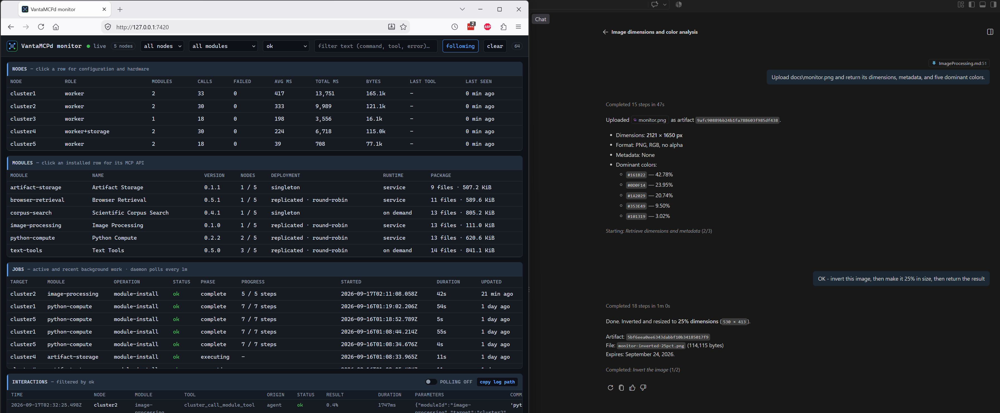

# Image Processing

## Purpose

Image Processing provides bounded inspection, editing, composition, conversion, and visual comparison
for PNG, JPEG, WebP, and GIF images. It is tuned for small ARM workers while using the same Debian
packages on `arm64` and `amd64` nodes.



*An artifact-backed image inspection and chained edit automatically routed to `image-processing`, with the cluster interaction visible in the live monitor.*

Typical agent workflows include:

- inspect dimensions, orientation, alpha, EXIF, histograms, and dominant colors before using an image;
- remove location and camera metadata before publication;
- normalize screenshots and photographs for vision-model input;
- produce thumbnails, WebP renditions, crops, letterboxed images, and contact sheets;
- rotate from EXIF orientation, annotate an image, or apply a logo overlay;
- compare generated screenshots with references and retain a visual difference artifact;
- preprocess images for a separate OCR or vision service.

OCR, PDF/SVG rendering, animation editing, object or face recognition, OpenCV, arbitrary kernels,
caller-provided ImageMagick arguments, filesystem paths, and network retrieval are intentionally out of
scope.

## Requirements

| Requirement | Value |
| --- | --- |
| OS | Debian or Ubuntu |
| Architecture | `armhf`, `arm64`, or `amd64` |
| CPU | 1 core minimum; 2 or more recommended |
| RAM | 768 MB minimum |
| Root disk | 512 MB free minimum |
| Isolation | `bubblewrap` and `prlimit` |
| Image engines | Debian ImageMagick and/or `python3-pil` |

The installer uses distribution packages only. In `auto` mode it installs Pillow as a fallback and
attempts to install ImageMagick as the preferred edit/compose engine. Debian 12's ImageMagick 6 and
Debian 13's ImageMagick 7 command layouts are both detected at runtime.

## Quickstart

After building and restarting VantaMCPd:

> Check whether image-processing is compatible with the ARM workers.

> Install image-processing on worker-a and worker-b with the auto backend.

> List the tools provided by image-processing.

For a small inline image:

> Inspect this PNG from base64 and return its dimensions, metadata, and five dominant colors.

For a local image file:

> Upload `./screenshot.png` with cluster_upload_artifact, then inspect the returned artifact and report
> its dimensions, metadata, and five dominant colors.

A screenshot pasted only into chat may be visible to the model without its raw bytes being exposed to
MCP tools. In that case, save or attach it as a local file first; `cluster_upload_artifact` handles the
remaining transfer without model-generated base64 or manual chunk calls.

For normal or large images, first upload the bytes with `artifact-storage`, then pass its immutable ID:

```json
{
  "source": {"artifactId": "0123456789abcdef0123456789abcdef"},
  "edits": [
    {"operation": "auto_orient"},
    {"operation": "resize", "width": 1280, "height": 720, "mode": "fit"}
  ],
  "output": {
    "mode": "artifact",
    "format": "webp",
    "quality": 82,
    "stripMetadata": true,
    "name": "normalized.webp",
    "retentionDays": 7
  }
}
```

Artifact input or output reports a clear error when shared storage is not configured. Inline input and
output remain available independently.

## Tools

### `image_environment`

Reports installed engines and versions, selected backend, supported formats, artifact availability,
operations, isolation, and effective limits. Call this when a workflow depends on a particular codec
or when diagnosing an installation.

| Field | Type | Default |
| --- | --- | --- |
| `refresh` | boolean | `false` |

### `image_inspect`

Reads one source and returns its format, MIME type, dimensions, pixel count, mode or colorspace, alpha,
frame count, orientation, and optionally sanitized EXIF metadata, an RGB histogram, and dominant colors.

| Field | Type | Bounds/default |
| --- | --- | --- |
| `source` | source | required |
| `includeMetadata` | boolean | `true` |
| `histogramBins` | integer | 0-64; `0` disables it |
| `dominantColors` | integer | 0-16; `0` disables it |

Metadata keys are capped at 128 entries and values at 512 characters. Returned metadata is untrusted
text and should not be inserted into commands or markup without downstream escaping.

### `image_edit`

Applies one to eight edits in array order, then encodes once. This avoids quality loss and repeated
artifact transfers for workflows such as orient, crop, resize, strip metadata, and convert.

| Operation | Parameters |
| --- | --- |
| `auto_orient` | none |
| `resize` | `width`, `height`, `mode: fit\|fill\|stretch`, optional `background` |
| `crop` | `x`, `y`, `width`, `height` |
| `rotate` | `degrees` from -360 to 360, optional `background` |
| `flip` | `axis: horizontal\|vertical` |
| `trim` | optional `fuzzPercent` from 0 to 20 |
| `pad` | `width`, `height`, optional `background` and gravity |
| `grayscale` | none |
| `invert` | none; inverts RGB while preserving alpha |
| `gamma` | `gamma` from 0.1 to 10 |
| `auto_contrast` | optional `cutoffPercent` from 0 to 20 |
| `equalize` | none |
| `threshold` | `thresholdPercent` from 0 to 100; returns grayscale |
| `posterize` | `levels` from 2 to 256 per color channel |
| `solarize` | `thresholdPercent` from 0 to 100 |
| `hue` | `degrees` from -180 to 180 |
| `colorize` | six-digit hex `color` and `amount` from 0 to 100 |
| `opacity` | `amount` from 0 to 100; scales existing alpha |
| `brightness`, `contrast`, `saturation` | `amount` from -100 to 100 |
| `blur` | `radius` from 0.1 to 20 |
| `sharpen` | `amount` from 0.1 to 5 |

`fit` preserves aspect ratio within the box, `fill` fills and center-crops to the box, and `stretch`
uses the exact dimensions without preserving aspect ratio.

The edit surface is the portable, bounded intersection implemented by Debian 12's ImageMagick 6,
Debian 13's ImageMagick 7, and Pillow. The review covered ImageMagick's geometry, color, channel,
quantization, enhancement, convolution, morphology, distortion, drawing, sequence, and analysis
operators. The module does not expose arbitrary CLI options, expressions, kernels, draw commands,
profiles, lookup tables, delegates, animation/sequence editing, randomized effects, or transforms that
can generate unbounded geometry. Those features either bypass semantic validation, require additional
untrusted files or coders, vary by build, lack a dependable Pillow fallback, or have unsuitable cost on
small ARM workers.

### `image_compose`

Uses a discriminator in `operation`:

| Operation | Inputs |
| --- | --- |
| `overlay` | `source`, `overlay`, position, and opacity |
| `watermark` | `source`, text, position, font size, and color |
| `montage` | 1-8 `sources`, columns, cell size, and background |

Watermark text is capped at 256 characters and uses the fixed packaged DejaVu font path. Font paths or
ImageMagick drawing expressions are never accepted from callers.

### `image_compare`

Compares two decoded RGBA images and returns differing-pixel count, normalized mean absolute error,
normalized root mean square error, and a similarity score of $1-\mathrm{RMSE}$. Different dimensions
are rejected unless `normalize` is `fit`. Set `diffOutput` to an output descriptor to produce an
amplified visual difference image.

```json
{
  "source": {"artifactId": "0123456789abcdef0123456789abcdef"},
  "reference": {"artifactId": "fedcba9876543210fedcba9876543210"},
  "normalize": "none",
  "diffOutput": {
    "mode": "artifact",
    "format": "png",
    "name": "visual-diff.png",
    "retentionDays": 3
  }
}
```

## Sources and Outputs

A source is exactly one of:

```json
{"artifactId": "0123456789abcdef0123456789abcdef"}
```

```json
{"data": "<base64>", "mimeType": "image/png"}
```

The declared MIME type must agree with the file signature. Extensions and artifact metadata do not
select the decoder.

An output uses `mode: inline` or `mode: artifact` and accepts `format`, `quality`, and `stripMetadata`.
Artifact output additionally accepts a safe filename and retention period. Metadata is stripped by
default; preserving it can retain private EXIF or ICC content.

## Limits

| Resource | Limit |
| --- | --- |
| Inline source | 1 MiB decoded per image |
| Inline result | 1 MiB before base64 encoding |
| Artifact inputs | 32 MiB combined |
| Stored output | 32 MiB |
| Width or height | 4096 pixels |
| Decoded area | 16 MiPixels |
| Sources per composition | 8 |
| Edits per pipeline | 8 |
| GIF handling | first frame only |
| Default worker timeout | 60 seconds |
| Default concurrency on small nodes | 1 call |

The MCP request itself is capped at 10 MB, so artifacts are preferable when several inline inputs
would approach that transport ceiling.

## Installation Options

| Option | Values | Behavior |
| --- | --- | --- |
| `backend` | `auto`, `imagemagick`, `pillow` | Preferred engine; default `auto` |
| `maxMemoryMb` | 192-2048 | Worker address-space limit; otherwise derived from RAM |
| `maxTimeoutMs` | 5000-120000 | Per-call wall-clock limit; default 60000 |
| `concurrentCalls` | 1-4 | Otherwise derived from CPU and RAM |
| `callsPerMinute` | 1-120 | Otherwise derived from concurrency |

`auto` chooses ImageMagick for supported edits and compositions. Pillow supplies inspection analytics,
comparison, and a fallback when ImageMagick is unavailable. A malformed image, timeout, policy denial,
or decoder failure is returned directly and is never retried through a second parser.

## Security Model

Image bytes are untrusted native-parser input. Every operation runs in a fresh process with:

- user, mount, PID, IPC, UTS, cgroup, and network namespaces;
- no network interfaces beyond the private namespace;
- read-only system files and selected staged inputs;
- a private writable workspace and temporary filesystem;
- address-space, CPU, output-file, process, and descriptor limits;
- a custom ImageMagick policy allowing only PNG, JPEG, WebP, GIF, and the internal null sink;
- all delegates, filters, indirect reads, and other coders denied;
- Pillow's format allowlist and decompression-bomb warnings treated as errors.

The broker verifies shared artifact expiry, size, and SHA-256 before staging a read-only copy. The NFS
artifact root never enters the sandbox. Stored output reserves quota before processing and is committed
atomically with SHA-256 metadata. Logs record only artifact ID prefixes or digests of inline base64,
never the image payload.

The sandbox is defense in depth around maintained distribution libraries, not a claim that complex
native decoders are vulnerability-free. Keep Debian security updates current.

## Data Lifecycle

Inline inputs and outputs exist only for one MCP request. Per-call workspaces are deleted in a `finally`
path and stale workspaces are removed when the broker starts. Artifact output follows the shared store's
quota and expiration policy and remains after this module is uninstalled. Delete artifacts through
`artifact_delete` when they are no longer needed.

## Troubleshooting

| Symptom | Resolution |
| --- | --- |
| `shared artifact storage is unavailable` | Configure and install `artifact-storage`, or use inline mode |
| Inline output exceeds 1 MiB | Select artifact output or lower dimensions/quality |
| MIME type does not match content | Correct the declared MIME type or upload the intended bytes |
| Image exceeds dimensions or pixels | Resize upstream or use a worker profile with deliberately revised limits |
| `ImageMagick rejected the operation` | Inspect the policy/codec detail; SVG, PDF, EPS, URLs, and delegates are intentionally blocked |
| Requested backend is not installed | Reinstall with `backend: auto` or the available engine |
| Sandbox worker failed before returning | Check `journalctl -u vantamcpd-image-processing` and verify unprivileged namespaces |

## Research Sources

- [Debian ImageMagick package tracker](https://tracker.debian.org/pkg/imagemagick)
- [Debian Pillow package tracker](https://tracker.debian.org/pkg/pillow)
- [Debian ARM ports](https://www.debian.org/ports/arm/)
- [ImageMagick security policy](https://imagemagick.org/security-policy/)
- [ImageMagick command-line tools](https://imagemagick.org/command-line-tools/)
- [Pillow security guidance](https://pillow.readthedocs.io/en/stable/handbook/security.html)