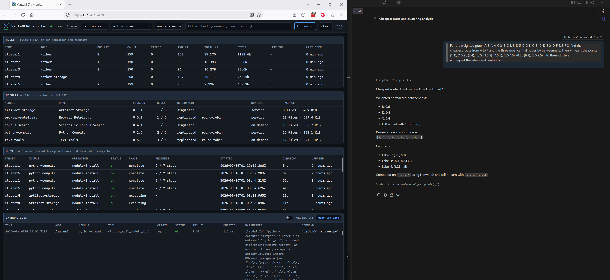

# Python Compute

## Purpose

Python Compute lets an MCP agent run real Python on a cluster node. It provides a curated scientific
package set and a sandboxed interpreter, so an agent can inspect what the node can do, submit code, and
receive values, printed output, tables, and rendered charts.



*A submitted NumPy and matplotlib workload returning a value and a rendered PNG from a cluster node.*

Each call starts a fresh interpreter with no network access, an empty working directory, and no state
from earlier calls. The module is designed for trusted agent-authored code with defense in depth; it is
not a hostile-code security boundary.

## Requirements

Debian or Ubuntu on `armhf`, `arm64`, or `amd64` with at least two CPU cores, 900 MB RAM, and 2.5 GB
free on the root filesystem. It requires Python 3, bubblewrap, `prlimit`, and systemd, plus working
unprivileged user namespaces. It does not require a GPU or configured node storage.

The manifest expresses hardware requirements rather than a node name. In the examples below,
`compute-worker` is any inventory node that satisfies them.

## Quickstart

After building and restarting VantaMCPd, check compatibility and install explicitly:

> Check whether python-compute is compatible with compute-worker.

> Install python-compute on compute-worker with the science bundle.

Installation requires confirmation and runs as a durable provisioning job, because the package set is
downloaded and unpacked on the node. The request returns immediately with a job ID:

> Show the progress of the python-compute installation on compute-worker.

The job reports `packages`, `environment`, and `verify` phases. It installs the selected Debian packages,
creates a locked system account, records the package inventory, and proves that a real sandbox starts,
isolates the network, and returns a result. Only then does the module become active as a hardened
systemd service. A first install of the `science` bundle on a 960 MHz ARMv7 board takes several minutes;
later reinstalls take about a minute because the packages are already present.

Discover what the node provides before writing any code:

> Ask python-compute what Python packages are available on compute-worker.

## Worked Examples

Each request below is self-contained: paste it into an agent connected to VantaMCPd. Every timing is a
measured range across two very different nodes with the `full` bundle, from a four-core AMD64 worker at
the fast end to a 960 MHz dual-core ARMv7 board at the slow end. All of them include interpreter start
and imports, which dominate the short examples.

**Regression and confidence intervals** (1-5 s, SciPy)

> Fit a least-squares line through (1, 2.1), (2, 4.2), (3, 5.9), (4, 8.4), (5, 9.9) and report the
> slope, intercept, R², p-value, and a 95% confidence interval for the slope.

Returns `slope 1.98`, `intercept 0.16`, `r_squared 0.99553`, `slope_95ci [1.83, 2.13]`.

**Exact symbolic mathematics** (1-7 s, SymPy)

> Solve x⁴ − 5x² + 4 = 0 exactly, integrate x·e^(−x²), verify the answer by differentiating it, expand
> sin(x)/x as a series to 8th order, and give me π to 50 digits.

Returns the exact roots `-2, -1, 1, 2`, the antiderivative `-exp(-x**2)/2` with `verified: true`, and
50-digit π — none of it estimated.

**Analyze a pasted CSV and get a CSV back** (0.5-5 s, pandas)

> Summarize this CSV by region — total revenue, total orders and average order value, ranked by revenue
> — and give me the summary back as a CSV file:
>
> ```csv
> region,month,revenue,orders
> north,2026-07,41200,310
> north,2026-08,38800,295
> south,2026-07,51700,402
> south,2026-08,60200,455
> west,2026-07,49800,377
> west,2026-08,65500,489
> east,2026-07,22100,150
> east,2026-08,25400,171
> ```

The agent passes the text through `files`, and `vanta.emit_table` returns `by-region.csv` as an
artifact alongside the ranked totals.

**Render an image** (1-16 s, NumPy and matplotlib)

> Render the Mandelbrot set over Re −2.2 to 0.8 and Im −1.1 to 1.1 at 480×360 with 60 iterations, label
> the axes, and show me the image.

Returns a 62-66 KB PNG captured automatically from the open figure, plus any values the code reports.
This is the example where node choice matters most: the 172,800-pixel escape-time loop is the work,
not the imports.

**Graphs and clustering** (1-8 s, NetworkX and scikit-learn)

> For the weighted graph A-B 4, A-C 2, B-C 1, B-D 5, C-D 8, C-E 10, D-E 2, D-F 6, E-F 3, find the
> cheapest route from A to F and the three most central nodes by betweenness. Then k-means the points
> (1,1), (1.5,2), (3,4), (5,7), (3.5,5), (4.5,5), (3.5,4.5), (8,8), (9,9), (8.5,9.5) into three clusters
> and report the labels and centroids.

Returns the route `A → C → B → D → E → F` at cost 13, the top betweenness scores, and the cluster
assignment with centroids.

**Long-running work** (up to 10 minutes)

> Estimate π by Monte Carlo with 50 million samples in batches, report the running estimate and error
> after each batch, and chart the convergence. Use a five-minute timeout.

Ask for a longer `timeoutMs` explicitly when the work warrants it; the default is 60 seconds.

Naming the module is optional. The manifest advertises what it can do, so an agent connected to
VantaMCPd routes calculation, data analysis, and charting requests here on its own. Name it explicitly
when a specific node matters or when a request could plausibly be answered without it:

> Use python-compute on compute-worker to check whether scipy.signal and sklearn.cluster import.

## Tools

### `python_env`

Reports what the node can do. Call this before writing code; packages cannot be installed from submitted
code, so the inventory is the contract.

| `operation` | Behavior |
| --- | --- |
| `describe` | Interpreter version and architecture, sandbox isolation, every execution limit, the helper API, and installed modules grouped by capability |
| `packages` | The same inventory filtered by `query` (module-name substring) or `group` |
| `check` | Imports up to 20 dotted module names inside the sandbox and returns availability, version, and import cost |

`describe` answers from the inventory recorded at installation. Pass `refresh: true` to re-scan the node,
for example after packages were changed outside the module.

Capability groups are `numeric`, `dataframe`, `plotting`, `imaging`, `symbolic`, `statistics`, `graph`,
`geometry`, `text`, `serialization`, and `standard-library`.

### `python_run`

Runs submitted code and returns its output.

| Field | Default | Bounds and behavior |
| --- | --- | --- |
| `code` | Required | Up to 65,536 characters, executed as `__main__` |
| `inputs` | `{}` | JSON object up to 64 KiB, bound to `inputs` and `vanta.inputs` |
| `files` | None | Up to 10 UTF-8 text files (131,072 characters total) written into the working directory |
| `timeoutMs` | node-sized | 1000 ms to the node's ceiling, at most 600000 |
| `memoryMb` | node-sized | 128 MB to the node's ceiling, at most 4096 |
| `artifacts` | `true` | Return emitted files and captured figures |
| `maxStdoutBytes` | `65536` | 1024-262144 bytes retained from stdout and from stderr |

The result contains:

| Field | Meaning |
| --- | --- |
| `exitReason` | `completed`, `error`, `timeout`, `memory`, or `killed` |
| `stdout`, `stderr` | Captured output with `stdoutTruncated` and `stderrTruncated` flags |
| `result`, `hasResult` | The returned value converted to bounded JSON |
| `error` | `type`, `message`, and a traceback limited to the submitted frames |
| `artifacts` | Base64 entries with `name`, `kind`, `mimeType`, `bytes`, and `truncated` |
| `durationMs`, `totalDurationMs` | Time inside the code, and including sandbox setup |
| `isolation`, `request`, `responseBytes` | The isolation achieved, the timeout and memory actually applied, and how much of the response budget was used |
| `limits` | Included only when `exitReason` is not `completed`, so a call rejected by a limit can be resized without a second discovery call |

The defaults and ceilings differ per node. `python_env` operation `describe` always reports the values in
force on the node that answers.

## Returning Content

Printed output is captured, but values and rendered content should be returned explicitly through the
injected `vanta` helper:

| Helper | Use |
| --- | --- |
| `vanta.result(value)` | Return a value. A trailing bare expression does the same. |
| `vanta.emit_image(figure, name=None)` | Attach a PNG from a matplotlib figure, a PIL image, or image bytes |
| `vanta.emit_table(rows, name=None)` | Attach a CSV from dict rows, row lists, or a pandas DataFrame |
| `vanta.emit_text(text, name=None)` | Attach a UTF-8 text artifact |
| `vanta.emit_json(value, name=None)` | Attach a JSON artifact |
| `vanta.emit_file(path, name=None)` | Attach a file the code wrote inside the working directory |
| `vanta.inputs` | The supplied `inputs` object, also available as `inputs` |

Open matplotlib figures are captured as PNG automatically, so a chart needs no explicit emit call.
NumPy arrays and scalars, pandas frames and series, dates, decimals, UUIDs, paths, byte strings, and
dataclasses are all converted to JSON with per-field bounds; anything else is returned as a typed
`repr`. Large arrays and frames are truncated with an explicit `truncated` flag rather than dropped.

```python
import matplotlib.pyplot as plt
import pandas as pd

frame = pd.DataFrame(inputs["rows"])
vanta.emit_table(frame, "totals.csv")
figure, axes = plt.subplots(figsize=(4, 2.5))
axes.bar(frame["month"], frame["total"])
vanta.result({"rows": len(frame), "peak": frame["total"].max()})
```

## Package Bundles and Limits

The `bundle` install option selects how much is provisioned. Each tier includes the ones before it, and
dependencies may pull in additional modules, which the inventory reports accurately.

| Bundle | Adds | Approximate root-filesystem cost |
| --- | --- | --- |
| `core` | NumPy, PyYAML, python-dateutil, tabulate | ~100 MB |
| `science` (default) | SciPy, pandas, matplotlib, Pillow, SymPy, NetworkX, DejaVu fonts | ~450 MB |
| `full` | scikit-learn, statsmodels, Shapely, lxml, BeautifulSoup, Jinja2, regex, openpyxl | ~800 MB |

Packages come from the node's distribution, which is what makes a full scientific stack practical on
ARMv7 where prebuilt wheels are unavailable. Submitted code cannot install packages, and `pip` is not
used. To change the bundle on a node, uninstall and reinstall with the new option.

### Node-sized execution limits

The installer reads the node's own memory and CPU count and sizes the execution limits from them, so a
4 GB worker is not held to a 1 GB board's budget. It writes the resolved values to the module's
environment file and generates a matching systemd drop-in, because a raised per-call limit is useless if
the service cgroup stops the process first.

| Derived value | Rule |
| --- | --- |
| Service memory | `MemoryHigh` at 60% and `MemoryMax` at 75% of node RAM |
| Concurrent calls | 2 on four cores or more, otherwise 1 |
| Per-call ceiling | `MemoryHigh` divided by the concurrency, capped at 4096 MB |
| Per-call default | Two thirds of that ceiling |
| Calls per minute | 12 per concurrent call |
| CPU and tasks | `CPUQuota` of `(cores - 1) x 100%`, minimum 100%; `TasksMax` of `64 x concurrency + 32` |

For example, a 1 GB dual-core board resolves to 400 MB per call with a 600 MB ceiling and one call at a
time, while a 4 GB quad-core worker resolves to 784 MB per call with a 1176 MB ceiling, two concurrent
calls, and 24 calls per minute.

### Install options

Every option below is optional. Omit it and the node-sized value applies; supply it and it overrides the
derivation, still clamped to the manifest bounds.

| Option | Bounds | Effect |
| --- | --- | --- |
| `bundle` | `core`, `science`, `full` | Package set to provision |
| `memoryMb` | 128-4096 | Default per-call address-space limit |
| `maxMemoryMb` | 128-4096 | Highest per-call limit a caller may request |
| `maxTimeoutMs` | 1000-600000 | Highest per-call wall-clock limit a caller may request |
| `concurrentCalls` | 1-4 | Calls the node runs at once |
| `callsPerMinute` | 1-120 | Calls the node accepts per minute |

Set persistent defaults in `cluster.config.local.json`, with optional per-node overrides for nodes that
can carry more. Per-node values are the reason a mixed cluster keeps its differences across automatic
updates, which re-apply the configured options every time they reinstall:

```json
{
  "modules": {
    "python-compute": {
      "installOptions": { "bundle": "full" },
      "nodes": {
        "compute-worker": {
          "installOptions": { "maxMemoryMb": 2048, "concurrentCalls": 3 }
        }
      }
    }
  }
}
```

Explicit arguments to `cluster_install_module` win over the per-node block, which wins over the
module-wide block. Configuration is read at startup, so restart VantaMCPd after editing the inventory.

## Sandbox and Safety

Submitted code runs in a fresh `python3` under bubblewrap with private user, mount, PID, IPC, UTS, and
cgroup namespaces, and an empty network namespace. The filesystem view is a read-only copy of the system
directories plus one writable working directory; `/home`, `/var`, `/root`, `/opt/vantamcpd`, and the
VantaMCPd receipts are not present. There is no shell escape to the node, no credential material, and no
route to the network, so a call can neither reach the LAN nor read another module's data.

Each sandbox additionally runs under POSIX limits on address space, CPU time, file size, open files, and
processes, and is terminated as a process group when its wall-clock budget expires. The working
directory, including anything the code wrote, is deleted after every call.

The broker itself runs as the locked `vantamcpd-python` account with no capabilities, a read-only
system, private devices and temporary directory, and systemd CPU, memory, task, and address-family
limits. It exposes no TCP listener. The MCP adapter reaches it through a mode-`0660` Unix socket whose
group is the VantaMCPd SSH user's own group, and the broker also verifies the peer UID on every
connection.

This is defense in depth for trusted agent-authored code. It does not claim to contain a deliberate
exploit of the kernel or of the interpreter.

## Resource Limits

A broker runs one call at a time on a small node, and two on a node with four or more cores. A call that
arrives when every slot is busy waits about five seconds and is then rejected rather than queued. Each
call is additionally limited to:

- 10 minutes of wall-clock time at most, and the node's per-call memory ceiling;
- 32 MB of files written inside the working directory;
- 8 artifacts, 1 MB each and 1.5 MB in total;
- 256 KiB of retained stdout and stderr; and
- the module's 2 MB MCP response limit.

Ask `python_env` for `describe` to read the node's actual numbers; a call rejected by a limit also
returns the full `limits` block. A long call holds a slot for its whole duration, so prefer an explicit
`timeoutMs` close to the work actually expected. The agent's own client may impose a shorter tool-call
timeout than 10 minutes.

Node choice dominates everything else. The same worked example runs roughly five to fifteen times faster
on a four-core AMD64 worker than on a 960 MHz ARMv7 board, and imports account for most of that gap on
short calls: on ARMv7, importing SciPy or SymPy costs three to four seconds, scikit-learn about six, and
the first matplotlib chart about eight, against well under a second on the AMD64 worker. Leave headroom
in `timeoutMs` for imports, pass data through `inputs` rather than regenerating it, and prefer several
small calls over one long call when the work can be split. Name a specific node with `target` when a
request is heavy enough for the difference to matter.

## Audit Behavior

VantaMCPd attributes SSH execution to `python-compute` and the outer `cluster_call_module_tool` request.
Submitted code may contain sensitive data, so the broker journal records only its SHA-256 digest and
byte length together with the action, status, timing, and error class. Code, inputs, output, and
artifacts are never written to the node's logs.

## Expected Failures

| Error | Meaning |
| --- | --- |
| `code must be a non-empty string` | No code was supplied |
| `unknown argument: ...` | An unsupported field was passed; check `python_env` for the accepted limits |
| `exitReason: timeout` | The code exceeded `timeoutMs` and its process group was terminated |
| `exitReason: memory` | The code reached the `memoryMb` address-space limit |
| `exitReason: killed` | The sandbox stopped before producing a result; see `diagnostics` |
| `ModuleNotFoundError` | The module is not in the installed bundle; confirm with `python_env` operation `check` |
| `URLError` or `name resolution` failures | Expected: submitted code has no network access |
| `at most 8 artifacts can be emitted` | The artifact count, per-file size, or total size budget was exceeded |
| `python-compute is already running` | Every concurrent slot on the node was busy; retry shortly |
| `python-compute accepts at most N calls per minute` | The node's per-minute budget was exhausted |
| `exceeds the 2000000-byte MCP response limit` | Print less output or emit fewer artifacts |

## Deactivation

> Uninstall python-compute from compute-worker.

Uninstallation requires confirmation. VantaMCPd stops and removes the systemd unit before the module
script removes its payload, socket, configuration, generated resource drop-in, per-call state directory,
and dedicated system account. There is no retained module data to purge. The provisioned Debian packages
stay installed because they are ordinary distribution packages; remove them with `cluster_packages` if
the node needs the space back.
