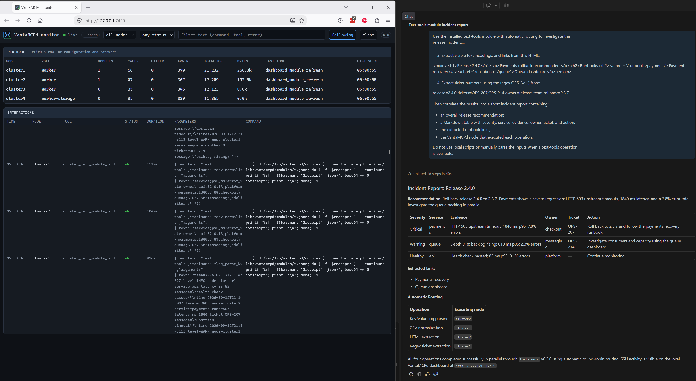

# Text Tools

`text-tools` is a bounded node-side text-processing MCP module. Its core uses only the Python standard
library, its constrained command wrappers reuse Debian packages (`ripgrep`, `jq`, `mawk`, and `sed`),
and a handful of operations unlock with optional packages. See [Operations](Operations.md) for the full
matrix, schemas, signatures, and deferrals.



*A release incident investigated with parallel, automatically routed `text-tools` operations.*

The module accepts caller-provided text and, when shared storage is enabled, opaque artifact IDs for
its two streamed CSV operations. It does not accept node paths, fetch URLs, run a shell, or execute
caller-supplied awk/sed programs.

It uses replicated deployment, so the cluster may have any number of interchangeable instances and
targetless calls are routed round-robin. Its on-demand runtime starts a fresh Python MCP process over
SSH stdio for each discovery or tool call and closes it afterward. Nothing runs continuously, and the
next call works normally after either VantaMCPd disconnects or the node reboots.

## Quickstart

The shortest path from an available worker node to a verified first operation is:

1. Check compatibility and free disk:

	> Check whether text-tools is compatible with worker-a.

2. Install it on one or more explicit nodes. Two installations give you interchangeable replicas:

	> Install text-tools on worker-a and worker-b.

3. Confirm the operation. Installation performs live preflight, installs any missing declared apt
	packages, repeats preflight, verifies staged file hashes, runs the module self-test, activates the
	version, and writes a receipt. It returns when the nodes are ready; there is no background job.

4. Verify the installed surface:

	> List the tools provided by text-tools.

	Confirm that the response lists the twelve category tools below.

5. Run a first operation. Neither the module name nor a node is needed:

	> Pull the numeric IDs out of `item=12 item=37`.

Each target node needs Debian or Ubuntu on `armhf`, `arm64`, or `amd64`, at least 256 MB RAM, and 40 MB
free on the root filesystem. No secondary storage is required and no data is retained between calls.

## Install

The module declares `bash`, Python 3, `rg`, `jq`, `awk`, and `sed`; VantaMCPd installs the missing
declared apt packages (`python3`, `ripgrep`, `jq`, `mawk`, `sed`) during preflight. It also declares
`python3-yaml`, `python3-markdown`, `python3-inflect`, `python3-tomli-w`, and `wamerican`, which unlock
seven optional operations; everything else works without them. Shared apt packages are never removed
during module uninstall.

In Copilot Chat Agent mode, check placement before installing:

> Check whether text-tools is compatible with worker-a.

Then install it on explicit nodes:

> Install text-tools on worker-a.

To provide two interchangeable instances:

> Install text-tools on worker-a and worker-b.

The corresponding MCP arguments are:

```json
{
	"moduleId": "text-tools",
	"targets": ["worker-a", "worker-b"],
	"confirm": true
}
```

Installation requires approval and an explicit target list; `all` is rejected. Because deployment is
replicated, adding or removing a replica needs no change to the others.

## Tools

Every capability is reached through twelve category tools holding 113 operations. Each takes an
`operation` discriminator and that operation's own fields; the advertised JSON Schema is a `oneOf` over
the operations, so the agent sees exactly what each one requires.

| Tool | Operations |
| --- | --- |
| `text_transform` | Case/identifier conversion, normalization, deduplication, sorting, filtering, wrapping, line slicing, literal replacement, truncation, padding, ASCII folding, number and byte formatting, pluralization |
| `text_extract` | Emails, URLs, numbers, IPs, date/time strings, code blocks, quotations, UUIDs, hashes, semantic versions |
| `text_analyze` | Statistics, readability, keywords, similarity, n-grams, sentences, token estimates, invisible-character inspection, duplicate lines, chunking, TF-IDF |
| `text_codec` | Base64, URL, HTML, Unicode, hex, binary, and unverified JWT decoding |
| `data_convert` | JSON formatting, inline and shared-artifact CSV, JSONL, flatten/unflatten, structural diff and merge, schema inference, `key=value` logs, dotenv, HTML, YAML, TOML, INI, XML, query strings |
| `text_security` | Digests, HMACs, checksums, UUID validation, secret scanning, redaction, password strength |
| `text_generate` | UUIDv4, secure passwords, diceware passphrases, placeholder text |
| `developer_text` | Regex extraction, replacement and testing, unified diffs, semantic versions, Python comment stripping |
| `document_process` | Markdown text/TOC/fences, JSON, TOML or YAML frontmatter, section splitting, table and link extraction, heading shifting, HTML rendering |
| `table_transform` | Markdown rendering and sorting of flat JSON or CSV tables |
| `datetime_text` | Timestamp parsing, reformatting, timezone conversion, intervals, and duration humanizing/parsing |
| `command_text` | stdin-only constrained wrappers for `rg`, `jq`, `awk`, and `sed` |

Per-operation schemas, argument bounds, and deferrals are documented in [Operations](Operations.md).

Seven operations need an optional Debian package (`python3-yaml`, `python3-markdown`,
`python3-inflect`, `python3-tomli-w`, `wamerican`). The module installs and runs without them; a call
that needs a missing one fails with a message naming the package, which `cluster_packages` can install.

List the tools advertised by the installed module:

> List the tools provided by text-tools.

To ask a specific replica instead, name it:

> List the tools provided by text-tools on worker-a.

Most requests need neither the module name nor a node. The manifest declares the module's capabilities,
VantaMCPd puts them in the instructions and proxy-tool descriptions it sends the agent, and routing
picks a reachable replica:

> Check this config for anything that looks like a credential before I paste it.

> Redact the email addresses and IPs from this log excerpt.

> These two lines look identical but don't compare equal - tell me why.

> Convert this YAML to JSON, then show me what changed against the previous version.

> What is `2026-09-13T12:00:00Z` in Europe/Berlin, and how long ago was that?

> Split this Markdown into sections at level 2 and chunk each one to 2000 characters.

> Does `^\d{3}-\d{4}$` match `555-1234` and `5551234`?

> Pull the numeric IDs out of `item=12 item=37`.

> Normalize `name;score\nAda;10\nLinus;9` as CSV.

> Sort the JSON table `[{"name":"b","score":2},{"name":"a","score":10}]` by score numerically.

Name the module when you want to force the cluster rather than let the agent answer locally:

> Use text-tools to search `level=info\nlevel=error code=42` with ripgrep for `error|code=[0-9]+`, with one line of context.

Name a node as well only to reproduce a result on a particular replica or to isolate a suspected node
problem.

### Routing and responses

The underlying generic proxy call for the regex example is:

```json
{
	"moduleId": "text-tools",
	"toolName": "developer_text",
	"arguments": {
		"operation": "regex_extract",
		"text": "item=12 item=37",
		"pattern": "item=(\\d+)"
	}
}
```

With no `target`, successive calls round-robin over reachable nodes where `text-tools` is installed.
Set `"target": "worker-a"` to pin a call. The proxy response identifies the selected node and module
version, then places the tool's structured result in `output`:

```json
{
	"ok": true,
	"node": "worker-a",
	"moduleId": "text-tools",
	"moduleVersion": "0.5.0",
	"toolName": "developer_text",
	"deployment": { "mode": "replicated", "routing": "round-robin" },
	"selection": "automatic",
	"output": {
		"matches": [
			{ "match": "item=12", "groups": ["12"], "namedGroups": {}, "start": 0, "end": 7 },
			{ "match": "item=37", "groups": ["37"], "namedGroups": {}, "start": 8, "end": 15 }
		],
		"count": 2,
		"truncated": false
	}
}
```

The proxy prefers the module's `structuredContent`, so the same result is not repeated as escaped JSON
inside `content[].text`. For text-only modules, a sole JSON text item is parsed when possible; plain text
and multi-part MCP content are preserved. Module-reported errors return `ok: false` and an MCP error.

## Example Parallel Workflow

Each call runs wholly on one node, so independent calls can use the replicas concurrently without the
prompt naming either the module or a node:

> Using text-tools with automatic routing, run these independent operations in parallel and report the
> node for each result: extract `OPS-142` and `OPS-207` from
> `release=2026.09 tickets=OPS-142,OPS-207`; normalize
> `node;status\nworker-a;ready\nworker-b;ready` as CSV; parse
> `level=info module=text-tools replicas:2 routing=round-robin`; and extract content from
> `<h2>Deployment report</h2><p>Two replicas ready.</p>`.

With two reachable installations, the four targetless calls are assigned two per node. Results can
finish in any order. A failed in-progress call is returned as a failure rather than silently replayed on
another node.

## Limits and Safety

Input text, pattern length, result counts, and total MCP output bytes are bounded: 256 KiB in and out,
a 10-second startup budget, and a 30-second call budget. Regular expressions are evaluated in a separate
process with a two-second limit, so a catastrophically backtracking pattern is terminated rather than
allowed to consume the node.

The service validates every argument, rejects undeclared fields, and exposes no paths, URLs, or shell.
The command wrappers pass caller text on stdin with fixed argument shapes; they never accept
caller-supplied awk or sed programs, and `jq` runs without environment access. YAML is read with
`safe_load`, XML rejects DTD and entity declarations, and `strftime` patterns are checked against an
allow-list before use. `secret_scan` reports a masked preview and never echoes the value it matched.
`markdown_to_html` deliberately does not sanitize and says so in its result. The module makes no changes
to node state and writes no artifacts.

Each call validates the remote installation receipt and active version, starts a fresh Python MCP
process over SSH stdio, and invokes only a tool returned by `tools/list`.

## Data Lifecycle

The module keeps no state: every call is independent and nothing is written outside the installation
directory. Uninstall the payload and receipt with:

> Uninstall text-tools from worker-a.

Uninstallation requires approval and an explicit target. It validates the receipt before removing the
active payload and receipt, and repeating it after removal is safe. Shared apt packages installed during
preflight are deliberately left in place, because other software on the node may depend on them.

## Troubleshooting

| Symptom | Check or action |
| --- | --- |
| Preflight reports missing commands | Let VantaMCPd install the declared apt packages, or install `ripgrep`, `jq`, `mawk`, and `sed` with `cluster_packages` first |
| `... requires the <package> package` | That operation is optional; install the named package with `cluster_packages` and retry |
| `unknown tool: <name>` | Every capability is an `operation` inside one of the twelve category tools; call `cluster_list_module_tools` to see the current surface |
| A call fails with a receipt or version error | Reinstall on that node; the receipt is validated on every call, so a partial installation fails closed |
| Targetless calls all land on one node | Only one installation is reachable; check `cluster_list_modules` for node coverage and connectivity |
| A regex call reports exceeding two seconds | Simplify the pattern; nested quantifiers over long input are terminated rather than allowed to run |
| Output is reported as truncated | Lower `maxMatches` or split the input; the module caps result counts and total output bytes |
| Dashboard shows an old module version | Run `npm run build`, restart the local VantaMCPd MCP server, then refresh the dashboard |

## Local Development

Run the standard-library smoke test from the module directory:

```bash
PYTHONDONTWRITEBYTECODE=1 python3 server.py --self-test
```

Run the complete stdio protocol matrix from the repository root:

```bash
node --test test/text-tools.test.mjs
```